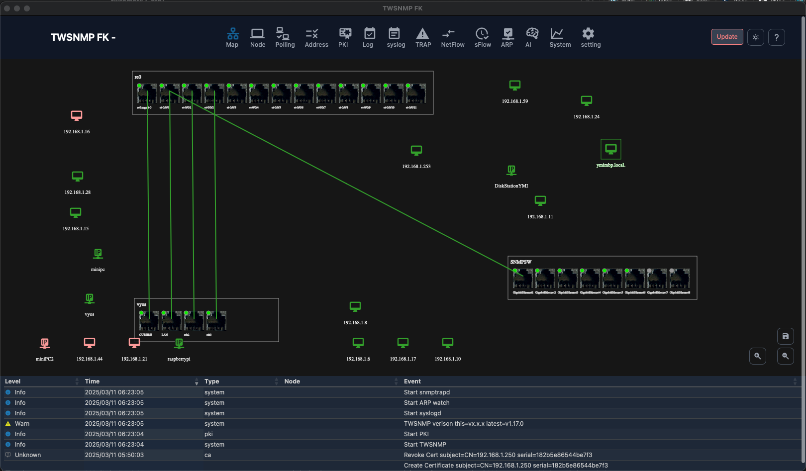

# twsnmpfk
TWSNMP For Kiosk

Ultra lightweight SNMP manager.
To keep maps and event logs, etc. always visible.
It is designed to be used in Windows kiosk mode.
Of course, it can also be used as a normal application.



超軽量なSNMPマネージャーです。
マップとイベントログなどを常に表示しておくため
Windowsのキオスクモードでの利用を想定しています。
もちろん通常のアプリとしても利用可能です。

;

## Document

[Manual](doc/twsnmpfk_en.pdf)

[日本語マニュアル](doc/twsnmpfk_ja.pdf)

## Status

The following functions will work

- Network map
- Node list
- Polling (PING/TCP/HTTP/NTP/DNS/SNMP/gNMI)
- Event log
- Syslog reception
- SNMP TRAP reception
- ARP monitoring
- MIB browser
- PING Confirmation
- Panel Display
- Host resource MIB display
- Wake On LAN support
- HTML e-mail notification, periodic report
- AI Analysis
- NetFlow/IPFIX
- sFlow
- gNMI
- PKI (CA and CRL/OCSPACME/SCEP server)
- SSH Server
- TCP Log server

以下の機能が動作します。

- マップ表示
- ノードリスト
- ポーリング(PING/TCP/HTTP/NTP/DNS/SNMP)
- イベントログ
- Syslog受信
- SNMP TRAP受信
- ARP監視
- MIBブラウザー
- PING確認
- パネル表示
- ホストリソースMIB表示
- Wake On LAN対応
- HTMLメール通知、定期レポート
- AI分析
- NetFlow/IPFIX
- sFlow
- gNMI
- PKI (CA機能とCRL/OCSPACME/SCEPサーバー)
- SSH Server
- TCP Log server

## Build 

The following environment is used for development

 - go 1.24 or higher
 - wails 2.9.3 or higher
 - nsis
 - go-task

You can build it with the following command.

 ````
 task
 ````

以下の環境で開発しています。

 - go 1.24以上
 - wails 2.9.3以上
 - nsis
 - go-task

以下のコマンドでビルドできます。
 ```
 task
 ```
 
 ## Run

 Double-click from the built executable file to drive it as a normal application.
It can also be started from the command line by specifying the following parameters

ビルドした実行ファイルからダブルクリックで通常のアプリとして
駆動できます。
コマンドラインから以下のパラメータを指定して起動することもできます。

```
Usage of twsnmpfk:
  -caCert string
    	CA Cert path
  -clientCert string
    	Client cert path
  -clientKey string
    	Client key path
  -datastore string
    	Path to data store directory
  -kiosk
    	Kisok mode(frameless and full screen)
  -lang string
    	Language(en|jp)
  -lock string
    	Disable edit map and lock page(map or loc)
  -maxDispLog int
    	Max log size to diplay (default 10000)
  -netflowPort int
    	Netflow port (default 2055)
  -ping string
    	ping mode icmp or udp
  -sFlowPort int
    	sFlow port (default 6343)
  -sshdPort int
    	SSH server port (default 2022)
  -syslogPort int
    	Syslog port (default 514)
  -tcpdPort int
    	tcp server port (default 8086)
  -trapPort int
    	SNMP TRAP port (default 162)
```

---

| Parameters | Description |
| --- | --- |
| dataStore | Datstore Pass |
| kiosk | Kiosk mode (frameless, full screen) |
| lock <page> | disable edit map and show fixed page |
| Maxdisplog <number> | Maximum number of logs (default 10000) |
| ping <Mode> | Ping operation mode (ICMP or UDP) |
| syslogPort <PORT> | Syslog receiving port (default 514) |
| trapPort <Port> | SNMP TRAP Reception port (Default 162) |
| sshdPort <Port> | SSH server port (Default 162) |
|sshdPort <port>| SSH Server Receive Port (Default 2022)|
|netflowPort <port>| NetFlow/IPFIX receive port (default 2055)|
|sFlowPort <port>| sFlow receiving port (default 6343)|
|tcpdPort <port>| TCP log receiving port (default 8086)|

---

|パラメータ|説明|
|---|---|
|datastore|データストアのパス|
|kiosk|キオスクモード（フレームレス、フルスクリーン）|
|lock <page>| マップの編集を禁止して表示するページを固定|
|maxDispLog <number>|ログの最大表示数(デフォルト 10000)| 
|ping <mode>|pingの動作モード(icmp又はudp)|
|syslogPort <port>|syslogの受信ポート(デフォルト514)|
|trapPort <port>| SNMP TRAP受信ポート(デフォルト162)|
|sshdPort <port>| SSH Server受信ポート(デフォルト2022)|
|netflowPort <port>| NetFlow/IPFIX受信ポート(デフォルト2055)|
|sFlowPort <port>| sFlow受信ポート(デフォルト6343)|
|tcpdPort <port>| TCPログ受信ポート(デフォルト8086)|
