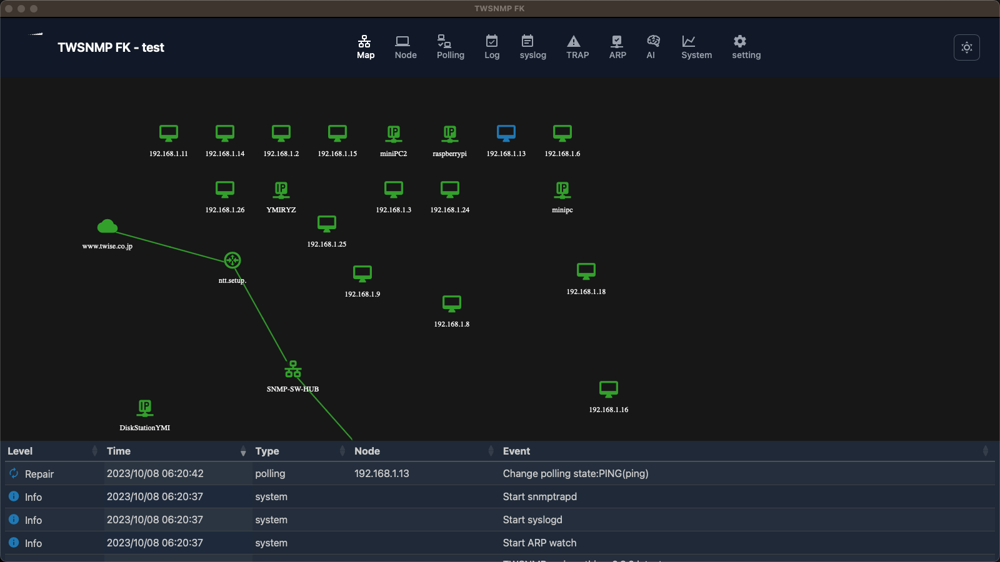

# twsnmpfk
TWSNMP For Kiosk

Ultra lightweight SNMP manager.
To keep maps and event logs, etc. always visible.
It is designed to be used in Windows kiosk mode.
Of course, it can also be used as a normal application.



超軽量なSNMPマネージャーです。
マップとイベントログなどを常に表示しておくため
Windowsのキオスクモードでの利用を想定しています。
もちろん通常のアプリとしても利用可能です。

;

## Status

Plans to release v0.9.0 as a beta version (10/10/2023)
The following functions will work

- Map display
- Node list
- Polling (PING/TCP/HTTP/NTP/DNS/SNMP)
- Event log
- Syslog reception
- SNMP TRAP reception
- ARP monitoring
- MIB browser
- PING Confirmation
- Panel Display
- Host resource MIB display
- Wake On LAN support
- HTML e-mail notification, periodic report
- AI Analysis

ベーター版としてv0.9.0をリリース予定(2023/10/10)
以下の機能が動作します。

- マップ表示
- ノードリスト
- ポーリング(PING/TCP/HTTP/NTP/DNS/SNMP)
- イベントログ
- Syslog受信
- SNMP TRAP受信
- ARP監視
- MIBブラウザー
- PING確認
- パネル表示
- ホストリソースMIB表示
- Wake On LAN対応
- HTMLメール通知、定期レポート
- AI分析

## Build 

The following environment is used for development

 - go 1.20 or higher
 - wails 2.5.1 or higher
 - nsis
 - go-task

You can build it with the following command.

 ````
 task
 ````


以下の環境で開発しています。

 - go 1.20以上
 - wails 2.5.1以上
 - nsis
 - go-task

以下のコマンドでビルドできます。
 ```
 task
 ```
 
 ## Run

 Double-click from the built executable file to drive it as a normal application.
as a normal application by double-clicking on the built executable file.
It can also be started from the command line by specifying the following parameters

ビルドした実行ファイルからダブルクリックで通常のアプリとして
駆動できます。
コマンドラインから以下のパラメータを指定して起動することもできます。

```
Usage of twsnmpfk:
  -datastore string
    	Path to Data Store directory
  -kiosk
    	Kisok mode(frameless and full screen)
  -lang string
    	Language(en|jp)
  -lock string
      Disable edit map and lock page(map or loc)
  -maxDispLog int
    	Max log size to diplay (default 10000)
  -ping string
    	ping mode icmp or udp
  -syslogPort int
    	Syslog port (default 514)
  -trapPort int
    	SNMP TRAP port (default 162)
```