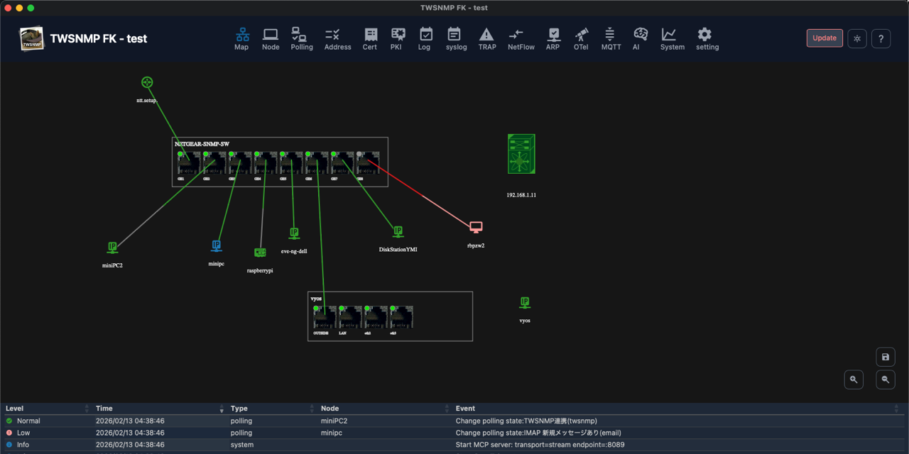
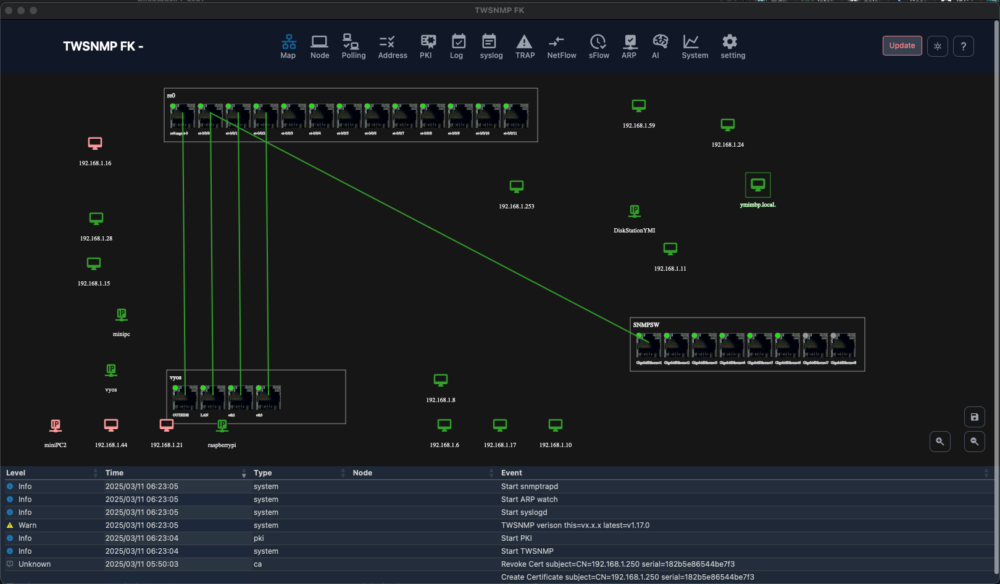

# TWSNMP FK

[日本語版はこちら](README_ja.md)

[](https://goreportcard.com/report/github.com/twsnmp/twsnmpfk)


【Built with】


TWSNMP FK is a next-generation Network Management System. It combines the performance of Go, the simplicity of Svelte, and the seamless desktop experience of Wails to provide a lightweight yet powerful observability tool.



---

Ultra lightweight SNMP manager.
To keep maps and event logs, etc. always visible.
It is designed to be used in Windows kiosk mode.
Of course, it can also be used as a normal application.



## Document

[English](https://twsnmp.github.io/twsnmpfk/index.html)

## Status

The following functions will work

- Network map
- Node list
- Polling (PING/TCP/HTTP/NTP/DNS/SNMP/gNMI)
- Event log
- Syslog reception
- SNMP TRAP reception
- ARP monitoring
- MIB browser
- PING Confirmation
- Panel Display
- Host resource MIB display
- Wake On LAN support
- HTML e-mail notification, periodic report
- AI Analysis
- NetFlow/IPFIX
- sFlow
- gNMI
- PKI (CA and CRL/OCSP/ACME/SCEP server)
- SSH Server
- TCP Log server
- OpenTelemetry collector
- MCP Server
- MQTT Server and Polling

## Build 

The following environment is used for development

 - go 1.24 or higher
 - wails 2.9.3 or higher
 - nsis
 - go-task

You can build it with the following command.

 ````
 task
 ````

## Run

Double-click from the built executable file to drive it as a normal application.

### Special Notes for Linux Environments

In Linux environments, running the application as a normal user will result in permission errors during startup (e.g., `socket: operation not permitted` when setting up ICMP Ping, or errors when binding to privileged ports under 1024 like 514 for Syslog or 162 for Trap).

To resolve this securely, **do not run the application directly with `sudo`** (which will break connection to the X11/Wayland display server, preventing the GUI from launching). Instead, grant the executable the required Capabilities to bind to privileged ports and use raw sockets, and then run it as a normal user.

Additionally, modern Linux distributions (like Ubuntu) do not have the `arp` command installed by default. **You must install the `net-tools` package to use the ARP monitoring feature.**

1. **Grant Capabilities**:
   ```bash
   sudo setcap 'cap_net_bind_service,cap_net_raw+ep' ./twsnmpfk
   ```
2. **Install ARP Monitoring Tools (net-tools)**:
   ```bash
   sudo apt-get update && sudo apt-get install -y net-tools
   ```
3. **Run as a normal user**:
   ```bash
   ./twsnmpfk
   ```

This allows the application to perform ping monitoring, ARP monitoring, and receive syslog/traps while properly displaying the GUI interface under your user session.

It can also be started from the command line by specifying the following parameters:

```
Usage of twsnmpfk:
 -caCert string
    	CA Cert path
  -clientCert string
    	Client cert path
  -clientKey string
    	Client key path
  -datastore string
    	Path to data store directory
  -kiosk
    	Kisok mode(frameless and full screen)
  -lang string
    	Language(en|jp)
  -lock string
    	Disable edit map and lock page(map or loc)
  -maxDispLog int
    	Max log size to diplay (default 10000)
  -mcpCert string
    	MCP server cert path
  -mcpKey string
    	MCP server key path
  -mqttCert string
    	MQTT server cert path
  -mqttFrom string
    	MQTT client IP
  -mqttKey string
    	MQTT server key path
  -mqttTCPPort int
    	MQTT server TCP port (default 1883)
  -mqttUsers string
    	MQTT user and password
  -mqttWSPort int
    	MQTT server WebSock port (default 1884)
  -netflowPort int
    	Netflow port (default 2055)
  -notifyOAuth2Port int
    	OAuth2 redirect port (default 8180)
  -otelCA string
    	OpenTelementry CA cert path
  -otelCert string
    	OpenTelemetry server cert path
  -otelGRPCPort int
    	OpenTelemetry server gRPC port (default 4317)
  -otelHTTPPort int
    	OpenTelemetry server HTTP port (default 4318)
  -otelKey string
    	OpenTelemetry server key path
  -ping string
    	ping mode icmp or udp
  -sFlowPort int
    	sFlow port (default 6343)
  -sshdPort int
    	SSH server port (default 2022)
  -syslogPort int
    	Syslog port (default 514)
  -tcpdPort int
    	tcp server port (default 8086)
  -trapPort int
    	SNMP TRAP port (default 162)
```

---

| Parameters | Description |
| --- | --- |
| dataStore | Datstore Pass |
| kiosk | Kiosk mode (frameless, full screen) |
| lock <page> | disable edit map and show fixed page |
| Maxdisplog <number> | Maximum number of logs (default 10000) |
| ping <Mode> | Ping operation mode (ICMP or UDP) |
| syslogPort <PORT> | Syslog receiving port (default 514) |
| trapPort <Port> | SNMP TRAP Reception port (Default 162) |
| sshdPort <Port> | SSH server port (Default 162) |
| sshdPort <port> | SSH Server Receive Port (Default 2022)|
| netflowPort <port> | NetFlow/IPFIX receive port (default 2055)|
| sFlowPort <port> | sFlow receiving port (default 6343)|
| tcpdPort <port> | TCP log receiving port (default 8086)|
| otelCA |OpenTelementry CA cert path|
| otelCert |OpenTelemetry server cert path|
| otelGRPCPort |OpenTelemetry server gRPC port (default 4317)|
| otelHTTPPort |OpenTelemetry server HTTP port (default 4318)|
| otelKey |OpenTelemetry server key path|
| mqttTCPPort |MQTT server TCP port (default 1883)|
| mqttWSPort |MQTT server Websock port (default 1884)|
| mqttCert |MQTT server cert path|
| mqttKey |MQTT server key path|
| mqttFrom |MQTT server Client|
| mqttUsers |MQTT server User ID and password list|
| mcpCert |MCP server cert path|
| mcpKey |MCP server key path|
| notifyOAuth2Port |OAuth2 redirect port (default 8180)|

## History

### v1.34.0 (2026/05/26)

#### Official Linux Support and Enhancements
*   **CI Auto-Build & Release Pipeline**: Added a GitHub Actions workflow (`build-linux.yml`) to automatically build and package the Linux version (`.tar.gz`).
*   **Ubuntu 24.04 Compatibility in CI**: Upgraded `WebKit2Gtk` to 4.1 to ensure compatibility and smooth building on Ubuntu 24.04 in CI.
*   **Linux Capability and Execution Instructions**: Added step-by-step instructions to the README and web docs on running twsnmpfk as a standard user with proper Linux Capabilities (`setcap` for `cap_net_bind_service` and `cap_net_raw`) rather than `sudo`.
*   **ARP Monitoring Dependency**: Documented that `net-tools` is required for Linux ARP monitoring.

#### Cleanup of Deprecated Features
*   **Removal of Unsupported SNMPv1**: Completely removed SNMPv1 options and controls from map, node, and network configuration UIs.
*   **Import & Help Docs Synchronization**: Refactored the v4 map import logic to align with the SNMPv1 deprecation, and updated corresponding English and Japanese help files (`editnetwork.md`, `editnode.md`, `mapconf.md`).

#### UI Improvements and Bug Fixes
*   **Long URL Menu Layout Fix**: Resolved a layout bug in the node right-click menu where extremely long URLs would squash the associated menu icons.
*   **Network Report VPanel Port Wrap**: Enhanced the virtual panel (VPanel) under Network/Node reports by introducing customizable Port Wrap and zoom settings.

#### Security and Maintenance
*   **Vulnerability Mitigations**: Audited and upgraded Go modules and frontend NPM dependencies to patch known security vulnerabilities.
*   **Framework Updates**: Bumped Wails framework to `v2.12.0` and upgraded TypeScript to `5.5.x`.

#### Documentation and Presentation Slide Updates
*   **Marp Presentation Theme Fix**: Resolved the "graph_paper" theme error in Marp by introducing a local `graph_paper.css` file and registering it in VS Code settings. Regrew and updated the distributable PDF slide manuals.
*   **Custom Website Headers**: Added a custom head snippet (`head-custom.html`) to the Jekyll-based web docs for easier customization of theme settings, analytics, and OGP metadata.

### v1.33.0 (2026/03/17)

#### SNMPv3 Security Enhancements
*   **Enhanced Security Modes**: Added support for SHA256/AES128 and SHA512/AES256 authentication and encryption modes, providing stronger security for SNMP monitoring.

#### Map and UI Improvements
*   **Node IP Display**: Added an option to display node IP addresses directly on the map for easier identification.
*   **Group Drawing Items**: Introduced new "group" (frame/background) drawing items to better organize nodes and areas on the map.
*   **VPanel Enhancements**: Added zoom control and port wrap control for the virtual panel (VPanel) in both node and network reports.
*   **Clean Map Style**: Removed the background rectangle for unselected nodes to provide a cleaner and less cluttered map interface.

#### Drawing Item Enhancements
*   **Opacity Support**: Added support for setting the opacity (transparency) of drawing items.
*   **Background Image UI**: Improved the user interface for background image settings, making it more intuitive to customize map backgrounds.

#### Security and Maintenance
*   **Vulnerability Fixes**: Updated Go and npm dependencies to address the latest security concerns.

### v1.32.0 (2026/02/27)

#### AI (LLM) Integration Features
*   **MIB Browser Enhancements**: Added natural language MIB search and AI-powered MIB object explanation.
*   **Log Analysis Support**: Integrated AI explanations for NetFlow, Syslog, and SNMP Trap logs.
*   **Periodic Report Summarization**: Added an AI-driven summary feature for periodic reports to quickly grasp network status.
*   **Multi-Provider Support**: Supports multiple LLM providers including Gemini (Google AI), OpenAI, Anthropic (Claude), and Ollama (local LLM).

#### Map and Display Improvements
*   **SVG Format Support**: Added support for SVG node images on maps, ensuring high quality at any scale.
*   **Node Display Adjustments**: Optimized icon sizing and layout based on node selection status.
*   **Component Refactoring**: Reusable "Neko" animation component for consistent UI across MIB Browser and other views.

#### Security and Maintenance
*   **Vulnerability Fixes**: Updated Go and npm dependencies to address security concerns.
*   **Documentation Update**: Separated README into English and Japanese versions for better maintainability.
*   **Bug Fixes**: Resolved translation issues in LLM settings and fixed minor UI typos.
