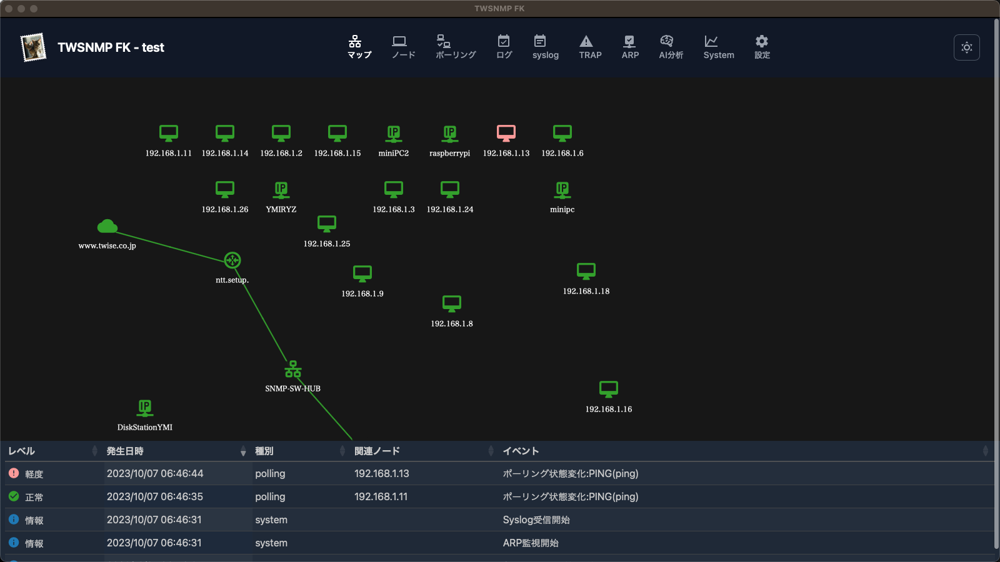

# TWSNMP FK

[English version is here](README.md)

[](https://goreportcard.com/report/github.com/twsnmp/twsnmpfk)


【Built with】


TWSNMP FK is a next-generation Network Management System. It combines the performance of Go, the simplicity of Svelte, and the seamless desktop experience of Wails to provide a lightweight yet powerful observability tool.


---

超軽量なSNMPマネージャーです。
マップとイベントログなどを常に表示しておくため
Windowsのキオスクモードでの利用を想定しています。
もちろん通常のアプリとしても利用可能です。



## Document

[日本語](https://twsnmp.github.io/twsnmpfk/index_ja.html)

## Status

以下の機能が動作します。

- マップ表示
- ノードリスト
- ポーリング(PING/TCP/HTTP/NTP/DNS/SNMP)
- イベントログ
- Syslog受信
- SNMP TRAP受信
- ARP監視
- MIBブラウザー
- PING確認
- パネル表示
- ホストリソースMIB表示
- Wake On LAN対応
- HTMLメール通知、定期レポート
- AI分析
- NetFlow/IPFIX
- sFlow
- gNMI
- PKI (CA機能とCRL/OCSP/ACME/SCEPサーバー)
- SSH Server
- TCP Log server
- OpenTelemetry コレクター
- MCP サーバー
- MQTT サーバーとコレクター

## Build 

以下の環境で開発しています。

 - go 1.24以上
 - wails 2.9.3以上
 - nsis
 - go-task

以下のコマンドでビルドできます。
 ```
 task
 ```
 
 ## Run

 ビルドした実行ファイルからダブルクリックで通常のアプリとして
駆動できます。
コマンドラインから以下のパラメータを指定して起動することもできます。

```
Usage of twsnmpfk:
 -caCert string
    	CA Cert path
  -clientCert string
    	Client cert path
  -clientKey string
    	Client key path
  -datastore string
    	Path to data store directory
  -kiosk
    	Kisok mode(frameless and full screen)
  -lang string
    	Language(en|jp)
  -lock string
    	Disable edit map and lock page(map or loc)
  -maxDispLog int
    	Max log size to diplay (default 10000)
  -mcpCert string
    	MCP server cert path
  -mcpKey string
    	MCP server key path
  -mqttCert string
    	MQTT server cert path
  -mqttFrom string
    	MQTT client IP
  -mqttKey string
    	MQTT server key path
  -mqttTCPPort int
    	MQTT server TCP port (default 1883)
  -mqttUsers string
    	MQTT user and password
  -mqttWSPort int
    	MQTT server WebSock port (default 1884)
  -netflowPort int
    	Netflow port (default 2055)
  -notifyOAuth2Port int
    	OAuth2 redirect port (default 8180)
  -otelCA string
    	OpenTelementry CA cert path
  -otelCert string
    	OpenTelemetry server cert path
  -otelGRPCPort int
    	OpenTelemetry server gRPC port (default 4317)
  -otelHTTPPort int
    	OpenTelemetry server HTTP port (default 4318)
  -otelKey string
    	OpenTelemetry server key path
  -ping string
    	ping mode icmp or udp
  -sFlowPort int
    	sFlow port (default 6343)
  -sshdPort int
    	SSH server port (default 2022)
  -syslogPort int
    	Syslog port (default 514)
  -tcpdPort int
    	tcp server port (default 8086)
  -trapPort int
    	SNMP TRAP port (default 162)
```

---

|パラメータ|説明|
|---|---|
| datastore |データストアのパス|
| kiosk |キオスクモード（フレームレス、フルスクリーン）|
| lock <page> | マップの編集を禁止して表示するページを固定|
| maxDispLog <number> |ログの最大表示数(デフォルト 10000)| 
| ping <mode> |pingの動作モード(icmp又はudp)|
| syslogPort <port> |syslogの受信ポート(デフォルト514)|
| trapPort <port> | SNMP TRAP受信ポート(デフォルト162)|
| sshdPort <port> | SSH Server受信ポート(デフォルト2022)|
| netflowPort <port> | NetFlow/IPFIX受信ポート(デフォルト2055)|
| sFlowPort <port> | sFlow受信ポート(デフォルト6343)|
| tcpdPort <port> | TCPログ受信ポート(デフォルト8086)|
| otelCA |OpenTelementry CA証明書のパス|
| otelCert |OpenTelemetryサーバー証明書のパス|
| otelGRPCPort |OpenTelemetryサーバーのgRPCポート番号 (default 4317)|
| otelHTTPPort |OpenTelemetryサーバーのHTTPポート番号 (default 4318)|
| otelKey |OpenTelemetryサーバーの秘密鍵のパス|
| mqttTCPPort |MQTTサーバーのTCPポート番号 (default 1883)|
| mqttWSPort |MQTTサーバーのWebsockポート番号 (default 1884)|
| mqttCert |MQTTサーバー証明書のパス|
| mqttKey |MQTTサーバーの秘密鍵のパス|
| mqttFrom |MQTT server 許可クライアントIP|
| mqttUsers |MQTT server ユーザーIDとパスワード|
| mcpCert |MCPサーバーの証明書のパス|
| mcpKey |MCPサーバーの秘密鍵のパス|
| notifyOAuth2Port |OAuth2リダイレクトサーバーのポート番号(default 8180)|

## History

### v1.32.0 (2026/02/27)

#### AI（LLM）統合機能の追加
*   **MIBブラウザの強化**: 自然言語によるMIB検索機能と、AIによるMIBオブジェクトの解説機能を追加しました。
*   **ログ解析支援**: NetFlow、Syslog、SNMP Trapの各ログ表示画面に、AIによるログ内容の解説機能を追加しました。
*   **定期レポートの要約**: AIを活用した定期レポートの要約機能を追加し、ネットワークの状態を素早く把握できるようになりました。
*   **マルチプロバイダー対応**: Gemini (Google AI), OpenAI, Anthropic (Claude), Ollama (ローカルLLM) など、複数のLLMプロバイダーをサポートしました。

#### マップ・表示機能の改善
*   **SVG形式のサポート**: マップ上のノード画像として、拡大しても劣化しないSVG形式をサポートしました。
*   **ノード表示の調整**: ノードの選択状態に応じたアイコンサイズの自動調整や、表示バランスの最適化を行いました。
*   **アニメーションの共通化**: MIBブラウザなどで使用されていた「猫（Neko）」のアニメーション表示をコンポーネント化し、UIの一貫性を向上させました。

#### セキュリティ・メンテナンス
*   **脆弱性への対応**: Go言語およびnpmパッケージの依存関係を更新し、セキュリティ上の脆弱性を解消しました。
*   **ドキュメントの整理**: READMEを英語と日本語に分割し、メンテナンス性と閲覧性を向上させました。
*   **不具合修正**: LLM設定画面の翻訳漏れや、UI上の細かなタイポの修正を行いました。
