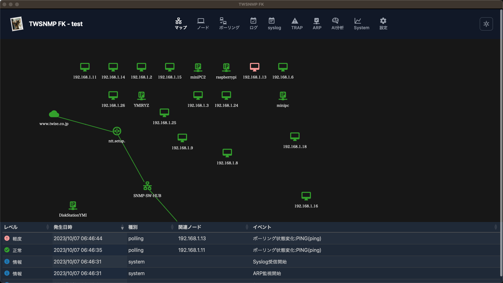

# TWSNMP FK

[English version is here](README.md)

[](https://goreportcard.com/report/github.com/twsnmp/twsnmpfk)


【Built with】


TWSNMP FK is a next-generation Network Management System. It combines the performance of Go, the simplicity of Svelte, and the seamless desktop experience of Wails to provide a lightweight yet powerful observability tool.


---

超軽量なSNMPマネージャーです。
マップとイベントログなどを常に表示しておくため
Windowsのキオスクモードでの利用を想定しています。
もちろん通常のアプリとしても利用可能です。



## Document

[日本語](https://twsnmp.github.io/twsnmpfk/index_ja.html)

## Status

以下の機能が動作します。

- マップ表示
- ノードリスト
- ポーリング(PING/TCP/HTTP/NTP/DNS/SNMP)
- イベントログ
- Syslog受信
- SNMP TRAP受信
- ARP監視
- MIBブラウザー
- PING確認
- パネル表示
- ホストリソースMIB表示
- Wake On LAN対応
- HTMLメール通知、定期レポート
- AI分析
- NetFlow/IPFIX
- sFlow
- gNMI
- PKI (CA機能とCRL/OCSP/ACME/SCEPサーバー)
- SSH Server
- TCP Log server
- OpenTelemetry コレクター
- MCP サーバー
- MQTT サーバーとコレクター

## Build 

以下の環境で開発しています。

 - go 1.24以上
 - wails 2.9.3以上
 - nsis
 - go-task

以下のコマンドでビルドできます。
 ```
 task
 ```
 
 ## Run

  ビルドした実行ファイルからダブルクリックで通常のアプリとして駆動できます。

  ### Linux環境での実行についての注意点

  Linux環境において、一般ユーザーで本アプリケーションを実行すると、ICMPによるPing監視（RAWソケットの作成）や、特権ポート（514のSyslog、162のTRAPなど）の待ち受けを行う権限がないため、起動時にエラーが発生します。

  この問題を回避するため、**管理者権限（sudo）でアプリを直接起動するのではなく**（画面描画用のディスプレイサーバーに接続できなくなるため）、実行ファイルに対して「特権ポートのバインド」と「RAWソケットの作成」の権限（Capabilities）を付与した上で、一般ユーザーとして起動してください。

  また、モダンなLinux（Ubuntuなど）では `arp` コマンドがデフォルトでインストールされていないため、**ARP監視機能を利用するには `net-tools` のインストールが必要**です。

  1. **権限（Capabilities）の付与**:
     ```bash
     sudo setcap 'cap_net_bind_service,cap_net_raw+ep' ./twsnmpfk
     ```
  2. **ARP監視用のツール（net-tools）のインストール**:
     ```bash
     sudo apt-get update && sudo apt-get install -y net-tools
     ```
  3. **一般ユーザーとしての起動**:
     ```bash
     ./twsnmpfk
     ```

  これにより、画面表示（X11/Waylandディスプレイ）との接続エラーを回避しつつ、Ping監視、ARP監視、Syslog等のパケット受信がすべて正常に機能するようになります。

  コマンドラインから以下のパラメータを指定して起動することもできます。

```
Usage of twsnmpfk:
 -caCert string
    	CA Cert path
  -clientCert string
    	Client cert path
  -clientKey string
    	Client key path
  -datastore string
    	Path to data store directory
  -kiosk
    	Kisok mode(frameless and full screen)
  -lang string
    	Language(en|jp)
  -lock string
    	Disable edit map and lock page(map or loc)
  -maxDispLog int
    	Max log size to diplay (default 10000)
  -mcpCert string
    	MCP server cert path
  -mcpKey string
    	MCP server key path
  -mqttCert string
    	MQTT server cert path
  -mqttFrom string
    	MQTT client IP
  -mqttKey string
    	MQTT server key path
  -mqttTCPPort int
    	MQTT server TCP port (default 1883)
  -mqttUsers string
    	MQTT user and password
  -mqttWSPort int
    	MQTT server WebSock port (default 1884)
  -netflowPort int
    	Netflow port (default 2055)
  -notifyOAuth2Port int
    	OAuth2 redirect port (default 8180)
  -otelCA string
    	OpenTelementry CA cert path
  -otelCert string
    	OpenTelemetry server cert path
  -otelGRPCPort int
    	OpenTelemetry server gRPC port (default 4317)
  -otelHTTPPort int
    	OpenTelemetry server HTTP port (default 4318)
  -otelKey string
    	OpenTelemetry server key path
  -ping string
    	ping mode icmp or udp
  -sFlowPort int
    	sFlow port (default 6343)
  -sshdPort int
    	SSH server port (default 2022)
  -syslogPort int
    	Syslog port (default 514)
  -tcpdPort int
    	tcp server port (default 8086)
  -trapPort int
    	SNMP TRAP port (default 162)
```

---

|パラメータ|説明|
|---|---|
| datastore |データストアのパス|
| kiosk |キオスクモード（フレームレス、フルスクリーン）|
| lock <page> | マップの編集を禁止して表示するページを固定|
| maxDispLog <number> |ログの最大表示数(デフォルト 10000)| 
| ping <mode> |pingの動作モード(icmp又はudp)|
| syslogPort <port> |syslogの受信ポート(デフォルト514)|
| trapPort <port> | SNMP TRAP受信ポート(デフォルト162)|
| sshdPort <port> | SSH Server受信ポート(デフォルト2022)|
| netflowPort <port> | NetFlow/IPFIX受信ポート(デフォルト2055)|
| sFlowPort <port> | sFlow受信ポート(デフォルト6343)|
| tcpdPort <port> | TCPログ受信ポート(デフォルト8086)|
| otelCA |OpenTelementry CA証明書のパス|
| otelCert |OpenTelemetryサーバー証明書のパス|
| otelGRPCPort |OpenTelemetryサーバーのgRPCポート番号 (default 4317)|
| otelHTTPPort |OpenTelemetryサーバーのHTTPポート番号 (default 4318)|
| otelKey |OpenTelemetryサーバーの秘密鍵のパス|
| mqttTCPPort |MQTTサーバーのTCPポート番号 (default 1883)|
| mqttWSPort |MQTTサーバーのWebsockポート番号 (default 1884)|
| mqttCert |MQTTサーバー証明書のパス|
| mqttKey |MQTTサーバーの秘密鍵のパス|
| mqttFrom |MQTT server 許可クライアントIP|
| mqttUsers |MQTT server ユーザーIDとパスワード|
| mcpCert |MCPサーバーの証明書のパス|
| mcpKey |MCPサーバーの秘密鍵のパス|
| notifyOAuth2Port |OAuth2リダイレクトサーバーのポート番号(default 8180)|

## History

### v2.0.0 (2026/06/27)

#### フロントエンドスタックの大幅なアップグレードと Svelte 5 への移行
*   **Svelte 5 への移行**: フロントエンドフレームワークを Svelte 4 から Svelte 5 にアップグレードしました。すべてのコンポーネントが新しいリアクティビティシステムに移行され、Svelte 5 の `$props()` や `$bindable()` 構文を使用するように刷新されました。
*   **技術スタックのアップデート**: Vite 8、Flowbite Svelte v1、Tailwind CSS、および PostCSS を含む、主要なビルドツールと依存パッケージを最新バージョンへ更新しました。
*   **Flowbite Svelte の互換性向上**: Flowbite Svelte の API 変更に対応するため、コンポーネントのプロパティを修正しました（非推奨となった `NavUl` の `ulClass` から `classes` への移行、および Spinner の `size` プロパティの更新など）。

#### DataTables DOM 操作の分離
*   **DOM操作の干渉回避**: Flowbite の `<TabItem>` や Svelte のスロット内で DataTables（データテーブル）を使用する際、`<table>` 要素を必ず `<div>` で囲むように実装を変更しました。これにより、DataTables の内部的な DOM 挿入処理が ECharts などの兄弟コンテナ要素を破壊・非表示化してしまう問題を解消しました。

#### レイアウト、デザインおよび UI のブラッシュアップ
*   **システムページのレイアウト最適化**: チャートとテーブルの高さを再設計・調整し、設定ボタンや操作ボタンなどの重要な要素が画面外に隠れることなく正しく表示されるようにレイアウトを最適化しました。
*   **OpenTelemetry レポートの改善**: グラフの表示高さを縮小して画面スペースを有効活用し、タイムスタンプが改行されないようテーブルの列幅を広げました。また、数値を小数点以下3桁に統一フォーマットして視認性を向上させました。
*   **サーバー制御ダイアログ**: ACME および SCEP サーバーのステータスバッジの余白と高さを調整し、より自然で統一感のある表示バランスに改善しました。
*   **AI ログ解説ポップアップ**: markdown 内の code block（ソースコード表示部）のテキスト色を白にし、不要なテキストシャドウ（影）を削除してフォントの視認性を改善しました。
*   **レスポンシブ動作の改善**: 各種ログ設定（Syslog、NetFlow など）のチェックボックスの間隔をレスポンシブ表示に合わせて最適化しました。

#### ヘルプドキュメントの簡素化・刷新
*   **シンプルなマニュアルスタイルへ変更**: 日英両方のヘルプ用 markdown ファイルをすべて書き換え、HTML テーブルや複雑な HTML タグを使わないシンプルな文書構造に刷新し、ボタンやアクションの表記を統一しました。

#### セキュリティおよび Go バックエンドの強化
*   **脆弱性の修正**: フロントエンドの依存パッケージを監査・更新し、`esbuild` を 0.28.1 へアップグレードして脆弱性（GHSA-gv7w-rqvm-qjhr）への対策を行いました。
*   **Wails ログルーティング機能の追加**: フロントエンドの JavaScript エラーやログ出力を Go バックエンド経由で Wails のターミナル出力に直接転送する `LogFromJS` 関数を実装し、デバッグを容易にしました。

### v1.35.0 (2026/06/11)

#### SNMPポートのカスタマイズ対応
*   **個別ポート設定の追加**: ノードおよびネットワークの設定画面に、個別のSNMPポート設定項目を追加しました。これにより、標準の161ポート以外を使用する機器の監視・ポーリングが可能になりました（0指定時はデフォルトの161ポートが使用されます）。

#### MQTT機能の強化
*   **ポーリング作成時のノード選択ロジックの改善**: MQTT統計からポーリングを作成する際のノード自動選択ロジックを強化しました。（1）接続元IPの一致、（2）ローカルホストまたはTWSNMPブローカー（127.0.0.1、localhost、::1、または名前に "twsnmp" を含むノード）、（3）ノードリストの先頭ノード、の優先順位でノードを自動選択します。
*   **便利なトピック操作の追加**: MQTT統計リスト画面に「トピックコピー」および「ポーリング作成」ボタンを追加し、選択したトピックのコピーやポーリング設定への追加を容易にしました。
*   **古い統計データの自動クリーンアップ**: ログ保存日数設定に基づいて、古いMQTT統計データを自動的に削除するクリーンアップ機能を追加しました。

#### セキュリティおよび信頼性の向上
*   **ライブラリの脆弱性対策**: `go.opentelemetry.io/otel/sdk` を v1.43.0（CVE-2026-39883）、`go.opentelemetry.io/otel` を v1.41.0（CVE-2026-29181）、および `go-jose` を v4.1.4（GO-2026-4945）へアップグレードし、脆弱性を修正しました。
*   **Code Scanning（GoSec）警告の修正**: ファイルパーミッション、コマンド変数、タイムアウト、弱いハッシュアルゴリズム、TLS設定、およびループ変数ポインタに関連する複数のセキュリティ警告（G112, G122, G204, G306, G401, G402, G505）を修正しました。
*   **SSHdの型変換警告とログの整理**: SSHサーバーモジュール（`logger/sshd`）における整数型変換警告（CodeQL指摘事項）を解消し、不要な詳細ログや機微情報の出力を削除しました。

#### UI/UXおよび多言語対応の修正
*   **Wailsローカルスキーマの導入**: `wails.json` のスキーマ警告に対応するため、`.vscode` 配下にローカルスキーマファイルを追加し、エディタ上での信頼性警告を解消しました。
*   **翻訳とタイポの修正**: 日英両言語における多くのタイポ、スペルミス、および多言語化の不整合（「Warnning」の修正やマップ・レポート等の誤訳修正など）を解決しました。

### v1.34.0 (2026/05/26)

#### Linux版の正式サポートと環境整備
*   **CI自動ビルド＆リリースパイプラインの導入**: GitHub Actionsワークフロー (`build-linux.yml`) を追加し、Linux向けパッケージ (`.tar.gz`) の自動ビルド・パッケージングに対応しました。
*   **Ubuntu 24.04（CI環境）との互換性向上**: CI上での動作安定性向上のため、`WebKit2Gtk` のバージョンを 4.1 へアップグレードしました。
*   **Linuxでの安全な実行手順の確立＆文書化**: 一般ユーザー権限で起動した際のICMP（Ping）RAWソケット作成や、特権ポート（514: Syslog / 162: TRAPなど）へのバインドエラーを解決するため、`sudo` を使用せずに `setcap` コマンドで Linux Capabilities を付与して実行する手順をREADMEやドキュメントに追記しました。
*   **ARP監視用の依存関係追記**: Linux環境でARP監視を利用するにあたり、`net-tools` の導入が必須である説明を追加しました。

#### 非推奨機能のクリーンアップ
*   **SNMPv1 サポートの廃止に伴うUI整理**: サポート外となったSNMPv1に関連する選択肢を、マップ設定・ノード設定・ネットワーク設定などのすべての画面コントロールから完全に削除しました。
*   **インポート処理とヘルプドキュメントの同期**: v4.xマップファイルからのインポート処理におけるSNMPv1の扱いを修正し、日本語および英語のヘルプドキュメント（`editnetwork.md`, `editnode.md`, `mapconf.md`）の古い記述を更新しました。

#### UIの改善とバグ修正
*   **メニューアイコンの押しつぶれ不具合を修正**: マップ上のノード右クリックメニューに長いURLが表示される際、その文字列によって横のアイコン画像が押しつぶされて変形してしまう表示崩れを修正しました。
*   **ネットワークレポート VPanel のポート折り返し制御改善**: ネットワークレポートおよびノードレポートの仮想パネル（VPanel）にて、ポートの折り返し（Port Wrap）設定およびズーム設定を追加・最適化しました。

#### セキュリティおよびメンテナンス
*   **Go・NPMパッケージの脆弱性への対応**: GoモジュールおよびフロントエンドのNPM依存関係に含まれていたセキュリティ脆弱性を監査し、安全な最新バージョンへアップデートを行いました。
*   **主要フレームワークのアップデート**: デスクトップアプリ構築フレームワーク Wails を `v2.12.0` へ、TypeScript を `5.5.x` へアップデートしました。

#### ドキュメントとスライドの強化
*   **プレゼンテーション（Marp）テーマの修正**: スライド作成ツール Marp の「graph_paper」テーマ読み込みエラーを解決するため、ローカルの `graph_paper.css` を定義して設定に追加し、公式PDFドキュメントを再生成して更新しました。
*   **Webサイト用カスタムヘッドの導入**: GitHub Pagesのドキュメントサイトに、テーマ・アナリティクス・OGPメタデータをカスタマイズするためのヘッドスニペットを追加しました。

### v1.33.0 (2026/03/17)

#### SNMPv3 セキュリティ強化
*   **高度なセキュリティモード**: SHA256/AES128 および SHA512/AES256 の認証・暗号化モードをサポートし、より強力なセキュリティを提供します。

#### マップおよび UI の改善
*   **ノードの IP アドレス表示**: マップ上でノードの IP アドレスを直接表示するオプションを追加し、識別を容易にしました。
*   **グループ描画アイテム**: マップ上のノードやエリアを整理しやすくするため、新しい「グループ（枠/背景）」描画アイテムを導入しました。
*   **VPanel の強化**: ノードおよびネットワークレポートの仮想パネル（VPanel）において、ズーム制御とポートの折り返し制御を可能にしました。
*   **マップスタイルの整理**: 未選択ノードの背景矩形を削除し、マップをよりスッキリと見やすくしました。

#### 描画アイテムの機能拡張
*   **透明度への対応**: 描画アイテムの透明度（Opacity）を設定できるようになりました。
*   **背景画像設定の UI 改善**: マップ背景画像の設定をより直感的に行えるよう、ユーザーインターフェースを改善しました。

#### セキュリティ・メンテナンス
*   **脆弱性への対応**: Go および npm のパッケージを更新し、セキュリティ上の脆弱性を解消しました。

### v1.32.0 (2026/02/27)

#### AI（LLM）統合機能の追加
*   **MIBブラウザの強化**: 自然言語によるMIB検索機能と、AIによるMIBオブジェクトの解説機能を追加しました。
*   **ログ解析支援**: NetFlow、Syslog、SNMP Trapの各ログ表示画面に、AIによるログ内容の解説機能を追加しました。
*   **定期レポートの要約**: AIを活用した定期レポートの要約機能を追加し、ネットワークの状態を素早く把握できるようになりました。
*   **マルチプロバイダー対応**: Gemini (Google AI), OpenAI, Anthropic (Claude), Ollama (ローカルLLM) など、複数のLLMプロバイダーをサポートしました。

#### マップ・表示機能の改善
*   **SVG形式のサポート**: マップ上のノード画像として、拡大しても劣化しないSVG形式をサポートしました。
*   **ノード表示の調整**: ノードの選択状態に応じたアイコンサイズの自動調整や、表示バランスの最適化を行いました。
*   **アニメーションの共通化**: MIBブラウザなどで使用されていた「猫（Neko）」のアニメーション表示をコンポーネント化し、UIの一貫性を向上させました。

#### セキュリティ・メンテナンス
*   **脆弱性への対応**: Go言語およびnpmパッケージの依存関係を更新し、セキュリティ上の脆弱性を解消しました。
*   **ドキュメントの整理**: READMEを英語と日本語に分割し、メンテナンス性と閲覧性を向上させました。
*   **不具合修正**: LLM設定画面の翻訳漏れや、UI上の細かなタイポの修正を行いました。
