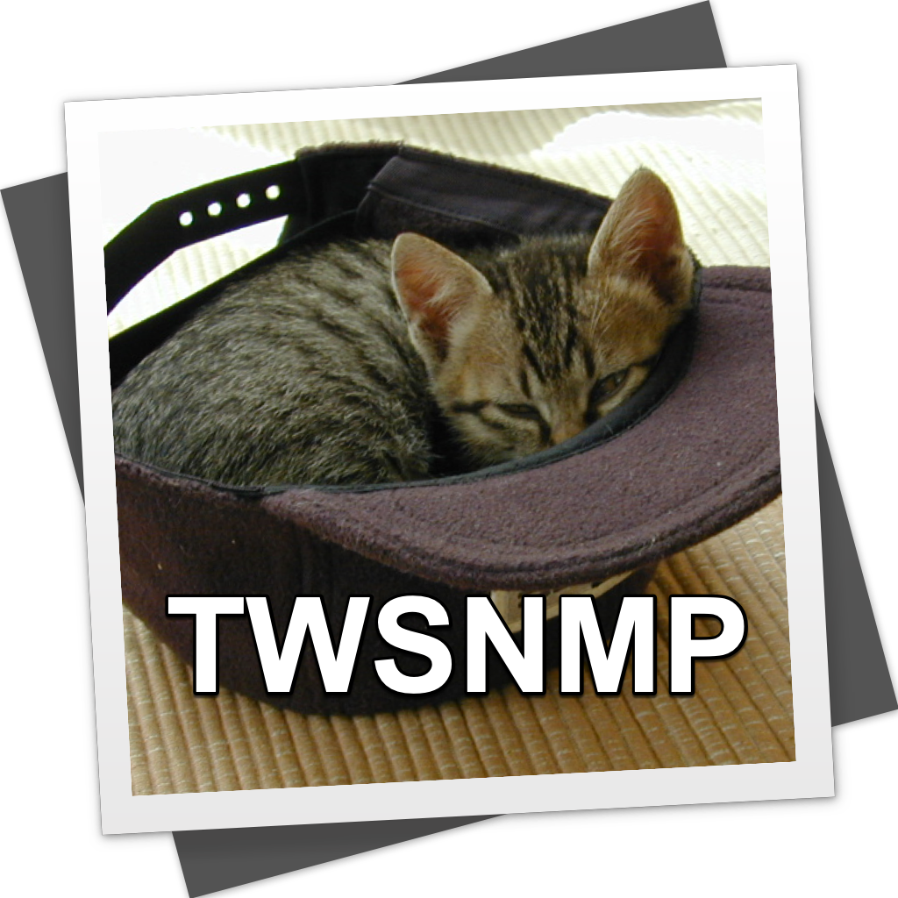
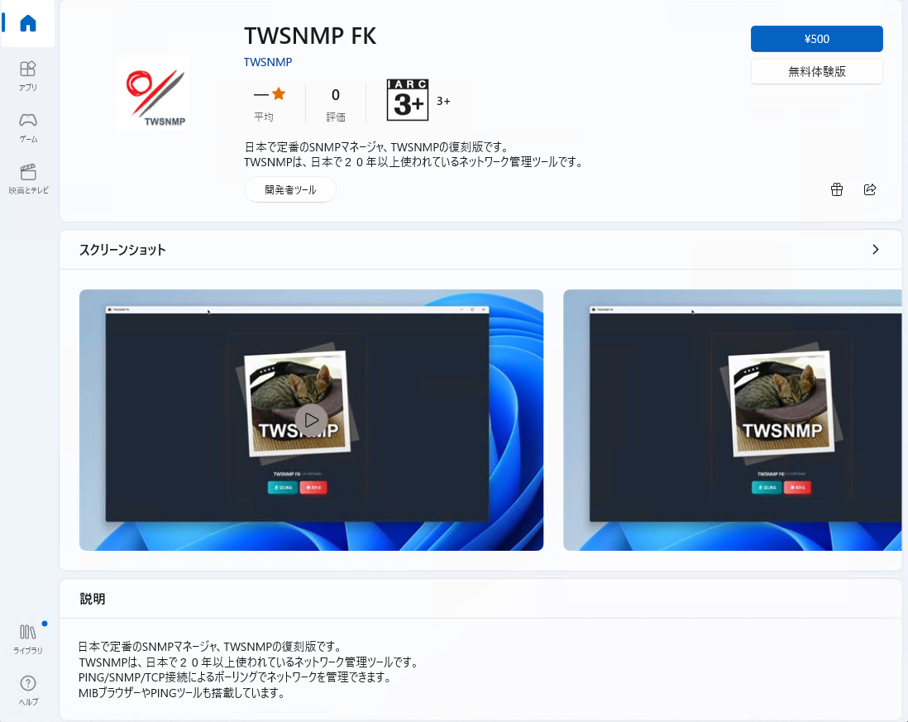
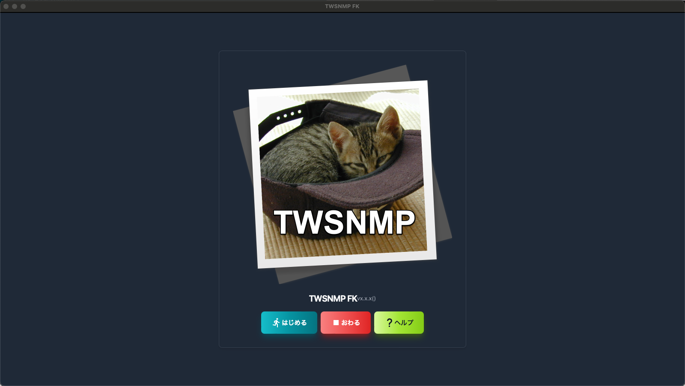

# はじめてのTWSNMP FK
日本で定番のSNMPマネージャー
復刻版



---

## はじめに

TWSNMPは日本で20年以上定番のSNMPv3に対応したSNMPマネージャです。
これを2023年の最新機技術で復刻したのがTWSNMP FKです。
コンテナで動作するTWSNMP FCはWebブラウザーからアクセスして操作しますが、FKは、デスクトップアプリであるためブラウザー不要です。


---

## Windows版Microsoft Store
Windows版は
https://www.microsoft.com/store/apps/9NSQN46P0MVL

で購入できます。





---
## Scoop

https://scoop.sh/
を参照してScoopをインストール後に

```
>scoop bucket add twsnmp https://github.com/twsnmp/scoop-bucket
>scoop install twsnmpfk
```
でTWSNMP FKをインストールできます。
（無料で使いたい人向けです。）

---

## Mac OS版のApp Store

Mac版は
https://apps.apple.com/jp/app/twsnmpfk/id6468539128
で購入できます。
無料で使いたい人は、
https://github.com/twsnmp/twsnmpfk/releases
からパッケージをダウンロードできます。


---

## TWSNMP FKの起動

Windowsの場合はスタートメニューからMac OSの場合はランチャーからなどお好きな方法で起動してください。ようこそ画面が表示されます。
＜はじめる＞ボタンで開始します。
＜おわる＞ボタンでプログラムを終了します。
<ヘルプ＞ボタンで使い方の説明画面が表示されます。



---
## データを保存するフォルダーを選択

ようこそ画面で＜はじめる＞ボタンをクリックするとデータを保存するフォルダーを選択するダイアログが表示されます。フォルダー選択してください。新規の作成することもできます。


---
## 最初のマップ

新規のフォルダを選択して起動すると何もノードのないマップが表示されます。しばらくするとログが表示されます。


---
## ダークモード

右上の🌙マークをクリックすれば、ダークモードになります。私はダークモードが好きです。たぶんホワイトハッカーの目指す人はダークモードが好きだと思います。猫の世界にはホワイトハッカーしかいないそうです。By 先代助手の猫
現在の助手の猫さんは模様が白黒なので両方好きだそうです。


---
## はじめてのマップ作成の流れ

マップを作成する大まかな流れは、

- マップ上の適当な位置を右クリック
- メニューから「自動発見」を実行
- 検索するIPアドレス範囲を設定
- 自動発見を実行
- ノードの配置を調整
- ラインの接続

です。これで管理対象のネットワークに接続されたPCやルーター、サーバーなどを検索してマップに登録できます。

---
