[日本語の説明](./index_ja.html)

# TWSNMP FK
Most popular SNMP manager in Japan

{: width="256" }


## About

TWSNMP is an SNMP manager that supports the most popular SNMPv3 in Japan for over 20 years.
It is TWSNMP FK that has been reprinted with the latest machine technology in 2023.
The TWSNMP FC that runs on the container is accessed from the web browser, but the FK is a desktop app and does not require a browser.


## Microsoft Store
Windows version

[Microsoft Streo](https://www.microsoft.com/store/apps/9nsqn46p0mVL)

You can buy it.


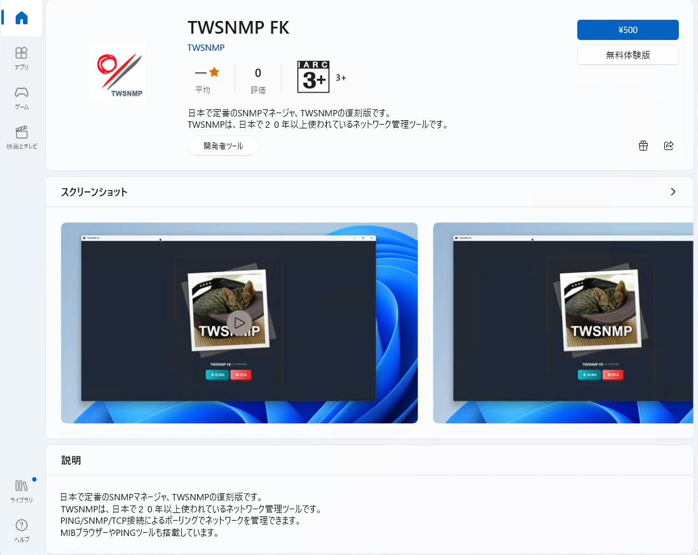{: width="95%" }


## App Store

The Mac version is

[Apple App Store](https://apps.apple.com/jp/app/twsnmpfk/id6468539128)

You can buy it.

{: width="95%"}


## Starting TWSNMP FK
In the case of Windows, start from the start menu to the Mac OS in your favorite method, such as from the launcher.Welcome to the screen.Start with the <Start> button.Stop the program with the <Stop> button.The explanation screen of how to use it is displayed with the <Help> button.
<!-- _class: tinytext -->

{: width="95%"}


## Select a folder to save data
Click the <Start> button on the screen to display a dialog to select a folder to save the data.Please select a folder.You can also create a new one.

{: width="95%"}


## First map
Select a new folder and start a map without node.After a while, the log will be displayed.

{: width="95%"}


## Flow of the first map creation
The flow of creating a map is

- Click the appropriate position on the map
- Start "Automatic discovery" from the menu
- The IP address range to be searched
- Precrose automatic discovery
- Move node on map
- Line connection

You can now search for PCs, routers, servers, etc. connected to the managed network and register on the map.


## Map

The map screen has three large parts.

{: width="95%" }


| Screen | Contents |
| ---- | ---- |
| Toolbar | Switch the screen.|
| Map | This is the part that displays the composition of the network.|
| Event Log | Displays the latest 100 event logs.|


###  Light/dark mode switching

Click the 🌙 mark on the upper right to dark mode.I like dark mode.Probably the person who aims for a white hacker likes dark mode.There are only white hackers in the cat world.By Cat of the predecessor assistant.The current assistant cat seems to like both because the pattern is black and white.

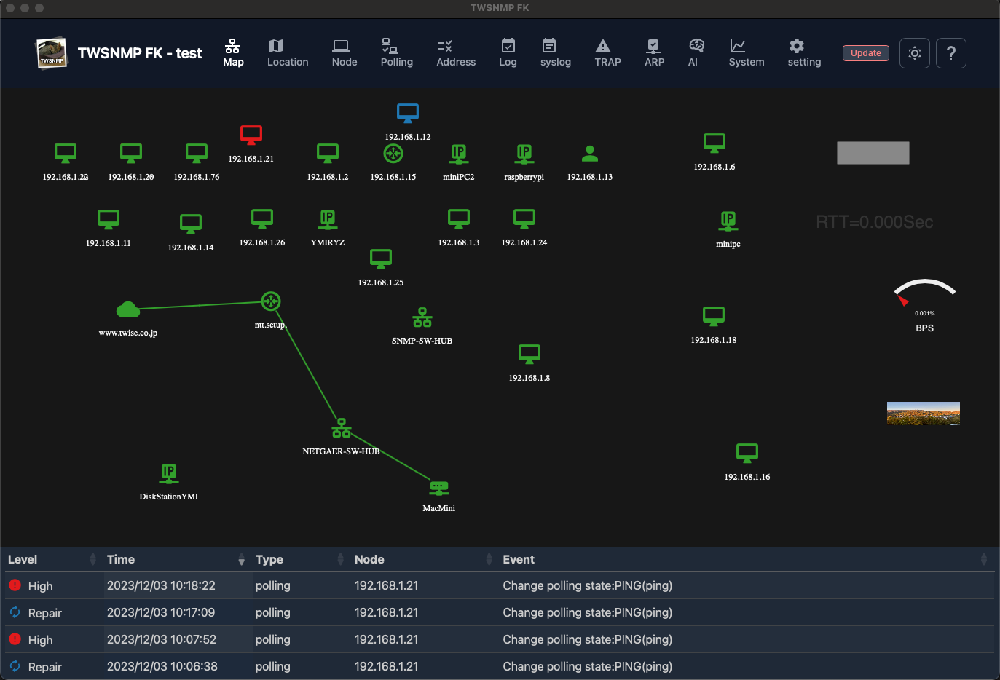{: width="95%" }


### Map menu

Right -click the location other than the node and drawing items on the map to display.


| Menu | Operation |
| ---- | ---- |
| Add node | Add the node to the map manually.|
| Draw item | Add drawing items to the map.|
| Check all | Reconfirm the node that has occurred.|
| Discover | Displays the automatic discovery screen.|
| Grid | Align the position of the node at the specified interval.|
| Backgrand image| set backgrand image to map|
| Reload | Update the map to the latest state.|
| Edit mode | All drawing items are displayed regardless of the state of the map.|


### Node menu
Right -click the node on the map to display it.


| Menu | Operation |
| ---- | ---- |
| Report | Displays the report screen related to the node.|
| Ping | Displays the ping screen.|
| MIB browser | Displays MIB browser.|
| gNMI Tool | Displays gNMI Tool.|
| Wake on LAN | Wake on LAN packet.|
| Edit | Displays the screen to edit the node settings.|
| Polling | Displays a polling list related to nodes.|
| ReCheck | Relieve the condition of the node by executing the polling.|
| Copy | Create a node duplication.|
| Delete| Delete node.|


### Draw item menu
Right -click the drawing item on the map to display it.

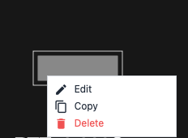

| Menu | Operation |
| ---- | ---- |
| Edit | Displays the screen to edit the drawing item settings.|
| Copy | Create drawing items.|
| Delete| Delete drawing items.|


### Discover
Automatic discovery screen.


| Items | Contents |
| ---- | ---- |
| Start IP | The first IP address range to search.|
| End IP | The end of the IP address range to search.|
| Timeout | This is the timeout of ping when searching.|
| Retry | This is the number of retrys of ping when searching.|
| Port scan | Perform a port scan on the found node.|
| add polling| Polling is automatically set on the found node.|
| <Start>| Start automatic discovery.|
| <Auto IP range> | Automatically set the search range from the PC IP address.|


#### Automatic discovery is being performed

The number of nodes you have executed or discovered is displayed.


#### Automatic discovery is being executed (with port scanning)

The number of nodes you have executed or discovered is displayed.When performing a port scan, the discovered server function is also displayed.


### Node editing

You can edit the node from the menu or button by selecting a node on the map screen or node list.


| Items | Contents |
| ---- | ---- |
| Name | Node name.|
| IP address | Node IP address.|
| Address mode | IP address fixation (default), MAC address fixing, host name fixed.|
| Icon | It is an icon to be displayed.|
| Auto recheck | When it is returned, it will be automatically normal.|
| SNMP mode | SNMP mode.There are SNMPv1, V2C, V3 (authentication and encryption).|


| Items | Contents |
| ---- | ---- |
| SNMP Community | Community name for SNMPV1, V2C.|
| User | User ID when accessing with SNMPv3.|
| Password | Password when accessing with SNMPv3.|
| Public key | This is the public key of the node when polling with SSH.<br> In the case of blank, automatically set at the first connection.|
| URL | URL when accessing with browser etc.<br> It will be displayed on the right -click menu.<BR> You can specify multiple by separation of comma.|
| Description | Supplementary information is described.|


### Drawing item (rectangle, elliptical)

It is an edit screen of drawing item (rectangle, elliptical).


| Items | Contents |
| ---- | ---- |
| Type | It is a type of drawing item.You can only change it when you add it.|
| Width | The width of the drawing item.|
| Height | It is the height of the drawing item.|
| Color | It is the color of the drawing item.|
| Display condition | It is a state of the map that displays drawing items.|
| Magnification | The display rate of drawing items.|


### Drawing item (label)

It is the editing screen of the drawing item (label).


| Items | Contents |
| ---- | ---- |
| Type | It is a type of drawing item.You can only change it when you add it.|
| Character size | Label character size.|
| Color | It is the color of the drawing item.|
| Display condition | It is a state of the map that displays drawing items.|
| Character string | It is a string to be displayed.|
| Magnification | The display rate of drawing items.|

### Drawing item (image)
It is the editing screen of drawing item (image).


| Items | Contents |
| ---- | ---- |
| Type | It is a type of drawing item.You can only change it when you add it.|
| Width | It is the width of the image.|
| Height | It is the height of the image.|
| Display condition | It is a state of the map that displays drawing items.|
| Image | It is an image to be displayed.Select an image file with the <Select> button.|
| Magnification | The display rate of drawing items.|


### Drawing item (polling result)
It is the editing screen of drawing item (polling result: text).


| Items | Contents |
| ---- | ---- |
| Type | It is a type of drawing item.You can only change it when you add it.|
| Size | Character size.|
| Node | This is a node list for selecting polling.|
| Polling | Polling that displays results.|
| Variable name | The name of the variable displayed from the polling results.|
| Display format | Format when displaying.|
| Magnification | The display rate of drawing items.|

### Drawing item (polling result: gauge)
It is the editing screen of drawing item (polling result: gauge).It can be used to display % data.


| Items | Contents |
| ---- | ---- |
| Type | It is a type of drawing item.You can only change it when you add it.|
| Size | Gauge size.|
| Node | This is a node list for selecting polling.|
| Polling | Polling that displays results.|
| Variable name | The name of the variable displayed from the polling results.|
| Gauge label | This is a character string displayed under the gauge.|
| Magnification | The display rate of drawing items.|


### Line editing

To edit the line, press the two nodes while pressing the shift key on the map screen.


| Items | Contents |
| ---- | ---- |
| Node1 | This is the first node to connect the line.|
| Polling1 | This is the first node polling that determines the color on one side of the line.|
| Node2 | This is the second node to connect the line.|
| Polling2 | This is the second node polling that determines the color on one side of the line.|


| Items | Contents |
| ---- | ---- |
| Polling for information | Polling for information displayed next to the line.<br> Specify the traffic monitor polling.|
| Information | Set the character string to be displayed next to the line.<br> It will be overwritten by setting a polling for information.|
| Thickness of the line | It is the thickness of the line.|
| Port | Specify the port number used when displaying the panel.|

### PING

This is the screen to execute ping.
To get a location information, you need a Geoip database file.


| Items | Contents |
| ---- | ---- |
| IP address | This is the IP address to run ping.|
| Number of times | Ping is the number of execution times.|
| Size | Ping packet size.<br> The change mode is executed while increasing the size.|
| TTL | TTL value of ping packet.<br> The trace route runs while increasing the TTL value.|
|Result Graph | Ping's execution result is a graph of the response time, TTL value.|

| Items | Contents |
| ---- | ---- |
| Results | Ping execution results.<br> As a result, the date and time of implementation, the response time, the size, the transmission reception TTL, the source IP, the location |
| Beep | Ping will be informed by sound.|
| Start | Start ping.|
| Stop | Ping stops.|
| Close | Ends ping.|


####  PING Histogram

It is a histogram of response time.


#### PING 3D analysis

The response time, size, and implementation date and time are displayed in 3D graphs.

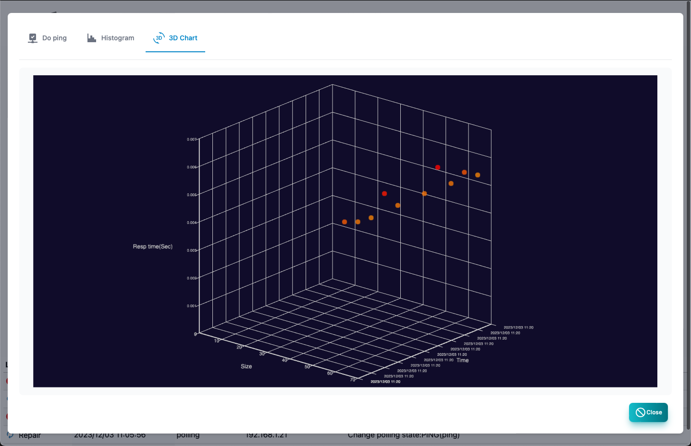


####  PING Line speed prediction

From the change in response time if the size is changed
This is a report that predicts the line speed.


#### PING Route analysis

Display location information.It cannot be displayed without a GEOIP database.


### MIB browser

This is a screen to get MIB information of SNMP from the node.
It is necessary to set SNMP access information in the node setting.
If you want to use MIB other than built -in, save the MIB file to the extmibs of the data folder.


| Items | Contents |
| ---- | ---- |
| Object name | Specify the object name of the MIB you want to get.<br> You can choose from the MIB tree.Example: System |
|<MIB Tree> button|Displays the MIB tree for object selection. |
| History | It is the history of the object name obtained so far.You can select and get it again.|
| Results | Acquired MIB information.In the case of MIB in a table format, it is automatically displayed in a table format.|
|Copy|Click to copy the selected MIB to the board. |
|Polling|Create a poll from the selected MIB. |
|SET|Displays a dialog to perform SET on the selected MIB. |
|Scalar only|Display only objects with index 0. |
| Raw data | Displays the acquired MIB information without converting it.<BR> In the case of off, convert the time data to an easy -to -understand display.|
| Get | Get MIB information.|
|MIB Tree|Displays the acquired MIB information in a tree view. |
| CSV | Export the obtained MIB information of the CSV file.|
| Excel | Export the acquired MIB information of the Excel file.|


#### MIB tree

This is a screen for selecting the obtained MIB object name.
Open the tree and click the object name to see the explanation.
Double click to select.


#### Set dialog

This is the screen for executing SNMP Set. Specify the object name, type, and value and press the <SET> button.
Click to send a Set request.


### GNMI tool

<!-_class: TinyText->
This is a screen to acquire management information from Node from GNMI.
You need to set the GNMI in the node settings.

| Items | Contents |
| ---- | ---- |
| Target | Specify the IP: port to access with GNMI.|
| Encoding | Specify GNMI encoding.(JSON | JSON_IETF) |
| PATH | Specify the path to get.|
| History | Path history acquired so far.You can select and get it again.|
| Result | This is the result of acquired.|
| Copy | Copy the acquired results.|
| Polling | Create a polling from the selected result.|
| Capabilities | Get Capabilities.|
| YANG Information | Displays GitHub in the Yang file.|
| Acquisition | Execute GET under the specified conditions.|
| CSV | Save the result with CSV.|
| Excel | Save the result with Excel.|


## Location Map screen

This is a screen that displays the node on the map.
Map data can be used in OpenStreetMap, which is used in location information services.
You can select by clicking the node.You can move by dragging.Multiple choices cannot be selected.


| Items | Contents |
| ---- | ---- |
| Edit | Displays the screen of the selected node.|
| Polling | Displays the selected node polling.|
| Delete| Delete the selected node from the map screen.|
| Report | Displays the selected node report screen.|
| Initial display| Save the center and zoom level of the map.The next time you open the map screen, it will be in the same state.|
| Reload | Update the list of event logs to the latest state.|


### Add node to location map

Right -click where you want to place the node on the map and the dialog to add is displayed.You can add it by selecting a node.


## Node list
A list of nodes to be managed.


| Items | Contents |
| ---- | ---- |
| State | Node condition.<br> Severe, mild, precautions, return, normal, unknown.|
| Name | Node name.|
| IP address | Node IP address.|
| MAC address | Node MAC address.|
| Vendor | The name of the vendor corresponding to the MAC address.|
| Description | Supplementary information about nodes.|
| Edit | Edit node settings.|
| Polling | Displays a list of polling related to the selected node.|
| Report | Displays the selected node analysis report.|
| Delete| Delete the selected node.|
| Reconfirm | Reconfirm the polling of the selected node.|
| Remost confirmation | Reconfirm all nodes polling.|
| CSV | Export the node list to the CSV file.|
| Excel | Export the node list to the Excel file.|
| Reload | Update the node list to the latest state.|


### Node polling list

A list of polling related to nodes.


| Items | Contents |
| ---- | ---- |
| State | Polling state.<br> Severe, mild, precautions, return, normal, unknown.|
| Name | Polling name.|
| Level | Pauling level.|
| Type | Polling type.<br> Ping, SNMP, TCP, etc. |
| Log | Log mode.|
| Last time | This is the last date and time when polling was implemented.|
| Add | Add polling to nodes.|
| Edit | Edit the selected polling.|
| Copy | Create a selected polling copy.|
| Report | Displays the selected polling analysis report.|
| Delete | Delete the selected polling.|
| Reload | Update the polling list to the latest state.|
| Close | Close the list of polling.|


### Basic information report
Basic information about nodes.


### Memo

Memo about the node.


### node event log
This is an event log related to the node.


### Panel

Displays the appearance of the node.Displays the port from the acquisition of the interface mib by SNMP or the line connection information.The <physical port> switch can only be displayed on the physical port.Rotate the panel display with the <rotation> switch.


### Host information
Displays the information of the host resource mib of SNMP.If it is not compatible with the host resource MIB, it cannot be displayed.


### Storage

Displays the storage information of SNMP host resource mib.When you select, the addition button of the polling will be displayed.If it is not compatible with the host resource MIB, it cannot be displayed.

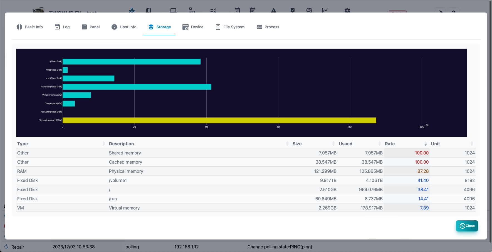


### Device

Displays the device information of the SNMP host resource MIB.If it is not compatible with the host resource MIB, it cannot be displayed.


### File System

Displays File System, information on SNMP host sources MIB.If it is not compatible with the host resource MIB, it cannot be displayed.


### Process

Displays the process information of SNMP host resource mib.When you select, the addition button of the polling will be displayed.If it is not compatible with the host resource MIB, it cannot be displayed.


## Polling list

A list of polling to be managed.


---
| Items | Contents |
| ---- | ---- |
| State | Polling state.<br> Severe, mild, precautions, return, normal, unknown.|
| Node name | Node related to polling.|
| Name | Polling name.|
| Level | Pauling disability level.|
| Type | Polling type.|
| Log | Polling log mode.|
| Final confirmation | Polling final confirmation date and time.|
| Add | Add polling.|
| Edit | Edit the selected polling.|
| Copy | Copy the selected polling.|
| Export | Export the selected polling settings.|
| Report | Displays the selected polling analysis report.|
| Delete logs| Delete the selected polling logs.|
| Delete| Delete the selected polling.|
| CSV | Export the polling list to the CSV file.|
| Excel | Export the polling list to the Excel file.|
| Reload | Update the polling list to the latest state.|


### Polling template selection

This is the selection screen of the template displayed when adding polling.


| Items | Contents |
| ---- | ---- |
| ID | Template number.|
| Name | Polling name.|
| Type | Polling type.<br> Ping, SNMP, TCP, etc. |
| Mode | Polling mode.|
| Description | Polling explanation.|
| Template file | Import polling from template file|
| Add | Select polling.|
| Cancel | Polling Closes.|

### Basic information

Basic information about polling.


### Polling log

This is a log of the polling result.It is displayed only when the log mode is not output.


### Time chart

In the log of the polling result, the numerical data is displayed in a chronological graph.The displayed items can be selected at the top of the graph.It is displayed only when the log mode is not output.


### Histogram

The numerical data in the log of the polling result is displayed on the histogram.The displayed items can be selected at the top of the graph.It is displayed only when the log mode is not output.


### AI analysis

This is the result of AI analysis of numerical data in the log of the polling results.It is displayed only when the log mode is set to AI analysis and sufficient data is obtained.


### Polling editing

Polling edit can be displayed from the button by selecting a polling list on the polling list.


| Items | Contents |
| ---- | ---- |
| Name | Polling name.|
| Level | Pauling disability level.|
| Type | Polling type.<br> Ping, SNMP, TCP, etc. |
| Mode | Operation mode depends on the type of polling.|
| Log mode | How to save the polling result log.|
| Parameter | Polling type and mode -dependent parameters.|
| Filter | Polling type and filter condition that depends on mode.|
| Extract pattern | This is a GROK pattern that depends on the type of polling and the mode.Use when extracting data from logs.|
| Script | Java Script that determines disability and calculates variables.|
| Polling interval | Polling interval.|
| Timeout | Timeout at the time of polling.|
| Retry | This is the number of retry times when polling.|
|Failure Action|Sets the action when a failure occurs.|
|Return action|Sets the action when returning from an error.|

## Address list

This is a list of IP address found by TWSNMP.Only the IP address in the same segment found in the ARP watch function is displayed.You can detect duplicate and the change in the address.


| Items | Contents |
| ---- | ---- |
| State | It is the state of the address.(Normal, duplicate, IP change, Mac change.) |
| Address | IP address.|
| MAC address | MAC address.|
| Node name | The name of the node registered on the map as a management target.|
| Vendor | The name of the vendor corresponding to the MAC address.|
| Final change | This is the last change date and time.|
| Add node | Add the selected IP address to the map.It is displayed only when it is not registered.|
| Delete| Delete the selected IP address.|
| Report | Display the address list report.|
| clear| Clear all address lists.|
| CSV | Export the address list to the CSV file.|
| Excel | Export the address list to the Excel file.|
| Reload | Update the address list to the latest state.|


### IP address usage status

This is a report on the status of the set IP address.


### Relationship between IP and MAC address (force model)

This is a report that shows the relationship between IP address and MAC address with an force model.The normal address is one -on -one for the IP address and the MAC address.You can detect MAC addresses using the same IP address on multiple Macs or having multiple IP addresses.

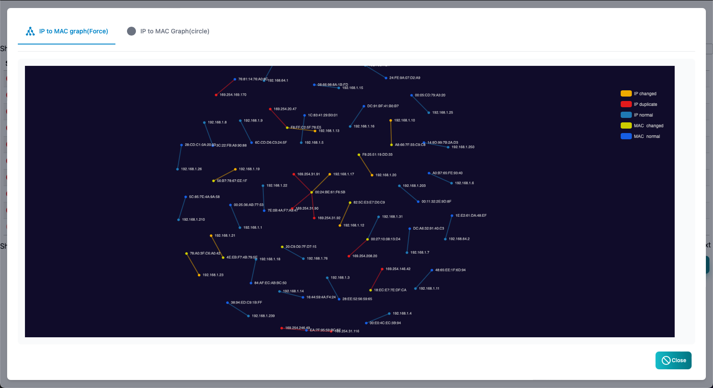

### Relationship between IP and MAC address (circular model)
This is a report that shows the relationship between IP address and MAC address with a circular model.The normal address is one -on -one for the IP address and the MAC address.You can detect MAC addresses with the same IP address on multiple Macs or have multiple IP addresses.


### Address Analysis

This screen displays detailed information on IP addresses, MAC addresses, and domain names.
It can be displayed from the address list or log lists (Syslog, NetFlow, etc.).
You can also enter a domain name to investigate.
The displayed information can be copied to the clipboard with the Copy button.

| Item | Contents |
| ---- | ---- |
| State | Information level (severity). |
| Name | Information item name. |
| Value | Information value. |

## Server certificate list

A list of server certificates to monitor from TWSNMP.


|Item|Content|
|----|---|
|>|Expand the server certificate details.|
|Status|Status certificate state.|
|Target|The IP address or host name of the server.|
|Port number|The port number to monitor.|
|Subject|This is the certificate content of the server certificate.Host name, etc. |
|Issuer|Issuer of the server certificate.|
|Start|The start date and time for the server certificate expiration date.|
|End|The end date and time of the server certificate expiration date.|
|Last Confirmation|The end date and time of the server certificate expiration date.|

|Button|Content|
|----|---|
|Add|Add monitored targets.|
|Edit|Edit the selected monitored object.|
|Delete|Deletes the selected monitored object.|
|Update|Refresh the list to the latest state.|

### Edit to monitor

This is the editing screen to be monitored.


Specify an IP address or host name or IP address for the target.
For port, specify the number of the port you monitored.

## PKI CA construction

This is the screen before building a CA for the PKI function.


|Item|Content|
|----|---|
|Name|This is the name of the CA.I'll try to use the Subject of the CA certificate.|
|DNS name|Specify the CDP of the certificate to be issued, the OCSP address, the host name and IP address to be used for SANs for the certificate of the ACME server, separated by commas.|
|ACME URL|This is the basic URL for the ACME server.Blanks will be automatically set from the host name.|
|OCSP/SCEP Server URL|This is the basic URL for the CRL/OCSP/SCEP Server.Blanks will be automatically set from the host name.|
|CA key type|Specify the CA key type.|
|CA certificate duration|Specify the number of years the certificate is valid.|
|CRL Update Interval|Specify the CRL update interval in hours.|
|Certificate Period|Specify the period of the certificate to be issued in hours.|
|CRL/OCSP/SCEP server port number|Specify the HTTP server port number.Cannot be changed later.|
|ACME Server Port Number|Specify the ACME Server Port Number.Cannot be changed later.|

### Certificate list

After the CA is built, the certificate list screen will be displayed.You can check the issued certificate.


|Item|Content|
|----|---|
|Status|Certificate status.|
|Type|Certificate type.|
|ID|Certificate serial number.|
|Subject|A Subject for the certificate.|
|Node|The node where the certificate was obtained.|
|Created|The start date and time of the certificate period.|
|Expire|The end date and time of the certificate period.|
|Revoked|The date and time the certificate was revoked.|
|Create CSR|Displays the screen for creating a certificate request (CSR).|
|Certificate creation|Read the CSR and issue the certificate.|
|CA Initialization|Destroy CA.|
|Server Control|Displays the server control screen.|
|Renew|Update the certificate list.|
|Revokes|Revokes the selected certificate.|
|Export|Saves the selected certificate to a file.|


#### Create CSR

This is the screen for creating a certificate request (CSR).


|Item|Content|
|----|---|
|Key type|Specifies the key type for CSR.|
|Name|Specifies the value for CN.|
|SANs|Subject Alt Names are specified, separated by commas.|
|Organization name|Specify the organization name.It's OK to leave blank.|
|Organization Unit|Specify an organizational unit.It's OK to leave blank.|
|Country code|Specify the country code.It's OK to leave blank.|
|State/Province name|Specify the state or prefecture name.It's OK to leave blank.|
|City name|Specify the city name.It's OK to leave blank.|


### Server Control

This is a screen that controls the operation of the PKI server.


|Item|Content|
|----|---|
|ACME Server|Start the ACME server.|
|CRL/OCSP/SCEP Server|Start the CRL/OCSP/SCEP server.|
|ACME Server Basic URL|Specifies the basic URL that the ACME server responds to.|
|CRL Update Interval|Specify the CRL update interval in hours.|
|Certificate Period|Specify the period of the certificate to be issued in hours.|

## Event Log

This is the event log screen.At the top, there is a graph showing the number of logs in chronological order.


| Items | Contents |
| ---- | ---- |
| Level | Log level.There is severe, mild, attention, return, and information.|
| Date and time | The date and time of the log is recorded.|
| Type | Log type. Polling, System, Oprate, User, ArpWatch, |
| Related node | Name of node related to logs.<br> The blank means that there is no related node.|
| Event | This is an event that occurred.|
| Filter | Specify the search conditions and display the log.|
| Delete all logs | Delete all event logs.|
| Report | Displays the event log analysis report.|
| CSV | Export the event log to the CSV file.|
| Excel | Export the event log to the Excel file.|
| Reload | Update the list of event logs to the latest state.|


### Event log filter

This is a dialog that specifies the search conditions for the event log.


| Items | Contents |
| ---- | ---- |
| Level | Log level.All, there are more attention, more than severe, mild.|
| Type | Log type. Polling, System, Oprate, User, ArpWatch, |
| Related node | Search by node name related to the log.|
| Event | Search by the string of the event that occurred.|


> The string can be searched by regular expression.

### Event log count by state

This is a report of the number of event logs by state (level).


### Event log Heatmap

This is a report of the number of cases of each event log on the heat map.


### Event log count by node

This is a report of the number of event logs by node.

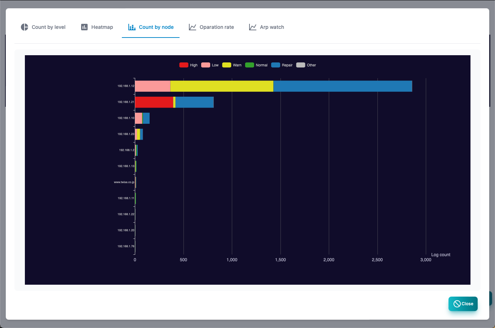

### Operating rate

This is a report that uses a chronological graph of the value of the operating rate (OPRATE) in the event log.


### ARP watch

This is a report of the value of the address usage rate (ARPWATCH) in the event log as a chronological graph.


## Syslog

Syslog screen.At the top, there is a graph showing the number of logs in chronological order.


| Items | Contents |
| ---- | ---- |
| Level | Syslog level.There is severe, High,Low, Warn, and information.|
| Date and time | It is the date and time when I received syslog.|
| Host | SYSLOG source host.|
| Type | Syslog Facility and priority string.|
| Tags | Syslog tag.Process and process ID.|
| Message | Syslog message.|
| Polling | Register the polling from the selected syslog.|
| Filter | Specify the search conditions and display syslog.|
| Delete all logs | Delete all syslogs.|
| Report | Displays Syslog analysis reports.|
| Export CSV | syslog to CSV file.|
| Excel | EXCEL file is exported to syslog.|
| Reload | Update the list of syslog to the latest state.|

### Syslog Filter

This is a dialog that specifies the search conditions for syslog.


| Items | Contents |
| ---- | ---- |
| Level | Syslog level.<BR> All, more than information, more than caution, mild or higher, more severe.|
| Host | It is the source host.|
| Tags | The value of the syslog tag.|
| Message | Syslog message.|

> Host,Tag,Message can be searched in regular expressions.

### Syslog count by state

This is a report of the number of syslogs by state.


### Syslog Heatmap

This is a report of the number of cases of syslog on the heat map.


### Normalization Analysis

This is a report that normalizes syslog and aggregates it.
It counts numbers, IP addresses, email addresses, etc. with common characters.


### Syslog count by host

This is a report of the number of syslogs by the source host.


### Syslog count by host (3D)

This is a report displayed in three -dimensional graphs of Syslog, source host, priority, and time.


### Syslog FFT

This is a report that analyzes Syslog for each host and analyzes the number of receiving cases.


## SNMP TRAP

SNMP Trap log screen.At the top, there is a graph showing the number of logs in chronological order.


| Items | Contents |
| ---- | ---- |
| Date and time | This is the date and time of receiving SNMP Trap.|
| Sending source | SNMP Trap's source host.|
| Type | SNMP Trap type.|
| Variables | Variables attached to SNMP Trap.|
| Polling | Register the polling from the selected SNMP Trap.|
| Filter | Specify the search conditions and display SNMP Trap.|
| Delete all logs | Delete all syslogs.|
| Report | Displays the analysis report of SNMP Trap.|
| CSV | Sport the SNMP Trap to the CSV file.|
| Excel | Export SNMP Trap to Excel file.|
| Reload | Update the SNMP Trap list to the latest state.|


### SNMP TRAP Filter

This is a dialog that specifies the search conditions for SNMP Trap.


| Items | Contents |
| ---- | ---- |
| Sending source | It is the source host.|
| Type | SNMP Trap type.|

> Character strings can be searched in regular expressions.

### SNMP TRAP count by TRAP type

This is a report of the number of SNMP traps by type.

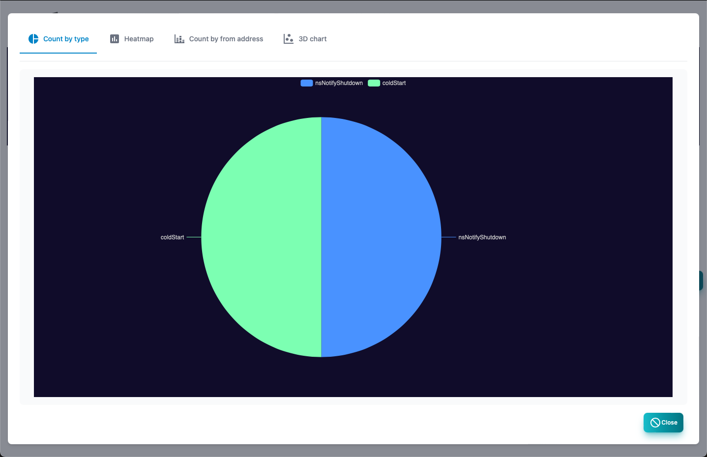


### SNMP TRAP  Heatmap

This is a report of the number of cases of SNMP TRAP on the heat map.


### SNMP TRAP count by host

This is a report of the number of SNMP Trap receiving cases by source host.


### SNMP TRAP send source and type (3D)

This is a report displayed in the source host, type, and three -dimensional graph of the SNMP Trap receiving log.


### NetFlow

This is the analysis screen of Netflow.


#### Explanation of table items

| Items | Contents |
| ---- | ---- |
| Date and time | The date and time of receiving Netflow.|
| Sending source | It is the source IP.|
| Port | It is the port number of the source.|
| Location | It is the source of the source.GEOIP DB is required.|
| Address | IP for the destination.|
| Port | The destination port number.|
| Location | It is the destination position.GEOIP DB is required.|
| Protocol | Protocol such as TCP/UDP/ICMP.|
| TCP flag | TCP flag.|
| Packet | The number of sending packets.|
| Byte | The number of sending bytes.|
| Period | Flow communication time.|


#### Button

| Items | Contents |
| ---- | ---- |
| Filter | Specify the search conditions and display Netflow.|
| Delete all logs | Delete all Netflow.|
| Copy | Copy the selected log.|
| Report | Displays Netflow analysis reports.|
| CSV | Export Netflow to CSV file.|
| Excel | Export Netflow to Excel file.|
| Update | Update the Netflow list to the latest state.|


#### Filter item

It is a filter for netflow search.


| Items | Contents |
| ---- | ---- |
| Start date and time | Specify the date and time of the search start.|
| End date and time | Specify the date and time of the search termination.|
| Simple mode | Mode to apply IP, port, and position in both directions.|
| IP | In the case of simple mode, specify the source and destination IP.|
| Port | In the case of simple mode, specify the source and destination port.|
| Location | Specify the source and destination position in the case of simple mode.|
| Sending source IP | Specify the source IP.|
| Port | Specify the source port.|
| Location | Specify the source position.|
| Destination IP | Specify the destination IP.|
| Port | Specify the destination port.|
| Location | Specify the destination position.|
| Protocol | Specify the protocol name.|
| TCP flag | Specify the TCP flag.|

#### Netflow report

| Report name | Contents |
| ---- | ---- |
| Heat Map | Heat map by time zone of Netflow's receiving number.|
| Histogram | Histgram of numerical data.|
| Traffic | This is a time -series graph of traffic.|
| TOP List | This is a ranking report for each item.|
| TOP list (3D) | Ranking reports for each item are displayed in 3D graphs.|
| IP Pair Flow | The combination of communication is displayed in a graph.|
| FFT Analysis | Analyzing the communication cycle with FFT.|
| FFT Analysis (3D) | Analyze the communication cycle with FFT and display it on the 3D graph.|
| Map | Display the position of the IP address on the map.|


#### sFlow

This is the analysis screen of sFLOW.


##### Flow sample

| Items | Contents |
| ---- | ---- |
| Date and time | It is the date and time when the SFLOW sample received.|
| Sending source | It is the source IP.|
| Port | It is the port number of the source.|
| Location | It is the source of the source.GEOIP DB is required.|
| Mac | This is the MAC address of the source.|
| Address | IP for the destination.|
| Port | The destination port number.|
| Location | It is the destination position.GEOIP DB is required.|
| Mac | This is the destination MAC address.|
| Protocol | Protocol such as TCP/UDP/ICMP.|
| TCP flag | TCP flag.|
| Byte | The number of sending bytes.|

#### Description of button

| Items | Contents |
| ---- | ---- |
| Counter | Switch between flow samples and counter samples.|
| Filter | Specify the search conditions and display sFlow.|
| Delete all logs| Delete all sFlow.|
| Copy | Copy the selected log.|
| Report | Displays SFLOW analysis reports.|
| CSV | Export sFlow to CSV file.|
| Excel | Export SFLOW to Excel file.|
| Update | Update the SFLOW log to the latest state.|

#### Flow sample filter item

| Items | Contents |
| ---- | ---- |
| Start date and time | Specify the date and time of the search start.|
| End date and time | Specify the date and time of the search termination.|
| Simple mode | Mode to apply IP, port, and position in both directions.|
| IP | In the case of simple mode, specify the source and destination IP.|
| Port | In the case of simple mode, specify the source and destination port.|
| Location | Specify the source and destination position in the case of simple mode.|
| Sending source IP | Specify the source IP.|
| Port | Specify the source port.|
| Location | Specify the source position.|
| Destination IP | Specify the destination IP.|
| Port | Specify the destination port.|
| Location | Specify the destination position.|
| Protocol | Specify the protocol name.|
| TCP flag | Specify the TCP flag.|

> Strings can be searched using regular expressions.

##### Counter sample

| Items | Contents |
| ---- | ---- |
| Date and time | It is the date and time when the SFLOW sample received.|
| Sending source | It is the source IP.|
| Type | The type of counter sample.(I/F, CPU, Memory, Disk, Netowk) |
| Data | Data of counter sample.|

#### Counter sample filter item

| Items | Contents |
| ---- | ---- |
| Start date and time | Specify the date and time of the search start.|
| End date and time | Specify the date and time of the search termination.|
| Submit | Specify the source.|
| Type | Specify the type of counter sample.|

> The character string can be searched by regular expression.

#### Flow sample report

| Report name | Contents |
| ---- | ---- |
| Heat map | Heat map showing the number of log time.|
| Communications | This is a time -series graph of communication volume.|
| TOP List | This is a ranking report for each item.|
| TOP list (3D) | Ranking reports for each item are displayed in 3D graphs.|
| IP Pair Flow | The combination of communication is displayed in a graph.|
| FFT Analysis | Analyzing the communication cycle with FFT.|
| FFT Analysis (3D) | Analyze the communication cycle with FFT and display it on the 3D graph.|
| Map | Display the position of the IP address on the map.|

#### Counter sample report

| Report name | Contents |
| ---- | ---- |
| Heat map | Heat map showing the number of log time.|
| I/F BPS | This is a time -series graph of the communication volume (Bytes/Sec) obtained from I/F sample.|
| I/F PPS | This is a time -series graph of the communication volume (Packets/Sec) obtained from I/F sample.|
| CPU | CPU usage rate and load time series graph acquired from CPU sample.|
| Memory | Memory is a graph of memory usage and available capacity obtained from a sample.|
| DISK | This is a graph of disk usage and access amount acquired from Disk sample.|
| Network | Network is a graph of network usage obtained from sample.|


## ARP warch log

ARP watch log screen.
At the top, there is a graph showing the number of logs in chronological order.

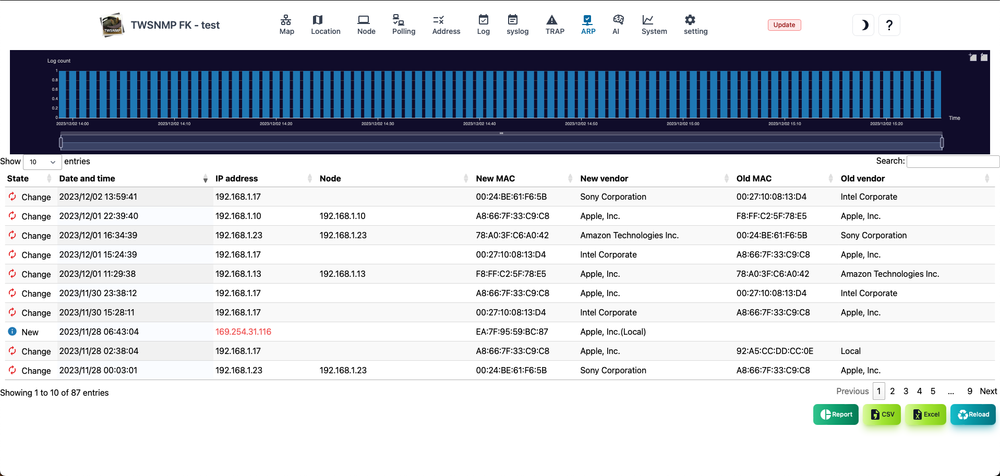

| Items | Contents |
| ---- | ---- |
| State | Log status.Either new or change.|
| Date and time | The date and time of the log.|
| IP address | IP address to log.|
| Node | The name of the node registered on the map.|
| New MAC | New discovery or MAC address after change.|
| New vendor | The vendor name of the new MAC address.|
| Old MAC | MAC address before change.|
| Old vendor | This vendor name of the old MAC address.|
| Report | Displays the ARP watch log analysis report.|
| CSV | Export the ARP watch log to the CSV file.|
| Excel | Export the ARP watch log to the Excel file.|
| Reload | Update the list of ARP watch logs to the latest state.|


### ARP watch log count by IP address

This is a report of the number of logs by IP address.The IP address with many changes is obvious at a glance.


### ARP watch log count by IP address (3D)

This is a report of ARP watch logs from both IP addresses and time series.The time of new discoveries and changes is obvious at a glance.


## OpenTelemetry

This is the OpenTelemetry Collector screen.
Toggle in the Metrics, Traces, and Logs tabs.

### metric

A list of received metrics.


|Item|Content|
|----|---|
|Source Host|The source host for the metric.|
|Service|Name of the service associated with the metric.|
|Scope|Name of the scope associated with the metric.|
|Name|Name of the metric.|
|Type|Metric type.|
|Number of times|The number of times the metric is received.|
|First time|The date and time when the metric was first received.|
|Last|The date and time when the metric was last received.|

#### Metric (button)

|Item|Content|
|----|---|
|Report|View a graph for the selected metric.|
|<span style="color: red;">Delete all logs</span>|Delete all data from OpenTelemetry.|
|Update|Update information.|

#### Time Chart

Select a metric and click the Report button to display the time chart.


#### histogram

If the metric is a histogram, selecting a row in the table displays the histogram for that time.


### trace

This is the screen for the received trace.At the top there is a graph showing the start time, processing time, and number of spans of traces.


|Item|Content|
|----|---|
|Start date and time|The start date and time for the trace.|
|End Date and Time|The end date and time of the trace.|
|Time|Tracing processing time.|
|Trace ID|The ID that identifies the trace.|
|Source Host|The source host for the trace.|
|Service|The service name associated with the trace.|
|Span|The number of Spans in the trace.|
|Scope|Related scope for traces.|

#### Trace (button)

|Item|Content|
|----|---|
|Report|View the graph for the selected trace.|
|DAG|Views relationships between services from traces for the selected time range.|
|Time Range|Specifies the time range for the trace.|
|<span style="color: red;">Delete all logs</span>|Delete all data from OpenTelemetry.|
|Update|Update information.|

#### DAG

Graphically displays relationships between services from traces in the selected time range.

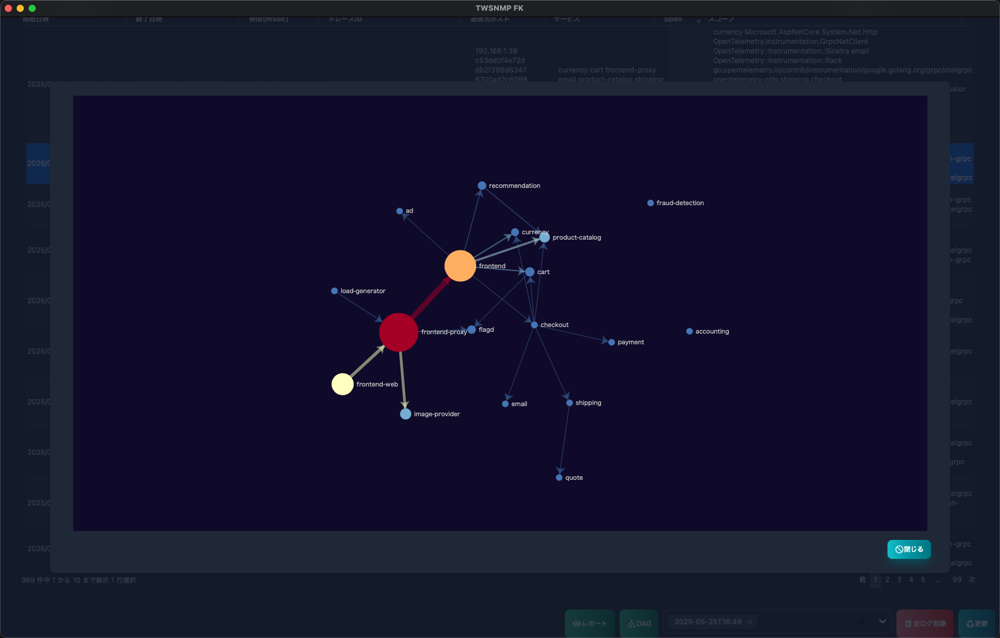

#### Timeline

Displays a graphical view of the selected Torres timeline.

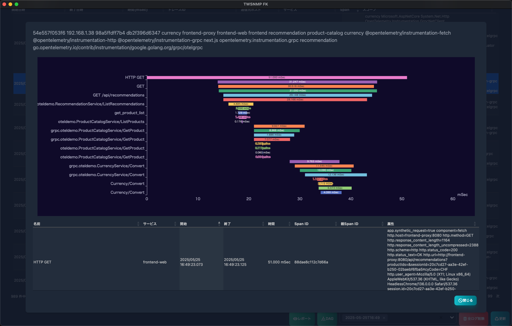


### log

This is a screen to search for the received OpenTelemetry logs from syslog.
At the top, you will see a graph by log level.


|Item|Content|
|----|---|
|Level|Syslog level.<br>Severe, mild, warnings and information.|
|Date and Time|The date and time when Syslog was received.|
|Host|The source host for Syslog.|
|Type|Stand for syslog facility and priority.|
|Tag|Syslog tag.Process and process ID etc.|
|Message|Syslog message.|

#### Log (button)

|Item|Content|
|----|---|
|<span style="color: red;">Delete all logs</span>|Delete all data from OpenTelemetry.I won't delete syslog.|
|Update|Update information.|

### OpenTelemetry Settings

The OpenTelemetry-related settings in the map settings are in the yellow box.

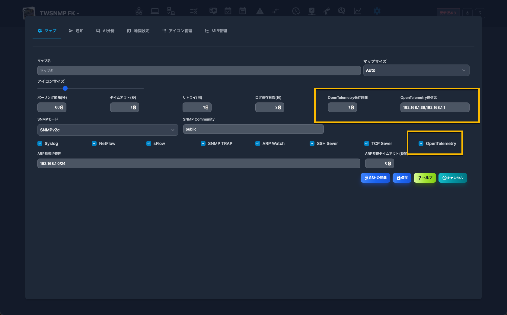

|Item|Content|
|----|---|
|Retention Time|Specifies the time to save metrics and traces.|
|Source|Limits the source IP.There are no limits to blank spaces.|
|Switch|Turns ON/OFF reception.|

### Startup parameters

```
 -otelCA string
			OpenTelementry CA cert path
	-otelCert string
			OpenTelemetry server cert path
	-otelGRPCPort int
			OpenTelemetry server gRPC port (default 4317)
	-otelHTTPPort int
			OpenTelemetry server HTTP port (default 4318)
	-otelKey string
			OpenTelemetry server key path
```

You can change the port number.
Specify the certificate and private key for otelCert and otelKey and enter TLS mode.
If you specify the certificate of the CA that issued the client certificate to otelCA, it will enter mTLS mode.

## MQTT

This is a list of received MQTT topics.


|Item|Contents|
|----|----|
|Status|Reception status. If you haven't received it for more than a day, it's a warning, and if you haven't received it for more than 7 days, it's a mild condition. Everything else is normal. |
|Client ID|The client ID of the sender. |
|Topic|Received topic name. |
|Number of times|Number of times the topic was received. |
|Number of Bytes|Number of bytes received by the topic. |
|First|The date and time the topic was first received. |
|Last Checked|The date and time the topic was last received. |

### MQTT(button)

|Item|Contents|
|----|----|
|<span style="color: red;">Delete</span>|Delete the selected MQTT data. |
|<span style="color: red;">Delete all MQTT data</span>|Delete all MQTT data. |
|Update|Update information. |

### MQTT settings

MQTT-related settings in the map settings are indicated by yellow arrows.


There are settings to enable/disable it and to record data received via MQTT to syslog.

### startup parameters

```
	-mqttCert string
			MQTT server cert path
	-mqttFrom string
			MQTT client IP
	-mqttKey string
			MQTT server key path
	-mqttTCPPort int
			MQTT server TCP port (default 1883)
	-mqttUsers string
			MQTT user and password
	-mqttWSPort int
			MQTT server WebSock port (default 1884)
```


## MCP Server

It has an MCP server function for AI to use TWSNMP FK.

### MCP Server Settings

The settings related to MCP server in the map settings are in the yellow box.


|Item|Content|
|----|---|
|MCP Server Transport|Select OFF/SSE/StreamableHTTP.|
|MCP Server Endpoint|Specify the IP address and port to receive.<br>Local only, 127.0.0.0:8089<br>If you receive at all addresses:8089 |

### MCP Server Features

The TWSNMP FK MCP (Management Control Protocol) server provides tools for network monitoring, SNMP management, and device control. 

[MCP server specifications](./mcp.html)

[MCP server prompt specifications](./mcp_prompt.html)

[MCP server system prompt](https://github.com/twsnmp/twsnmpfk/blob/main/docs/prompt.md)

## AI analysis

The screen of the AI analysis list.Only the list is displayed in the polling log settings and the analysis is performed.


| Items | Contents |
| ---- | ---- |
| anomaly score | A deviation value that indicates the degree of anomaly of AI analysis results.<br> 50 is average.Large values are highly anomaly.|
| Node name | The name of the node to be analyzed.|
| Polling | Polling for AI analysis.|
| Data count | The number of data to be analyzed AI.If you are small, the accuracy will be low.|
| Last time | The last date and time of AI analysis.|
| Report | Displays reports on the selected AI analysis results.|
| clear| Clear the selected AI analysis results.|
| Reload | Update the AI analysis list to the latest state.|

### AI anomaly score heatmap

This is a report showing an anomaly score on a daily heat map.It indicates that the red color is the time when the anomaly has occurred.


### AI anomaly score percentage

The percentage of the anomaly score in the entire period is shown in a circular graph.

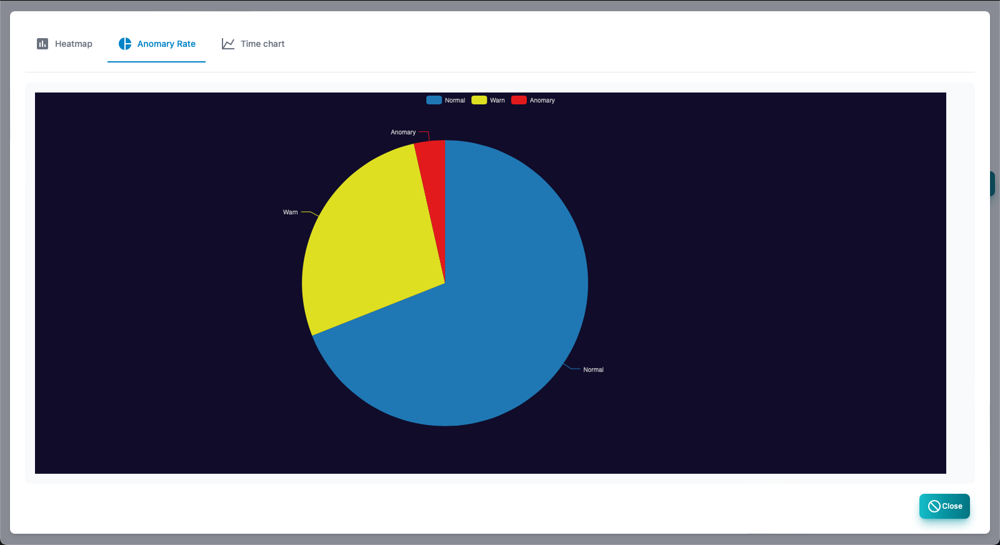


### AI anomaly score time chart

This is a report that displays an anomaly score in chronological order.


## System

System information screen.At the top, there is a graph showing log resources and communication information in a chronological order.


| Items | Contents |
| ---- | ---- |
| Date and time | It is the date and time when System information is recorded.|
| CPU | CPU usage rate.|
| Memory | Memory usage rate.|
| Disk | Data folder is the usage rate of disks.|
| Load | load.|
| Communication amount | LAN port communication amount.|
| Connection number | TCP connection number.|
| Process | Total number of processes.|
| DB size | Database size.|
| Size prediction | Database size and disk usage rate are forecast for one year.|
| Backup | Get backup.|
| Reload | Update System information to the latest state.|

### Size prediction

This is a year forecast for the database size and disk usage rate.

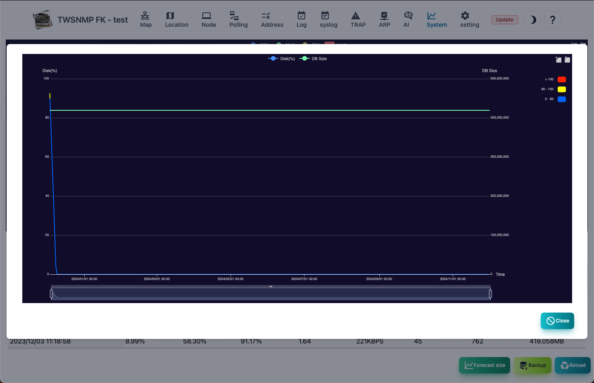

## Map settings

This is the screen to set the management map.


| Items | Contents |
| ---- | ---- |
| Map name | Map name.It will be displayed in the upper left of the screen.<br> Please give your favorite name.|
| Icon size | It is the size of the icon to be displayed on the map.|
| Polling interval | Default polling interval.|
| Timeout | Default timeout.|
| Retry | Default number of retry times.|
| Log saving days | It is the number of days to save the log.The log will be deleted automatically after passing.|
| SNMP mode | SNMP version and type of encryption.(SNMPV1, SNMPv2C, SNMPv3) |
| SNMP Community | Community name for SNMPV1, V2C.|
| SNMP user | User name at SNMPv3.|
| SNMP password | Password name for SNMPv3.|
| Syslog | Receive syslog.|
| SNMP Trap | Receive SNMP Trap.|
| SSH Seerver | SSH Server|
| ARP Watch | Enable ARP monitoring function.|


### When you want to change the receiving port of syslog, SNMP Trap

The port number is specified by the startup parameter of the program.


```
  -syslogPort int
    	Syslog port (default 514)
  -trapPort int
      SNMP TRAP port (default 162)
  -sshdPort int
      SSH Server port (default 2022)
```

> If SYSLOG or SNMP Trap cannot be received, check the OS and security software firewall settings.

## Notification settings

This is the screen to set the notification.


| Items | Contents |
| ---- | ---- |
|Provider|Select from smtp/Google/Microsoft.|
|Client ID|The OAuth2 (Google/Microsoft) client ID.|
|Client Secret|The OAuth2 (Google/Microsoft) client secret.|
|Tenant Name|The OAuth2 (Microsoft) tenant name.|
| Mail server | Specify a mail server to send notification emails.<br> Host name or IP address: port number |
| Do not check the server certificate | Check when the specified mail server is self certificate.|
| User | Set a user ID for authentication.|
| Password | Set the password for authentication|
| Form | Sending source email address.|
| To | Notification email destination email address.<BR> You can specify multiple by separation of comma.|
|Subject | Notification email subject.|
| Notification level | Specify the monitoring level to send disability notifications.|
| Notification interval | Specify the interval to check the notification.|
| Regular report | Send a daily report.|
| Repair notification | We will also send an email when you repair.|
|Notification Webhook|Specify the URL of the webhook to be POSTed in the event of a failure.|
|Report Webhook|Specify the URL of the webhook to be POSTed during periodic reports.|
| Command execution | Run the command specified in the state parameter when the map changes.<br> $ Level is in the map.0: Severe, 1: Mild, 2: Note, 3: Normal, -1: Unknown |
| Sounds played during severe disorders | Specify the audio file to play when the state of the map is severe.|
| Sounds played during mild disability | Specify the audio file to be played when the state of the map is mild.|


### Email send test

Click the <Test> button to send the test email with the configured content.


## AI analysis setting

This is the screen to set AI analysis.


| Items | Contents |
| ---- | ---- |
| Level to be high | Specify the deviation level of AI analysis determined as severe disorder.|
| Level to be low | Specify the deviation level of AI analysis determined as mild disorder.|
| Level to be warn | Specify the deviation level of AI analysis determined as a disorder.|


### About AI analysis

- The AI analysis is implemented by setting the log mode to "AI analysis" in the polling settings.
- An anomaly detection of the numerical data of the polling result in isolation forest.
- The results are set to deviation values.
- The deviation value is familiar to school results.It shows how rare it is.
- So, the disability level setting is an expression of once every 10,000 times.


## Location map settings

This is the screen to set the map.

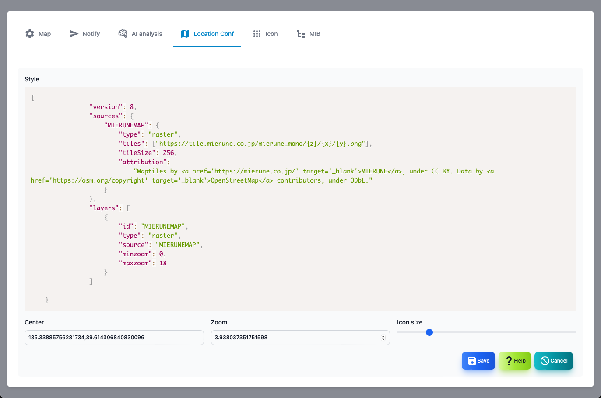

| Items | Contents |
| ---- | ---- |
| Style | Specify the map style.Specify in URL or JSON.|
| Central coordinates | The central coordinates on the map are in the order of longitude and latitude.<br>Example: 135.3338576281734, 39.614306840830096 |
| Zoom | Specify the enlargement level of the map.|
| Icon size | Specify the size of the icon to be displayed.|

### About map style

The map is displayed using Maplibre GL JS.The map to be displayed is specified in the style.
You can specify it with URL or JSON.Search for MAPLIBRE GL JS and find something suitable.


##### URL example

```
https://tile.openstreetmap.jp/styles/osm-bright-ja/style.json
```


##### JSON example

```json
{
			 	"version": 8,
			 	"sources": {
			 		"MIERUNEMAP": {
						"type": "raster",
			 			"tiles": ["https://tile.mierune.co.jp/mierune_mono/{z}/{x}/{y}.png"],
						"tileSize": 256,
			 			"attribution":
			 				"Maptiles by <a href='https://mierune.co.jp/' target='_blank'>MIERUNE</a>, under CC BY. Data by <a href='https://osm.org/copyright' target='_blank'>OpenStreetMap</a> contributors, under ODbL."
			 		}
			 	},
			 	"layers": [
					{
						"id": "MIERUNEMAP",
		 				"type": "raster",
			 			"source": "MIERUNEMAP",
			 			"minzoom": 0,
			 			"maxzoom": 18
			 		}
			 	]
}
```


## Icon management

This is a screen that manages the icon.

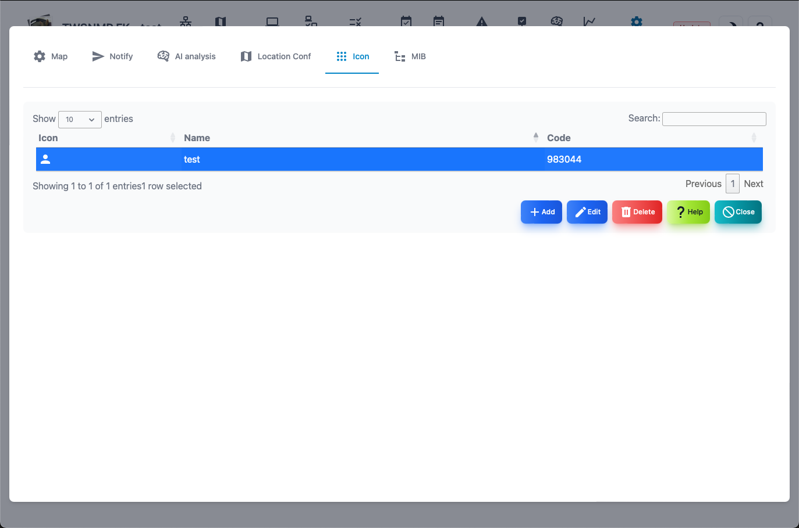

| Items | Contents |
| ---- | ---- |
| Icon | It is an image of an icon.|
| Name | Name when choosing.You can attach it freely.|
| Code | icon code.|
| Added | Add a new icon.|
| Edit | Edit the name of the selected icon.|
| Delete| Delete the selected icon.|
| Help | Display this help.|
| Close | Close the setting screen.|

### Icon editing screen

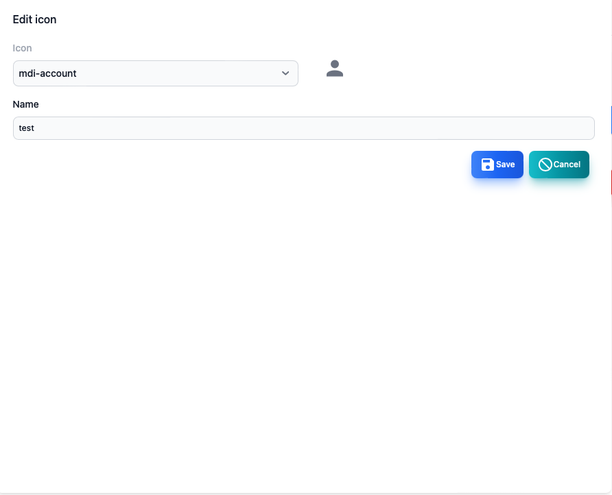

| Items | Contents |
| ---- | ---- |
| Icon | Select an icon.The name of the web font of the MDI icon.|
| Name | Give the icon your favorite name.|

## MIB management

This is a screen that manages SNMP MIB.


| Items | Contents |
| ---- | ---- |
| Type | It is a type of built -in or reading.|
| Name | MIB module name.|
| File | It is a read file name.|
| Error | An error when you read it.|
| MIB Tree | Displays MIB tree.|
| Help | Display this help.|
| Close | Close the setting screen.|

### MIB tree screen


## File in the datastore

You can customize it by saving the following files in the data folder.

| File | Contents |
| --- | --- |
| twsnmpfk.db | Database file.If it does not exist, it will be created automatically.|
| services.txt | This is a file to use the service name conversion.(Optional) |
| mac-vendors-export.csv | Mac A database that indicates the relationship between the MAC address and the vendor name.(Optional) |
| polling.json | Polling settings (optional) |
| mail_test.html | Notification test mail template (optional) |
| mail_notify.html | Notification mail template (optional) |
| Mail_repot.html | Template of report mail (optional) |
| geoip.mmdb | Geo IP database (optional) |
| extmibs/*| Additional reading extended MIB (optional) |
| icons/*| icon images file png or jpeg (optional) |

## Usage

```
Usage of twsnmpfk:
  -caCert string
    	CA Cert path
  -clientCert string
    	Client cert path
  -clientKey string
    	Client key path
  -datastore string
    	Path to data store directory
  -kiosk
    	Kisok mode(frameless and full screen)
  -lang string
    	Language(en|jp)
  -lock string
    	Disable edit map and lock page(map or loc)
  -maxDispLog int
    	Max log size to diplay (default 10000)
  -mcpCert string
    	MCP server cert path
  -mcpKey string
    	MCP server key path
  -mqttCert string
    	MQTT server cert path
  -mqttFrom string
    	MQTT client IP
  -mqttKey string
    	MQTT server key path
  -mqttTCPPort int
    	MQTT server TCP port (default 1883)
  -mqttUsers string
    	MQTT user and password
  -mqttWSPort int
    	MQTT server WebSock port (default 1884)
  -netflowPort int
    	Netflow port (default 2055)
  -notifyOAuth2Port int
    	OAuth2 redirect port (default 8180)
  -otelCA string
    	OpenTelementry CA cert path
  -otelCert string
    	OpenTelemetry server cert path
  -otelGRPCPort int
    	OpenTelemetry server gRPC port (default 4317)
  -otelHTTPPort int
    	OpenTelemetry server HTTP port (default 4318)
  -otelKey string
    	OpenTelemetry server key path
  -ping string
    	ping mode icmp or udp
  -sFlowPort int
    	sFlow port (default 6343)
  -sshdPort int
    	SSH server port (default 2022)
  -syslogPort int
    	Syslog port (default 514)
  -tcpdPort int
    	tcp server port (default 8086)
  -trapPort int
    	SNMP TRAP port (default 162)
```

| Parameters | Description |
| --- | --- |
| dataStore | Datstore Pass |
| kiosk | Kiosk mode (frameless, full screen) |
| lock <page> | disable edit map and show fixed page |
| Maxdisplog <number> | Maximum number of logs (default 10000) |
| ping <Mode> | Ping operation mode (ICMP or UDP) |
| syslogPort <PORT> | Syslog receiving port (default 514) |
| trapPort <Port> | SNMP TRAP Reception port (Default 162) |
| sshdPort <Port> | SSH server port (Default 162) |
|sshdPort <port>| SSH Server Receive Port (Default 2022)|
|netflowPort <port>| NetFlow/IPFIX receive port (default 2055)|
|sFlowPort <port>| sFlow receiving port (default 6343)|
|tcpdPort <port>| TCP log receiving port (default 8086)|
|otelCert <file>|OpenTelemetry server certificate|
|otelKey <file>|OpenTelemetry server private key|
|otelGRPCPPort <number>|GRPC port number for OpenTelemetry |
|otelHTTPPort <file>|OpenTelemetry HTTP port number|
| mqttTCPPort |MQTT server TCP port (default 1883)|
| mqttWSPort |MQTT server Websock port (default 1884)|
| mqttCert |MQTT server cert path|
| mqttKey |MQTT server key path|
| mqttFrom |MQTT server Client|
| mqttUsers |MQTT server User ID and password list|
| mcpCert |MCP server cert path|
| mcpKey |MCP server key path|
| notifyOAuth2Port |OAuth2 redirect port (default 8180)|

## Configuration File

Place .twsnmpfk.ini in a folder in the datastore and loads the boot parameters from the configuration file.The format is

```ini:.twsnmpfk.ini
#lang=ja
#maxDispLog=10000
#lock=map

[logger]
syslogPort=8514
trapPort=8162
netflowPort=2056
sshdPort=2023
#tcpdPort=8086
#sFlowPort=6343

[OTel]
#otelGRPCPort=4317
#otelHTTPPort=4318
#otelCert=
#otelKey=
#otelCA=

[client]
#clientCert=
#clientKey=
#caCert=

[MCP]
#mcpCert=
#mcpKey=

[MQTT]
#mqttTCPPort=1883
#mqttWSPort=1884

```