[English](./)
[PDF(更新していません)](./twsnmpfk_ja.pdf)

# はじめてのTWSNMP FK
日本で定番のSNMPマネージャー
復刻版

{: width="256"}


## はじめに

TWSNMPは日本で25年以上定番のSNMPv3に対応したSNMPマネージャです。
これを2023年の最新機技術で復刻したのがTWSNMP FKです。
コンテナで動作するTWSNMP FCはWebブラウザーからアクセスして操作しますが、FKは、デスクトップアプリであるためブラウザーは不要です。

## Windows版Microsoft Store

Windows版は

[マイクロソフトストア](https://www.microsoft.com/store/apps/9NSQN46P0MVL)

で購入できます。


## Scoop

[SCOOP](https://scoop.sh/)

を参照してScoopをインストール後に

```
>scoop bucket add twsnmp https://github.com/twsnmp/scoop-bucket
>scoop install twsnmpfk
```

でTWSNMP FKをインストールできます。
（無料で使いたい人向けです。）


## Mac OS版のApp Store

Mac版は

[Apple App Store](https://apps.apple.com/jp/app/twsnmpfk/id6468539128)

で購入できます。

無料で使いたい人は、

[GitHUBのリリース](https://github.com/twsnmp/twsnmpfk/releases)

からパッケージをダウンロードできます。


## TWSNMP FKの起動

Windowsの場合はスタートメニューからMac OSの場合はランチャーからなどお好きな方法で起動してください。ようこそ画面が表示されます。＜はじめる＞ボタンで開始します。＜おわる＞ボタンでプログラムを終了します。<ヘルプ＞ボタンで使い方の説明画面が表示されます。

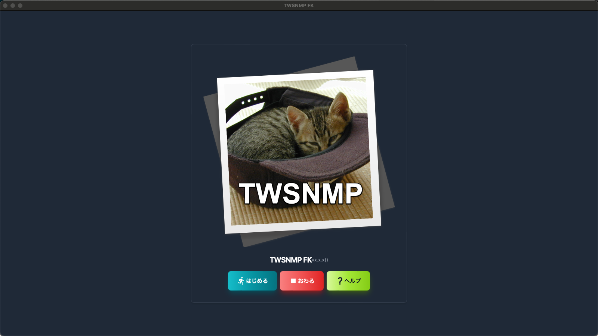

## データを保存するフォルダーを選択

ようこそ画面で＜はじめる＞ボタンをクリックするとデータを保存するフォルダーを選択するダイアログが表示されます。フォルダー選択してください。新規の作成することもできます。

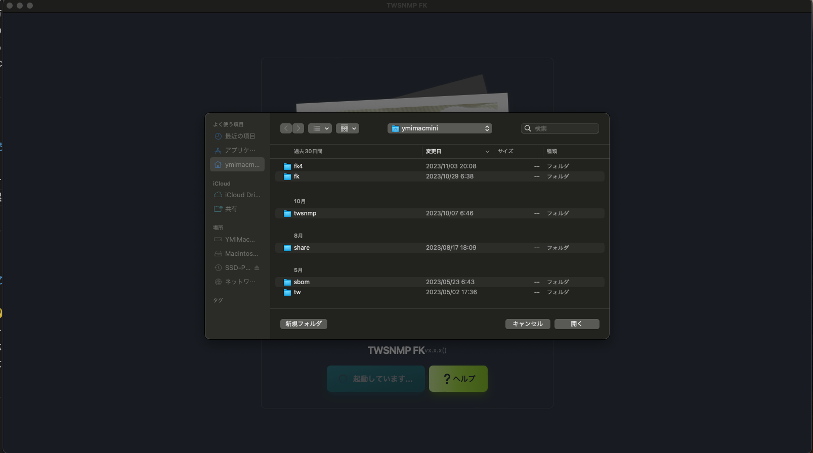

## 最初のマップ

新規のフォルダを選択して起動すると何もノードのないマップが表示されます。しばらくするとログが表示されます。


## はじめてのマップ作成の流れ

マップを作成する大まかな流れは、

- マップ上の適当な位置を右クリック
- メニューから「自動発見」を実行
- 検索するIPアドレス範囲を設定
- 自動発見を実行
- ノードの配置を調整
- ラインの接続

です。これで管理対象のネットワークに接続されたPCやルーター、サーバーなどを検索してマップに登録できます。

## マップ画面

マップ画面は大きく３つの部分があります。


|画面|内容|
|----|----|
|ツールバー|画面を切り替えます。|
|マップ|ネットワークの構成を表示する部分です。|
|イベントログ|最新100件のイベントログを表示します。|

###  ライト/ダークモード切り替え

右上の🌙マークをクリックすれば、ダークモードになります。
私はダークモードが好きです。たぶんホワイトハッカーの目指す人はダークモードが好きだと思います。
猫の世界にはホワイトハッカーしかいないそうです。By 先代助手の猫
現在の助手の猫さんは模様が白黒なので両方好きだそうです。

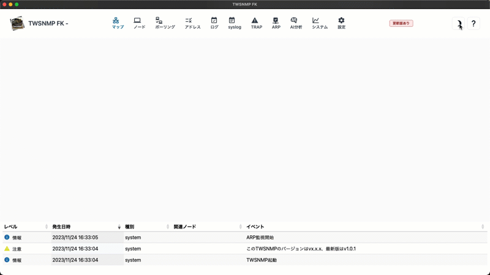


### マップメニュー

マップ上のノードや描画アイテム以外の場所を右クリックして表示します。


|メニュー|動作|
|----|----|
|新規ノード|ノードを手動でマップに追加します。|
|描画アイテム|描画アイテムをマップに追加します。|
|全て再確認|障害が発生しているノードを再確認します。|
|自動発見|自動発見画面を表示します。|
|インポート|TWSNMP v4.xのマップファイルをインポートします。|
|グリッド整列|ノードの位置を指定の間隔に整列します。|
|背景画像|マップの背景に表示する画像を設定します。|
|更新|マップの表示を最新の状態に更新します。|
|アイテム編集表示|全ての描画アイテムをマップの状態に関わらず表示します。|

#### 背景画像設定

背景の画像を設定するダイアログです。X、Yで左上の座標を指定します。幅と高さ画像ファイルを選択してください。


#### グリッド整列

マップのアイコンを指定した間隔に整列するダイアログです。間隔を指定します。変更する前に＜テスト＞ボタンで表示を確認できます。


### ノードメニュー

マップ上のノードを右クリックして表示します。


|メニュー|動作|
|----|----|
|レポート|ノードに関連するレポート画面を表示します。|
|PING|PING画面を表示します。|
|MIBブラウザー|MIBブラウザーを表示します。|
|gNMIツール|gNMIツールを表示します。|
|Wake On Lan|Wake On Lanパケットを送信します。|
|編集|ノードの設定を編集する画面を表示します。|
|ポーリング|ノードに関連したポーリング一覧を表示します。|
|再確認|ポーリングを実行してノードの状態を再確認します。|
|コピー|ノードの複製を作成します。|
|削除|ノードを削除します。|

### 描画アイテムメニュー

マップ上の描画アイテムを右クリックして表示します。


|メニュー|動作|
|----|----|
|編集|描画アイテムの設定を編集する画面を表示します。|
|コピー|描画アイテムの複製を作成します。|
|削除|描画アイテムを削除します。|

### 自動発見

自動発見の画面です。


|項目|内容|
|----|----|
|開始IP|検索するIPアドレス範囲の最初です。|
|終了IP|検索するIPアドレス範囲の最後です。|
|タイムアウト|検索時のPINGのタイムアウトです。|
|リトライ|検索時のPINGのリトライ回数です。|
|ポートスキャン|発見したノードにポートスキャンを実施します。 |
|ポーリング自動設定|発見したノードにポーリングを自動で設定します。|
|＜開始＞|自動発見を開始します。|
|＜自動IP範囲＞|PCのIPアドレスから検索範囲を自動で設定します。|

#### 自動発見実行中

実行や発見したノードの数が表示されます。


#### 自動発見実行中（ポートスキャンあり）

実行や発見したノードの数が表示されます。ポートスキャンを実施する場合は、発見したサーバー機能も表示されます。


### ノード編集
ノードの編集はマップ画面やノードリストでノードを選択してメニューかボタンから表示できます。


|項目|内容|
|----|----|
|名前|ノードの名前です。|
|IPアドレス|ノードのIPアドレスです。|
|アドレスモード|IPアドレス固定（デフォルト）、MACアドレス固定、ホスト名固定のいずれかです。|
|アイコン|表示するアイコンです。|
|復帰時に自動確認|復帰状態になった時には、自動で正常状態にします。|
|SNMPモード|SNMPのモードです。SNMPv1,v2c,v3（認証と暗号化別）があります。|
|SNMP Community|SNMPv1,v2cの時のCommunity名です。|
|ユーザー|SNMPv3でアクセスする時のユーザーIDです。|
|パスワード|SNMPv3でアクセスする時のパスワードです。|
|公開鍵|SSHでポーリングする場合のノードの公開鍵です。<br>空欄の場合は初回接続時に自動設定します。|
|URL|ブラウザーなどでアクセスする時のURLです。<br>右クリックメニューに表示されます。<br>カンマ区切りで複数指定できます。TWSNMP連携の場合のアクセス先にも使用します。|
|説明|補足情報を記載します。|

### 描画アイテム（矩形、楕円）

描画アイテム（矩形、楕円）の編集画面です。


|項目|内容|
|----|----|
|種類|描画アイテムの種類です。追加の時だけ変更できます。|
|幅|描画アイテムの幅です。|
|高さ|描画アイテムの高さです。|
|色|描画アイテムの色です。|
|表示条件|描画アイテムを表示するマップの状態です。|
|倍率|描画アイテムの表示倍率です。|


### 描画アイテム（ラベル）

描画アイテム（ラベル）の編集画面です。


|項目|内容|
|----|----|
|種類|描画アイテムの種類です。追加の時だけ変更できます。|
|文字サイズ|ラベルの文字サイズです。|
|色|描画アイテムの色です。|
|表示条件|描画アイテムを表示するマップの状態です。|
|文字列|表示する文字列です。|
|倍率|描画アイテムの表示倍率です。|

### 描画アイテム（イメージ）
描画アイテム（イメージ）の編集画面です。


|項目|内容|
|----|----|
|種類|描画アイテムの種類です。追加の時だけ変更できます。|
|幅|イメージの幅です。|
|高さ|イメージの高さです。|
|表示条件|描画アイテムを表示するマップの状態です。|
|イメージ|表示するイメージです。＜選択＞ボタンでイメージファイルを選択します。|
|倍率|描画アイテムの表示倍率です。|

### 描画アイテム（ポーリング結果）

描画アイテム（ポーリング結果：テキスト）の編集画面です。


|項目|内容|
|----|----|
|種類|描画アイテムの種類です。追加の時だけ変更できます。|
|サイズ|文字のサイズです。|
|ノード|ポーリングを選択ためのノードリストです。|
|ポーリング|結果を表示するポーリングです。|
|変数名|ポーリング結果の中から表示する変数の名前です。|
|表示フォーマット|表示する時のフォーマットです。|
|倍率|描画アイテムの表示倍率です。|

### 描画アイテム（ポーリング結果：ゲージ）

描画アイテム（ポーリング結果：ゲージ）の編集画面です。％のデータの表示に利用できます。
新ゲージ、バー、ラインも同様の設定です。


|項目|内容|
|----|----|
|種類|描画アイテムの種類です。追加の時だけ変更できます。|
|サイズ|ゲージのサイズです。|
|ノード|ポーリングを選択ためのノードリストです。|
|ポーリング|結果を表示するポーリングです。|
|変数名|ポーリング結果の中から表示する変数の名前です。|
|ゲージのラベル|ゲージの下に表示する文字列です。<br>下の例ではBPSです。|
|倍率|描画アイテムの表示倍率です。|


### ライン編集

ラインの編集はマップ画面でSHIFTキーを押しながら２つのノードを選択して表示します。


|項目|内容|
|----|----|
|ノード１|ラインを接続する１つ目のノードです。|
|ポーリング１|ラインの片側の色を決める１つ目のノードのポーリングです。|
|ノード２|ラインを接続する２つ目のノードです。|
|ポーリング２|ラインの片側の色を決める２つ目のノードのポーリングです。|
|情報のためのポーリング|ラインの横に表示する情報のためのポーリングです。<br>トラフィック量を測定するポーリング指定します。|
|情報|ラインの横に固定で表示する文字列を設定します。<br>情報のためのポーリングを設定すると上書されます。|
|ラインの太さ|ラインの太さです。|
|ポート|パネル表示の時に使うポート番号を指定します。|


### PING

PINGを実行する画面です。
位置情報を取得するには、GeoIPのデータベースファイルが必要です。


|項目|内容|
|----|----|
|IPアドレス|PINGを実行する対象のIPアドレスです。|
|回数|PINGの実行回数です。|
|サイズ|PINGパケットのサイズです。<br>変化モードは、サイズを増やしながら実行します。|
|TTL|PINGパケットのTTL値です。<br>トレースルートは、TTL値を増やしながら実行します。|
|結果グラフ|PINGの実行結果の応答時間、TTL値のグラフです。|
|結果|PINGの実行結果です。<br>結果、実施日時、応答時間、サイズ、送信受信のTTL、応答元IP、位置|
|BEEP|PINGの実行結果を音で知らせます。|
|開始|PINGを開始します。|
|停止|PINGを停止します。|
|閉じる|PINGを終了します。|

#### PINGヒストグラム

応答時間のヒストグラムです。


####  PING３D分析

応答時間、サイズ、実施日時を３Dのグラフで表示したものです。


#### PING 回線予測

サイズを変化させならが実施した場合に応答時間の変化から
回線速度を予測するレポートです。

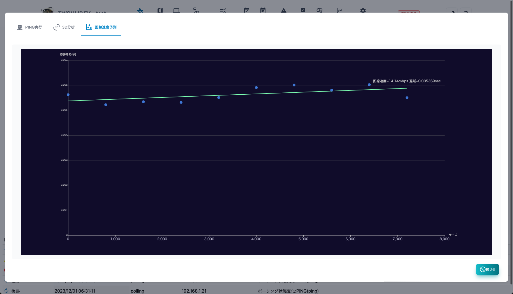

#### PING 経路分析

位置情報を表示します。GeoIPのデータベースがないと表示できません。


### MIBブラウザー

ノードからSNMPのMIB情報を取得する画面です。
ノードの設定でSNMPのアクセス情報を設定しておく必要があります。
組み込み以外のMIBを利用したい場合は、データフォルダのextmibsにMIBファイルを保存してください。


|項目|内容|
|----|----|
|オブジェクト名|取得したいMIBのオブジェクト名を指定します。<br>MIBツリーから選択できます。<br>例:system|
|<MIBツリー＞ボタン|MIBツリーを表示します。|
|履歴|これまで取得したオブジェクト名の履歴です。選択して再取得できます。|
|結果|取得したMIB情報です。テーブル形式のMIBの場合は自動的に表形式で表示します。|
|生データ|取得したMIB情報を変換しないで表示します。<br>オフの場合は、時刻データを人間がわかりやすい表示に変換します。|
|取得|MIB情報を取得します。|
|コピー|結果をクリップボードへコピーします。|
|CSV|取得したMIB情報をCSVファイルのエクスポートします。|
|Excel|取得したMIB情報をExcelファイルのエクスポートします。|

#### MIBツリー

取得するMIBのオブジェクト名を選択するための画面です。ツリーを開いてオブジェクト名をクリックすれば説明が表示されます。ダブルクリックして選択します。


### gNMIツール

ノードからgNMIで管理情報を取得する画面です。
ノードの設定でgNMI設定しておく必要があります。

|項目|内容|
|----|----|
|ターゲット|gNMIでアクセスするIP:Portを指定します。|
|エンコード|gNMIのエンコードを指定します。(json|json_ietf)|
|Path|取得するPathを指定します。|
|履歴|これまで取得したPathの履歴です。選択して再取得できます。|
|結果|取得した結果です。|
|Copy|取得した結果をコピーします。|
|ポーリング|選択した結果からポーリングを作成します。|
|Capabilities|Capabilitiesを取得します。|
|YANG情報|YANGファイルのGitHUBを表示します。|
|取得|指定の条件でGetを実行します。|
|CSV|結果をCSVで保存します。|
|Excel|結果をExcelで保存します。|

## 地図画面

ノードを地図上に表示する画面です。地図データは、位置情報サービスで利用されているOpenStreetMapなどが利用できます。ノードをクリックすると選択できます。ドラックすれば移動できます。複数選択はできません。


|項目|内容|
|----|----|
|編集|選択したノードの編集を画面を表示します。|
|ポーリング|選択したノードのポーリングを表示します。|
|削除|選択したノードを地図画面から削除します。|
|レポート|選択したノードのレポート画面を表示します。|
|初期表示|地図の中心とズームレベルを保存します。次回地図画面を開いた時に同じ状態になります。|
|更新|イベントログのリストを最新の状態に更新します。|

### 地図画面へノードの追加

地図上のノードを配置したい場所を右クリックすると追加するためのダイアログが表示されます。ノードを選択すれば追加できます。


## ノードリスト

管理対象のノードの一覧です。


|項目|内容|
|----|----|
|状態|ノードの状態です。<br>重度、軽度、注意、復帰、正常、不明があります。|
|名前|ノードの名前です。|
|IPアドレス|ノードのIPアドレスです。|
|MACアドレス|ノードのMACアドレスです。|
|ベンダー|MACアドレスに対応したベンダーの名前です。|
|説明|ノードに関する補足情報です。|
|編集|ノードの設定の編集をします。|
|ポーリング|選択したノードに関連したポーリングのリストを表示します。|
|レポート|選択したノードの分析レポートを表示します。|
|削除|選択したノードを削除します。|
|再確認|選択したノードのポーリングを再確認します。|
|全て再確認|全てのノードのポーリングを再確認します。|
|CSV|ノードリストをCSVファイルにエクスポートします。|
|Excel|ノードリストをExcelファイルにエクスポートします。|
|更新|ノードリストを最新の状態に更新します。|

### ノードのポーリングリスト

ノードに関連したポーリングのリストです。


|項目|内容|
|----|----|
|状態|ポーリングの状態をです。<br>重度、軽度、注意、復帰、正常、不明があります。|
|名前|ポーリングの名前です。|
|レベル|ポーリングのレベルです。|
|種別|ポーリングの種類です。<br>ping,snmp,tcpなど|
|ログ|ログモードです。|
|最終確認|ポーリングを実施した最後の日時です。|
|追加|ノードにポーリングを追加します。|
|編集|選択したポーリングを編集します。|
|コピー|選択したポーリングのコピーを作成します。|
|レポート|選択したポーリングの分析レポートを表示します。|
|削除|選択したポーリングを削除します。|
|更新|ポーリングのリストを最新の状態に更新します。|
|閉じる|ポーリングのリストを閉じます。|

### 基本情報レポート

ノードに関する基本的な情報です。


### メモ

ノードに関連するメモです。


### ログ

ノードに関連するイベントログです。


### パネル

ノードの外観を表示します。SNMPによるinterface MIBの取得か、ライン接続の情報からポートを表示します。
＜物理ポート＞スイッチで、物理ポートだけ表示できます。＜回転＞スイッチでパネルの表示を回転します。


### ホスト情報

SNMPのホストリソースMIBの情報を表示します。ホストリソースMIBに対応していない場合は表示できません。


### ストレージ

SNMPのホストリソースMIBのストレージ情報を表示します。選択するとポーリングの追加ボタンが表示されます。ホストリソースMIBに対応していない場合は表示できません。

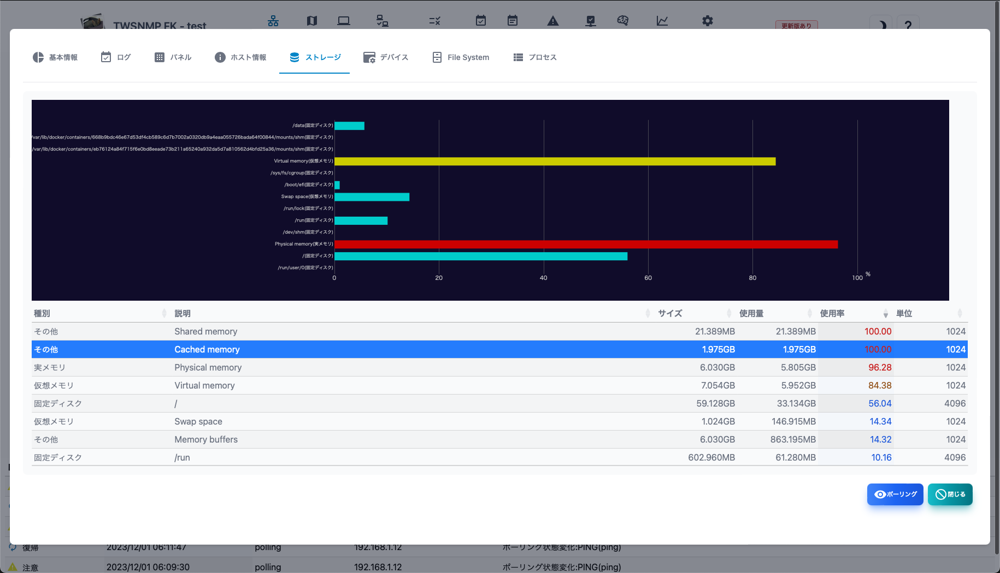


### デバイス

SNMPのホストリソースMIBのデバイス情報を表示します。ホストリソースMIBに対応していない場合は表示できません。


### File System

SNMPのホストリソースMIBのFile System,情報を表示します。ホストリソースMIBに対応していない場合は表示できません。


### プロセス

SNMPのホストリソースMIBのプロセス情報を表示します。選択するとポーリングの追加ボタンが表示されます。ホストリソースMIBに対応していない場合は表示できません。


## ポーリングリスト

管理対象のポーリングの一覧です。


|項目|内容|
|----|----|
|状態|ポーリングの状態です。<br>重度、軽度、注意、復帰、正常、不明があります。|
|ノード名|ポーリングに関連するノードの名前です。|
|名前|ポーリングの名前です。|
|レベル|ポーリングの障害レベルです。|
|種別|ポーリングの種類です。|
|ログ|ポーリングのログモードです。|
|最終確認|ポーリングの最終確認日時です。|
|追加|ポーリングを追加します。|
|編集|選択したポーリングを編集します。|
|コピー|選択したポーリングをコピーします。|
|エクスポート|選択したポーリングの設定をJSONファイルに保存します。|
|レポート|選択したポーリングの分析レポートを表示します。|
|削除|選択したポーリングを削除します。|
|CSV|ポーリングリストをCSVファイルにエクスポートします。|
|Excel|ポーリングリストをExcelファイルにエクスポートします。|
|更新|ポーリングリストを最新の状態に更新します。|

### ポーリングのテンプレート選択

ポーリングを追加する時に表示されるテンプレートの選択画面です。


|項目|内容|
|----|----|
|ID|テンプレートの番号です。|
|名前|ポーリングの名前です。|
|種別|ポーリングの種類です。<br>ping,snmp,tcpなど|
|モード|ポーリングのモードです。|
|説明|ポーリングの説明です。|
|テンプレートファイルから追加|ポーリングをJSONのテンプレートファイルから追加します。|
|追加|ポーリングを選択します。|
|キャンセル|ポーリングの選択閉じます。|

### ポーリング基本情報

ポーリングに関する基本的な情報です。

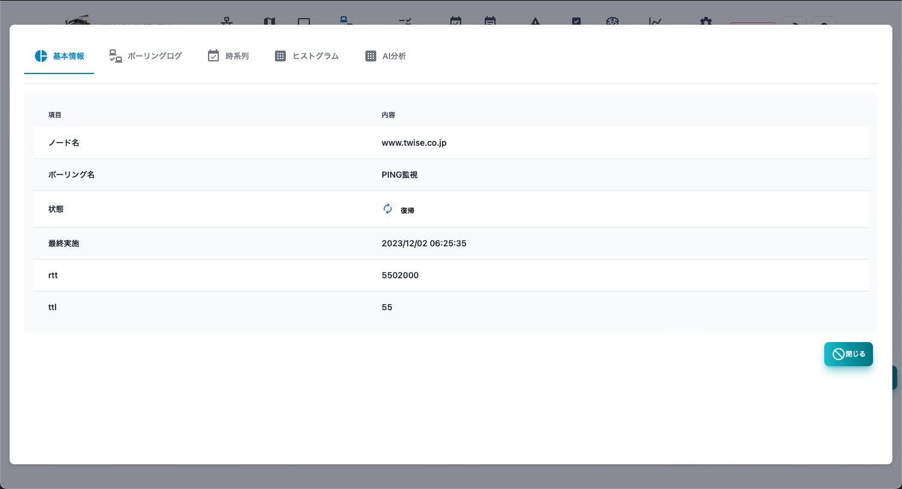

### ポーリングログ

ポーリング結果のログです。ログモードを出力しない以外に設定した場合のみ表示されます。


### 時系列

ポーリング結果のログの中で数値データを時系列のグラフで表示します。
表示する項目は、グラフの上部で選択できます。ログモードを出力しない以外に設定した場合のみ表示されます。


### ヒストグラム

ポーリング結果のログの中の数値データをヒストグラムで表示します。
表示する項目は、グラフの上部で選択できます。ログモードを出力しない以外に設定した場合のみ表示されます。

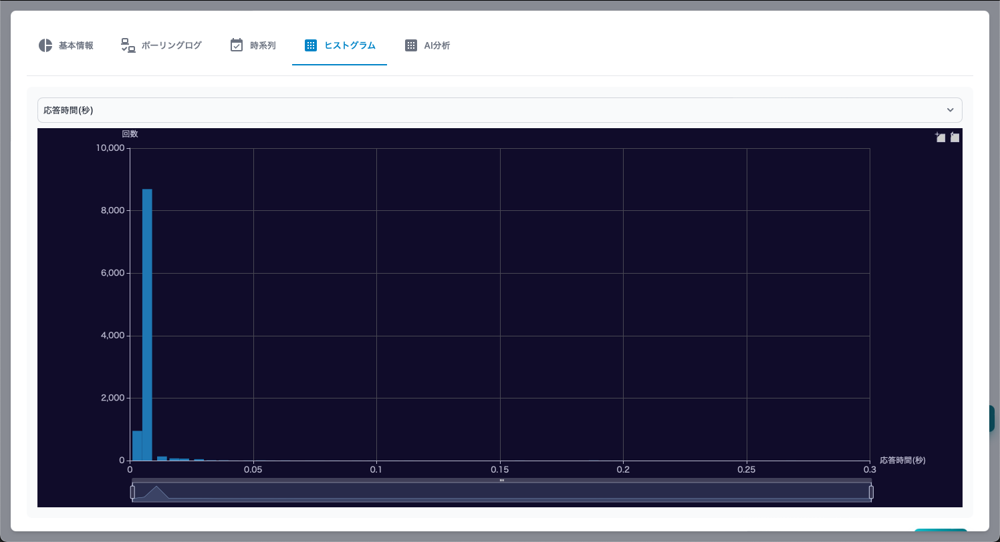


## OpenTelemetry

OpenTelemetryコレクターの画面です。
メトリック、トレース、ログのタブで切り替えます。

### メトリック

受信したメトリックの一覧です。


|項目|内容|
|----|----|
|送信元ホスト|メトリックの送信元ホストです。|
|サービス|メトリックに関連したサービスの名前です。|
|スコープ|メトリックに関連したスコープの名前です。|
|名前|メトリックの名前です。|
|種別|メトリックの種類です。|
|回数|メトリックの受信回数です。|
|初回|メトリックを最初に受信した日時です。|
|最終|メトリックを最後に受信した日時です。|

#### メトリック(ボタン)

|項目|内容|
|----|----|
|レポート|選択したメトリックのグラフを表示します。|
|<span style="color: red;">全ログ削除</span>|OpenTelemetryの全データを削除します。|
|更新|情報を更新します。|

#### タイムチャート

メトリックを選択して＜レポート＞ボタンをクリックするとタイムチャートが表示されます。


#### ヒストグラム

メトリックの種別がヒストグラムの場合はテーブルの行を選択すると、その時刻のヒストグラムを表示します。


### トレース

受信したトレースの画面です。上部にトレースの開始時刻、処理時間、スパン数を示すグラフがあります。


|項目|内容|
|----|----|
|開始日時|トレースの開始日時です。|
|終了日時|トレースの終了日時です。|
|時間|トレースの処理時間です。|
|トレースID|トレースを識別するIDです。|
|送信元ホスト|トレースの送信元ホストです。|
|サービス|トレースに関連したサービス名です。|
|Span|トレースに含まれるSpanの数です。|
|スコープ|トレースの関連したスコープです。|


#### トレース(ボタン)

|項目|内容|
|----|----|
|レポート|選択したトレースのグラフを表示します。|
|DAG|選択した時間範囲のトレースからサービス間の関係を表示します。|
|時間範囲|トレースの時間範囲を指定指定します。|
|<span style="color: red;">全ログ削除</span>|OpenTelemetryの全データを削除します。|
|更新|情報を更新します。|


#### DAG

選択した時間範囲のトレースからサービス間の関係をグラフで表示します。


#### タイムライン

選択したトーレスのタイムラインをグラフ表示します。


### ログ

受信したOpenTelemetryのログをsyslogから検索する画面です。
上部にログレベル別のグラフを表示します。


|項目|内容|
|----|----|
|レベル|Syslogのレベルです。<br>重度、軽度、注意、情報があります。|
|日時|Syslogを受信した日時です。|
|ホスト|Syslogの送信元ホストです。|
|タイプ|syslogのファシリティーと優先度の文字列です。|
|タグ|Syslogのタグです。プロセスとプロセスIDなどです。|
|メッセージ|Syslogのメッセージです。|


#### ログ(ボタン)

|項目|内容|
|----|----|
|<span style="color: red;">全ログ削除</span>|OpenTelemetryの全データを削除します。syslogは削除しません。|
|更新|情報を更新します。|

### OpenTelemetryの設定

マップ設定のOpenTelemetry関連の設定は、黄色の枠の部分です。
（※最新版では少し位置が変わっています）


|項目|内容|
|----|----|
|保存時間|メトリック、トレースを保存する時間を指定します。|
|送信元|送信元IPを制限します。空欄は無制限です。|
|スイッチ|受信のON/OFFを切り替えます。|

### 起動パラメータ

```
 -otelCA string
    	OpenTelementry CA cert path
  -otelCert string
    	OpenTelemetry server cert path
  -otelGRPCPort int
    	OpenTelemetry server gRPC port (default 4317)
  -otelHTTPPort int
    	OpenTelemetry server HTTP port (default 4318)
  -otelKey string
    	OpenTelemetry server key path
```

ポート番号を変更できます。
otelCertとotelKeyに証明書と秘密鍵を指定すれば、TLSモードになります。
otelCAにクライアント証明書を発行したCAの証明書を指定すれば、mTLSモードになります。

## MCPサーバー

AIがTWSNMP FKを利用するためのMCPサーバー機能があります。

### MCPサーバーの設定

マップ設定のMCPサーバー関連の設定は、黄色い枠の部分です。


|項目|内容|
|----|----|
|MCPサーバートランスポート|OFF/SSE/StreamableHTTPを選択します。|
|MCPサーバーエンドポイント|受信するIPアドレスとポートを指定します。<br>ローカルのみは、127.0.0.0:8089<br>全アドレスで受信する場合は:8089 |
|MCPサーバートークン|MCPサーバーのURLのパスに含める文字列です。横の赤いボタンでランダムな文字を生成できます。コピーボタンでURLをコピーできます。 |

### MCPサーバーの機能

TWSNMP FKのMCPサーバーは、ネットワークデバイスの監視・管理を担うシステムです。
MCPサーバーのの仕様は、以下のドキュメントに記載しました。

[MCPサーバー仕様](./mcp_ja.html)

[MCPサーバープロンプト仕様](./mcp_prompt_ja.html)

[MCPサーバーシステムプロンプト](https://github.com/twsnmp/twsnmpfk/blob/main/docs/prompt_ja.md)


## AI分析

ポーリング結果のログの中で数値データをAI分析した結果です。ログモードをAI分析に設定して十分なデータを取得した場合のみ表示されます。


### ポーリング編集

ポーリング編集はポーリングリストでポーリングを選択してボタンから表示できます。


|項目|内容|
|----|----|
|名前|ポーリングの名前です。|
|レベル|ポーリングの障害レベルです。|
|種別|ポーリングの種類です。PING,SNMP,TCPなど|
|モード|ポーリングの種類に依存した動作モードです。|
|ログモード|ポーリング結果ログの保存方法です。|
|パラメータ|ポーリングの種類とモードに依存したパラメータです。|
|フィルター|ポーリングの種類とモードに依存したフィルター条件です。|
|抽出パターン|ポーリングの種類とモードに依存したGrokのパターンです。|
|スクリプト|障害の判定や変数の計算を行うJava Scriptです。|
|ポーリング間隔|ポーリングの実施間隔です。|
|タイムアウト|ポーリング実施時のタイムアウトです。|
|リトライ|ポーリング実施時のリトライ回数です。|
|障害時アクション|障害が発生した時のアクションを設定します。|
|復帰時アクション|障害から復帰した時のアクションを設定します。|

## アドレスリスト

TWSNMPが見つけたIPアドレスのリストです。
ARP監視機能で見つけた同じセグメントにあるIPアドレスだけ表示されます。
重複やアドレスが変化したことを検知できます。


|項目|内容|
|----|----|
|状態|アドレスの状態です。(正常,重複、IP変化、MAC変化があります。)|
|アドレス|IPアドレスです。|
|MACアドレス|MACアドレスです。|
|ノード名|管理対象としてマップに登録されたノードの名前です。|
|ベンダー|MACアドレスに対応したベンダーの名前です。|
|最終変化|最後に変化した日時です。|
|ノード追加|選択したIPアドレスをマップに追加します。<br>未登録の場合だけ表示されます。|

|ボタン|内容|
|----|----|
|削除|選択したIPアドレスを削除します。|
|レポート|アドレスリストのレポートを表示します。|
|クリア|アドレスリストを全てクリアします。|
|コピー|選択したアドレスをクリップボードにコピーします。|
|CSV|アドレスリストをCSVファイルにエクスポートします。|
|Excel|アドレスリストをExcelファイルにエクスポートします。|
|更新|アドレスリストを最新の状態に更新します。|

### IPアドレス使用状況

設定したIPアドレスの範囲の状況のレポートです。


### IPとMACアドレスの関係（力学モデル）

IPアドレスとMACアドレスの関係を力学モデルで図示したレポートです。
正常なアドレスはIPアドレスとMACアドレスが１対１になります。
同じIPアドレスを複数のMACで使っていたり、複数のIPアドレスをもつ、MACアドレスを検知できます。

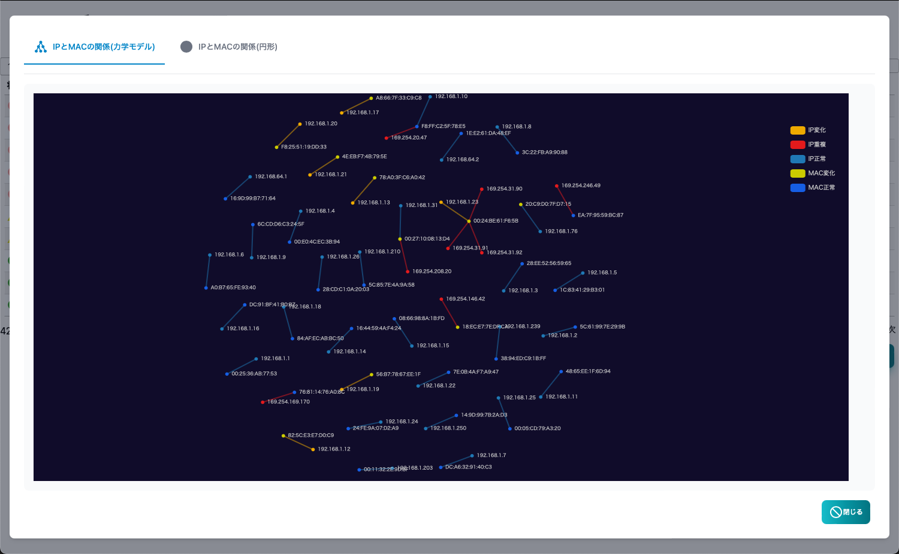

### IPとMACアドレスの関係（円形モデル）

IPアドレスとMACアドレスの関係を円形モデルで図示したレポートです。
正常なアドレスはIPアドレスとMACアドレスが１対１になります。
同じIPアドレスを複数のMACで使っていたり、複数のIPアドレスをもつMACアドレスを検知できます。


## サーバー証明書リスト

TWSNMPからモニターするサーバー証明書のリストです。


|項目|内容|
|----|----|
|>|サーバー証明書の詳細を展開表示します。|
|状態|サーバー証明書の状態です。|
|対象|サーバーのIPアドレスまたはホスト名です。|
|ポート番号|モニターするポート番号です。|
|Subject|サーバー証明書の証明内容です。ホスト名など|
|Issuer|サーバー証明書の発行者です。|
|開始|サーバー証明書の有効期限の開始日時です。|
|終了|サーバー証明書の有効期限の終了日時です。|
|最終確認|サーバー証明書の有効期限の終了日時です。|

|ボタン|内容|
|----|----|
|追加|モニター対象を追加します。|
|編集|選択したモニター対象を編集します。|
|削除|選択したモニター対象を削除します。|
|更新|リストを最新の状態に更新します。|

### モニター対象の編集

モニター対象の編集画面です。


対象にIPアドレスまたはホスト名かIPアドレスを指定します。
ポートには、モニターしたポートの番号を指定します。

## PKI CA構築

PKI機能のCAを構築する前の画面です。


設定項目は次の表です。

|項目|内容|
|----|----|
|名前|CAの名前です。CA証明書のSubjectにしようします。|
|DNS名|発行する証明書のCDP、OCSPのアドレス、ACMEサーバーの証明書のSANsに使用するホスト名、IPアドレスをカンマ区切りで指定します。|
|ACMEサーバー基本URL|ACMEサーバーの基本URLです。空欄はホスト名から自動設定します。|
|CRL/OCSP/SCEPサーバー基本URL|CRL/OCSP/SCEPサーバーの基本URLです。空欄はホスト名から自動設定します。|
|CAの鍵タイプ|CAの鍵の種類を指定します。|
|CA証明書の期間|証明書の有効期間の年数を指定します。|
|CRLの更新間隔|CRLの更新間隔を時間単位で指定します。|
|証明書の期間|発行する証明書の期間を時間単位で指定します。|
|CRL/OCSP/SCEPサーバーのポート番号|HTTPサーバーのポート番号を指定します。後から変更できません。|
|ACMEサーバーのポート番号|ACMEサーバーのポート番号を指定します。後から変更できません。|

### 証明書一覧

CA構築後は、証明書の一覧画面を表示します。発行した証明書の確認できます。


リストの項目は以下の通りです。

|項目|内容|
|----|----|
|状態|証明書の状態です。|
|Type|証明書の種類です。|
|ID|証明書のシリアル番号です。|
|Subject|証明書のSubjectです。|
|関連ノード|証明書を取得したノードです。|
|開始|証明書の期間の開始日時です。|
|終了|証明書の期間の終了日時です。|
|失効|証明書を失効した日時です。|

ボタンは以下の通りです。

|項目|内容|
|----|----|
|CSR作成|証明書要求(CSR)を作成する画面を表示します。|
|証明書作成|CSRを読み込んで証明書を発行します。|
|CA初期化|CAを破棄します。|
|サーバー制御|サーバー制御画面を表示します。|
|更新|証明書リストを更新します。|
|失効|選択した証明書を失効します。|
|エクスポート|選択した証明書をファイルに保存します。|

#### CSR作成

証明書要求(CSR)を作成する画面です。


|項目|内容|
|----|----|
|鍵タイプ|CSRの鍵の種類を指定します。|
|名前|CNの値を指定します。|
|DNS名|Subject Alt NameのためのDNS名をカンマ区切りで指定します。|
|組織名|組織名を指定します。空欄でもOKです。|
|組織単位|組織単位を指定します。空欄でもOKです。|
|国コード|国コードを指定します、。空欄でもOKです。|
|州/都道府県名|州または都道府県名を指定します。空欄でもOKです。|
|市町村名|市町村名を指定します。空欄でもOKです。|

### サーバー制御

PKIサーバーの動作を制御する画面です。


|項目|内容|
|----|----|
|ACMEサーバー|ACMEサーバーを起動します。|
|CRL/OCSP/SCEPサーバー|CRL/OCSP/SCEPサーバーを起動します。|
|ACMEサーバーの基本URL|ACMEサーバーが応答する基本URLを指定します。|
|CRLの更新間隔|CRLの更新間隔を時間単位で指定します。|
|証明書の期間|発行する証明書の期間を時間単位で指定します。|

## イベントログ

イベントログの画面です。上部にログの発生件数を時系列で示したグラフがあります。


|項目|内容|
|----|----|
|レベル|ログのレベルです。<br>重度、軽度、注意、復帰、情報があります。|
|発生日時|ログを記録した日時です。|
|種別|ログの種別です。<br>polling,system,oprate,user,arpwatchがあります、|
|関連ノード|ログに関連したノードの名前です。<br>空欄は、関連したノードがないという意味です。|
|イベント|発生したイベントです。|
|フィルター|検索条件を指定してログを表示します。|
|全ログ削除|全てのイベントログを削除します。|
|レポート|イベントログの分析レポートを表示します。|
|CSV|イベントログをCSVファイルにエクスポートします。|
|Excel|イベントログをExcelファイルにエクスポートします。|
|更新|イベントログのリストを最新の状態に更新します。|

### イベントログのフィルター

イベントログの検索条件を指定するダイアログです。


|項目|内容|
|----|----|
|レベル|ログのレベルです。<br>全て、重度、軽度以上、注意があります。|
|種別|ログの種別です。<br>polling,system,oprate,user,arpwatchがあります、|
|関連ノード|ログに関連したノードの名前で検索します。|
|イベント|発生したイベントの文字列で検索します。|

> 文字列は、正規表現で検索できます。


### イベントログの状態別グラフ

イベントログの件数を状態（レベル）別に集計したレポートです。


### イベントログ ヒートマップ

イベントログの時間毎の件数をヒートマップで集計したレポートです。


### イベントログ ノード別

イベントログの件数をノード別に集計したレポートです。


### 稼働率

イベントログの中の稼働率(oprate)の値を時系列グラフにしたレポートです。


### ARP監視

イベントログの中のアドレス使用率(arpwatch)の値を時系列グラフにしたレポートです。


## Syslog

Syslogの画面です。上部にログの発生件数を時系列で示したグラフがあります。


|項目|内容|
|----|----|
|レベル|Syslogのレベルです。重度、軽度、注意、情報があります。|
|日時|Syslogを受信した日時です。|
|ホスト|Syslogの送信元ホストです。|
|タイプ|syslogのファシリティーと優先度の文字列です。|
|タグ|Syslogのタグです。プロセスとプロセスIDなどです。|
|メッセージ|Syslogのメッセージです。|
|ポーリング|選択したSyslogからポーリングを登録します。|
|フィルター|検索条件を指定してSyslogを表示します。|
|全ログ削除|全てのSyslogを削除します。|
|レポート|Syslogの分析レポートを表示します。|
|マジック分析|ログからデータを自動抽出して分析できます。|
|コピー|選択したログをコピーします。|
|CSV|SyslogをCSVファイルにエクスポートします。|
|Excel|SyslogをExcelファイルにエクスポートします。|
|更新|Syslogのリストを最新の状態に更新します。|


### Syslog フィルター

Syslogの検索条件を指定するダイアログです。


|項目|内容|
|----|----|
|レベル|Syslogのレベルです。全て、情報以上、注意以上、軽度以上、重度があります。|
|ホスト|送信元のホストです。|
|タグ|Syslogのタグの値です。|
|メッセージ|Syslogのメッセージです。|

> 文字列は、正規表現で検索できます。

### Syslog 状態別

Syslogの件数を状態別に集計したレポートです。


### Syslog ヒートマップ

Syslogの時間毎の件数をヒートマップで集計したレポートです。


### Syslog ホスト別

Syslogの件数を送信元ホスト別に集計したレポートです。


### 正規化分析

syslogを正規化して集計したレポートです。
数値、IPアドレス、メールアドレスなどを共通の文字に置き換えてカウントするものです。


### Syslog ホスト別(3D)

Syslogを送信元ホスト、プライオリティー、時刻の３次元グラフで表示したレポートです。


### Syslog FFTによる周期分析

Syslogをホスト毎にFFT分析して受信件数の周期を分析したレポートです。


## SNMP TRAP
SNMP TRAPログの画面です。上部にログの発生件数を時系列で示したグラフがあります。


|項目|内容|
|----|----|
|日時|SNMP TRAPを受信した日時です。|
|送信元|SNMP TRAPの送信元ホストです。|
|タイプ|SNMP TRAPのタイプです。|
|変数|SNMP TRAPに付帯した変数です。|
|ポーリング|選択したSNMP TRAPからポーリングを登録します。|
|フィルター|検索条件を指定してSNMP TRAPを表示します。|
|全ログ削除|全てのSyslogを削除します。|
|レポート|SNMP TRAPの分析レポートを表示します。|
|CSV|SNMP TRAPをCSVファイルにエクスポートします。|
|Excel|SNMP TRAPをExcelファイルにエクスポートします。|
|更新|SNMP TRAPのリストを最新の状態に更新します。|

### SNMP TRAPフィルター

SNMP TRAPの検索条件を指定するダイアログです。


|項目|内容|
|----|----|
|送信元|送信元のホストです。|
|タイプ|SNMP TRAPのタイプです。|

> 文字列は、正規表現で検索できます。

### SNMP TRAP種類別

 SNMP TRAPの件数を種類別に集計したレポートです。


### SNMP TRAP ヒートマップ

SNMP TRAPの時間毎の件数をヒートマップで集計したレポートです。

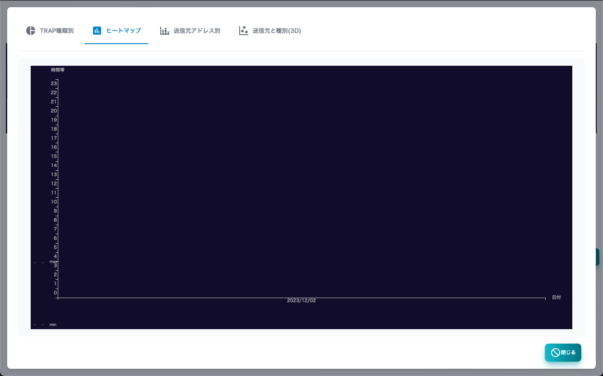

### SNMP TRAP ホスト別

SNMP TRAPの受信件数を送信元ホスト別に集計したレポートです。


### SNMP TRAP 送信元と種別(3D)

SNMP TRAPの受信ログを送信元ホスト、種別、時刻の３次元グラフで表示したレポートです。


### NetFlow

NetFlowの分析画面です。


#### テーブルの項目の説明

|項目|内容|
|----|----|
|日時|NetFlowを受信した日時です。|
|送信元|送信元のIPです。|
|ポート|送信元のポート番号です。|
|位置|送信元の位置です。GeoIP DBが必要です。|
|宛先|宛先のIPです。|
|ポート|宛先のポート番号です。|
|位置|宛先の位置です。GeoIP DBが必要です。|
|プロトコル|tcp/udp/icmpなどのプロトコルです。|
|TCPフラグ|TCPのフラグです。|
|パケット|送信パケット数です。|
|バイト|送信バイト数です。|
|期間|フローの通信時間です。|

#### ボタンの説明

|項目|内容|
|----|----|
|フィルター|検索条件を指定してNetFlowを表示します。|
|全ログ削除|全てのNetFlowを削除します。|
|Copy|選択したログをコピーします。|
|レポート|NetFlowの分析レポートを表示します。|
|CSV|NetFlowをCSVファイルにエクスポートします。|
|Excel|NetFlowをExcelファイルにエクスポートします。|
|更新|NetFlowのリストを最新の状態に更新します。|

#### フィルターの項目

NetFlow検索のためのフィルターです。


|項目|内容|
|----|----|
|開始日時|検索開始の日時を指定します。|
|終了日時|検索終了の日時を指定します。|
|簡易モード|IP、ポート、位置を双方向に適用するモードです。|
|IP|簡易モードの場合の、送信元、宛先のIPを指定します。|
|ポート|簡易モードの場合の、送信元、宛先のポートを指定します。|
|位置|簡易モードの場合の、送信元、宛先の位置を指定します。|

|項目|内容|
|----|----|
|送信元IP|送信元のIPを指定します。|
|ポート|送信元のポートを指定します。|
|位置|送信元の位置を指定します。|
|宛先IP|宛先のIPを指定します。|
|ポート|宛先のポートを指定します。|
|位置|宛先の位置を指定します。|
|プロトコル|プロトコル名を指定します。|
|TCPフラグ|TCPフラグを指定します。|

#### NetFlow レポート

|レポート名|内容|
|----|----|
|ヒートマップ|NetFlowの受信数の時間帯別のヒートマップです。|
|ヒストグラム|数値データのヒストグラムです。|
|トラフィック|通信量の時系列グラフです。|
|TOPリスト|項目別のランキングレポートです。|
|TOPリスト(3D)|項目別のランキングレポートを3Dのグラフで表示したものです。|
|IPペアーフロー|通信の組み合わせをグラフで表示したものです。|
|FFT分析|FFTで通信の周期を分析するものです。|
|FFT分析(3D)|FFTで通信の周期を分析して３Dのグラフに表示します。|
|地図|IPアドレスの位置を地図に表示します。| 

#### sFlow

sFlowの分析画面です。


##### フローサンプル

|項目|内容|
|----|----|
|日時|sFlowサンプルを受信した日時です。|
|送信元|送信元のIPです。|
|ポート|送信元のポート番号です。|
|位置|送信元の位置です。GeoIP DBが必要です。|
|MAC|送信元のMACアドレスです。|
|宛先|宛先のIPです。|
|ポート|宛先のポート番号です。|
|位置|宛先の位置です。GeoIP DBが必要です。|
|MAC|宛先のMACアドレスです。|
|プロトコル|tcp/udp/icmpなどのプロトコルです。|
|TCPフラグ|TCPのフラグです。|
|バイト|送信バイト数です。|

#### ボタンの説明

|項目|内容|
|----|----|
|カウンター|フローサンプルとカウンターサンプルを切り替えます。|
|フィルター|検索条件を指定してsFlowを表示します。|
|全ログ削除|全てのsFlowを削除します。|
|Copy|選択したログをコピーします。|
|レポート|sFlowの分析レポートを表示します。|
|CSV|sFlowをCSVファイルにエクスポートします。|
|Excel|sFlowをExcelファイルにエクスポートします。|
|更新|sFlowのログを最新の状態に更新します。|

#### フローサンプルのフィルターの項目

|項目|内容|
|----|----|
|開始日時|検索開始の日時を指定します。|
|終了日時|検索終了の日時を指定します。|
|簡易モード|IP、ポート、位置を双方向に適用するモードです。|
|IP|簡易モードの場合の、送信元、宛先のIPを指定します。|
|ポート|簡易モードの場合の、送信元、宛先のポートを指定します。|
|位置|簡易モードの場合の、送信元、宛先の位置を指定します。|
|送信元IP|送信元のIPを指定します。|
|ポート|送信元のポートを指定します。|
|位置|送信元の位置を指定します。|
|宛先IP|宛先のIPを指定します。|
|ポート|宛先のポートを指定します。|
|位置|宛先の位置を指定します。|
|プロトコル|プロトコル名を指定します。|
|TCPフラグ|TCPフラグを指定します。|

> 文字列は、正規表現で検索できます。

##### カウンターサンプル

|項目|内容|
|----|----|
|日時|sFlowサンプルを受信した日時です。|
|送信元|送信元のIPです。|
|種別|カウンターサンプルの種別です。(I/F,CPU,Memory,Disk,Netowk)|
|データ|カウンターサンプルのデータです。|

#### カウンターサンプルのフィルターの項目

|項目|内容|
|----|----|
|開始日時|検索開始の日時を指定します。|
|終了日時|検索終了の日時を指定します。|
|送信元|送信元を指定します。|
|種別|カウンターサンプルの種別を指定します。|

> 文字列は、正規表現で検索できます。

#### フローサンプルのレポート

|レポート名|内容|
|----|----|
|ヒートマップ|ログの時間帯別の数を示すヒートマップです。|
|通信量|通信量の時系列グラフです。|
|TOPリスト|項目別のランキングレポートです。|
|TOPリスト(3D)|項目別のランキングレポートを3Dのグラフで表示したものです。|
|IPペアーフロー|通信の組み合わせをグラフで表示したものです。|
|FFT分析|FFTで通信の周期を分析するものです。|
|FFT分析(3D)|FFTで通信の周期を分析して３Dのグラフに表示します。|
|地図|IPアドレスの位置を地図に表示します。| 


#### カウンターサンプルのレポート

|レポート名|内容|
|----|----|
|ヒートマップ|ログの時間帯別の数を示すヒートマップです。|
|I/F BPS|I／Fサンプルから取得した通信量(Bytes/Sec)の時系列グラフです。|
|I/F PPS|I／Fサンプルから取得した通信量(Packets/Sec)の時系列グラフです。|
|CPU|CPUサンプルから取得したCPU使用率と負荷の時系列グラフです。|
|Memory|Memoryサンプルから取得したメモリー使用量と利用可能容量のグラフです。|
|Disk|Diskサンプルから取得したディスク使用量とアクセス量のグラフです。|
|Network|Networkサンプルから取得したネットワーク使用量のグラフです。|

## ARP監視ログ

ARP監視ログの画面です。
上部にログの発生件数を時系列で示したグラフがあります。


|項目|内容|
|----|----|
|状態|ログの状態です。新規か変化のどちらかです。|
|日時|ログを記録した日時です。|
|IPアドレス|ログ対象のIPアドレスです。|
|ノード|マップに登録したノードの名前です。空欄はマップに未登録|
|新MACアドレス|新規発見か、変化後のMACアドレスです。|
|新ベンダー|新MACアドレスに対応したベンダーの名前です。|
|旧MACアドレス|変化前のMACアドレスです。|
|旧ベンダー|旧MACアドレスに対応したベンダーの名前です。|
|レポート|ARP監視ログの分析レポートを表示します。|
|CSV|ARP監視ログをCSVファイルにエクスポートします。|
|Excel|ARP監視ログをExcelファイルにエクスポートします。|
|更新|ARP監視ログのリストを最新の状態に更新します。|


### ARP監視ログ IPアドレス別

IPアドレス別にログの件数を集計したレポートです。変化が多いIPアドレスが一目瞭然です。


### ARP監視ログ IPアドレス別(3D)

IPアドレスと時系列の両面からARP監視ログを集計したレポートです。
新規発見や変化の時期が一目瞭然です。


## AI分析リスト

AI分析リストの画面です。
リストにはポーリングのログ設定でAIを選択して分析を実施したものだけ表示されます。


|項目|内容|
|----|----|
|異常スコア|AI分析結果の異常の度合いを示す偏差値です。<br>50が平均的です。大きい値が異常の度合いが高いです。|
|ノード名|AI分析対象のノードの名前です。|
|ポーリング|AI分析対象のポーリングの名前です。|
|データ量|AI分析対象のデータの数です。少ないと精度が低くなります。|
|最終確認|最後にAI分析した日時です。|
|レポート|選択したAI分析結果のレポートを表示します。|
|クリア|選択したAI分析結果をクリアします。|
|更新|AI分析リストを最新の状態に更新します。|


### AI異常スコアのヒートマップ

異常スコアを一日単位のヒートマップで示したレポートです。赤い色ほど異常が発生した時間帯であることを示しています。


### AI異常スコアの割合

異常スコアを全期間で集計した割合を円グラフで示しています。


### AI異常スコアのタイムチャート

異常スコアを時系列で表示したレポートです。


## System

System情報の画面です。上部にログのリソースと通信の情報を時系列で示したグラフがあります。


|項目|内容|
|----|----|
|日時|System情報を記録した日時です。|
|CPU|CPU使用率です。|
|メモリー|メモリー使用率です。|
|ディスク|データフォルダのあるディスクの使用率です。|
|負荷|負荷です。|
|通信量|LANポートの通信量です。|
|接続数|TCPのコネクション数です。|
|プロセス|プロセスの総数です。|
|DBサイズ|データベースのサイズです。|
|サイズ予測|データベースサイズとディスク使用率の１年間の予測です。|
|バックアップ|バックアップを取得します。|
|更新|System情報を最新の状態に更新します。|

### System サイズ予測

データベースサイズとディスク使用率の１年間の予測です。

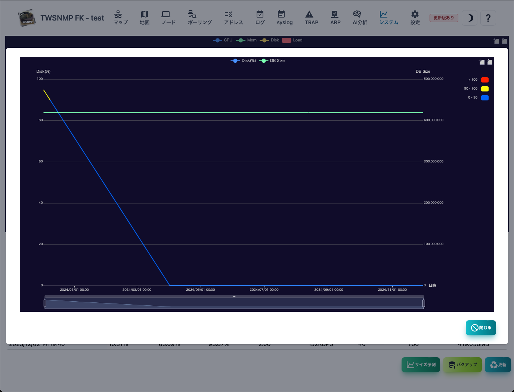


## マップ設定

管理マップの設定をする画面です。


|項目|内容|
|----|----|
|マップ名|マップの名前です。画面の左上に表示されます。<br>好きな名前をつけてください。|
|アイコンサイズ|マップに表示するアイコンのサイズです。|
|ポーリング間隔|デフォルトのポーリング間隔です。|
|タイムアウト|デフォルトのタイムアウトです。|
|リトライ|デフォルトのリトライ回数です。|
|ログ保存日数|ログを保存する日数です。過ぎた場合にログは自動で削除します。|
|SNMPモード|SNMPのバージョンと暗号化の種類です。|
|SNMP Community|SNMPv1,v2cの時のCommunity名です。|
|SNMP ユーザー|SNMPv3の時のユーザー名です。|
|SNMP パスワード|SNMPv3の時のパスワード名です。|
|Syslog|Syslogを受信します。|
|SNMP TRAP|SNMP TRAPを受信します。|
|ARP Watch|ARP監視機能を有効にします。|


### Syslog,SNMP TRAPの受信ポートを変えたい時

ポート番号は、プログラムの起動パラメータで指定します。

```
  -syslogPort int
    	Syslog port (default 514)
  -trapPort int
      SNMP TRAP port (default 162)
  -sshdPort int
      SSH Server port (default 2022)
```

> syslogやSNMP TRAPが受信できない時は、OSやセキュリティーソフトのファイヤーウオールの設定を確認ください。


## 通知設定

通知の設定をする画面です。


|項目|内容|
|----|----|
|プロバイダー|smtp/Google/Microsoftから選択します。|
|クライアントID|OAuth2(Google/Microsoft)のクライアントIDです。|
|クライアントシークレット|OAuth2(Google/Microsoft)のクライアントシークレットです。|
|テナント名|OAuth2(Microsoft)のテナント名です。|
|メールサーバー|通知メールを送信するためのメールサーバーを指定します。ホスト名又はIPアドレス：ポート番号|
|サーバー証明書をチェックしない|指定のメールサーバーがオレオレ証明書の場合にチェックします。|
|ユーザー|メール送信認証のユーザーIDを設定します。|
|パスワード|メール送信認証のパスワードを設定します。|
|送信元|送信元のメールアドレスです。|
|宛先|通知メールの宛先メールアドレスです。<br>カンマ区切りで複数指定できます。|
|件名|通知メールの件名のです。|
|通知レベル|障害通知を送信する監視レベルを指定します。|
|通知間隔|通知のチェックを行う間隔を指定します。|
|定期レポート|日報の送信を行います。|
|復帰通知|復帰した時もメールを送信します。|
|通知Webhook|障害時にPOSTするWebhookのURLを指定します。|
|レポートWebhook|定期レポート時にPOSTするWebhookのURLを指定します。|
|コマンド実行|マップの状態変化時に実行するコマンドです。<br> $levelがマップの状態です。0:重度,1:軽度,2:注意,3:正常,-1:不明|
|重度障害の再生音|マップの状態が重度の時に再生する音声ファイルを指定します。|
|軽度障害の再生音|マップの状態が軽度の時に再生する音声ファイルを指定します。|

### 送信テスト

＜テスト＞ボタンをクリックすれば、設定した内容でテストメールを送信します。
を送信します。

## AI分析設定
AI分析の設定をする画面です。


|項目|内容|
|----|----|
|重度と判定するレベル|重度障害と判定するAI分析の偏差値レベルを指定します。|
|軽度と判定するレベル|軽度障害と判定するAI分析の偏差値レベルを指定します。|
|注意と判定するレベル|注意障害と判定するAI分析の偏差値レベルを指定します。|

### AI分析について

- AI分析は、ポーリングの設定でログモードを"AI分析"に設定すると実施します。
- ポーリング結果の数値データをIsolation Forestで異常検知します。
- 結果を偏差値にしています。
- 偏差値は、学校の成績などでおなじみのものです。どのくらい稀なことかを示しています。
- というわけで、障害レベルの設定は、１万回に１回などの表現になっています。

## 地図設定

地図の設定をする画面です。


|項目|内容|
|----|----|
|スタイル|地図のスタイルを指定します。URLかJSONで指定します。|
|中央座標|地図の中央座標を経度,緯度の順にしています。<br>例:135.33885756281734,39.614306840830096|
|ズーム|地図の拡大レベルを指定します。|
|アイコンサイズ|表示するアイコンのサイズを指定します。|

### 地図のスタイルについて

MapLibre GL JSを使って地図を表示しています。表示する地図は、スタイルで指定します。
URLやJSONで指定できます。MapLibre GL JSで検索して適したものを見つけてください。

##### URLの例

```
https://tile.openstreetmap.jp/styles/osm-bright-ja/style.json
```

##### JSONの例

```json
{
			 	"version": 8,
			 	"sources": {
			 		"MIERUNEMAP": {
						"type": "raster",
			 			"tiles": ["https://tile.mierune.co.jp/mierune_mono/{z}/{x}/{y}.png"],
						"tileSize": 256,
			 			"attribution":
			 				"Maptiles by <a href='https://mierune.co.jp/' target='_blank'>MIERUNE</a>, under CC BY. Data by <a href='https://osm.org/copyright' target='_blank'>OpenStreetMap</a> contributors, under ODbL."
			 		}
			 	},
			 	"layers": [
					{
						"id": "MIERUNEMAP",
		 				"type": "raster",
			 			"source": "MIERUNEMAP",
			 			"minzoom": 0,
			 			"maxzoom": 18
			 		}
			 	]
}
```

## アイコン管理

アイコンを管理する画面です。


|項目|内容|
|----|----|
|アイコン|アイコンのイメージです。|
|名前|選択する時の名前です。自由につけられます。|
|コード|アイコンのコードです。|

|ボタン|内容|
|----|----|
|追加|新しいアイコンを追加します。|
|編集|選択したアイコンの名前を編集します。|
|削除|選択したアイコンを削除します。|
|ヘルプ|このヘルプを表示します。|
|閉じる|設定画面を閉じます。|


### アイコン編集画面


|項目|内容|
|----|----|
|アイコン|アイコンを選択します。MDIアイコンのWeb fontの名前です。|
|名前|アイコンに好きな名前をつけます。|

## MIB管理

SNMPのMIBを管理する画面です。


|項目|内容|
|----|----|
|種別|組み込みか読み込みの種類です。|
|名前|MIBモジュールの名前です。|
|ファイル|読み込んだファイル名です。|
|エラー|読み込んだ時のエラーです。|

|ボタン|内容|
|----|----|
|MIBツリー|MIBツリーを表示します。|
|ヘルプ|このヘルプを表示します。|
|閉じる|設定画面を閉じます。|

### MIBツリー画面

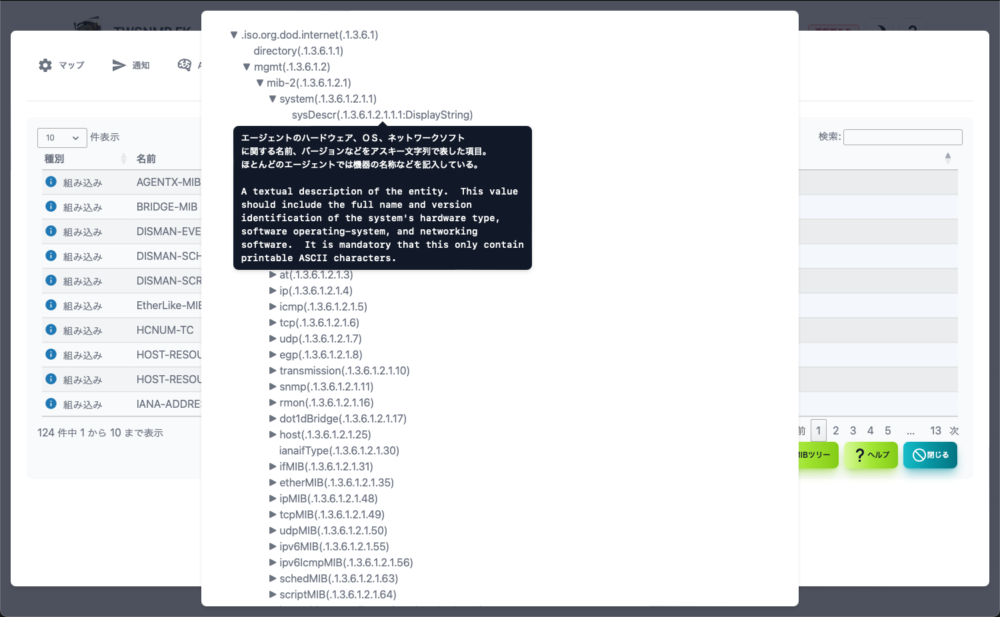

## データストア内のファイル

データフォルダ内に以下ファイルを保存すればカスタマイズできます。

|ファイル|内容|
|---|---|
|twsnmpfk.db|データベースファイルです。存在しない場合は自動作成されます。|
|services.txt|サービス名の変換の使用するファイルです。(オプション)|
|mac-vendors-export.csv|MACアドレスとベンダー名の関係を示すデータベースです。(オプション)|
|polling.json|ポーリング設定(オプション)|
|mail_test.html|通知テストメールのテンプレート(オプション)|
|mail_notify.html|通知メールのテンプレート(オプション)|
|mail_repot.html|レポートメールのテンプレート(オプション)|
|geoip.mmdb| IP位置情報 データベース (オプション) |
|extmibs/*|追加読み込みの拡張MIB(オプション)|
|icons/*| イメージアイコンのための画像ファイル pngかjpeg (オプション) |

## 起動パラメータ

```
Usage of twsnmpfk:
  -caCert string
    	CA Cert path
  -clientCert string
    	Client cert path
  -clientKey string
    	Client key path
  -datastore string
    	Path to data store directory
  -kiosk
    	Kisok mode(frameless and full screen)
  -lang string
    	Language(en|jp)
  -lock string
    	Disable edit map and lock page(map or loc)
  -maxDispLog int
    	Max log size to diplay (default 10000)
  -mcpCert string
    	MCP server cert path
  -mcpKey string
    	MCP server key path
  -netflowPort int
    	Netflow port (default 2055)
  -notifyOAuth2Port int
    	OAuth2 redirect port (default 8180)
  -otelCA string
    	OpenTelementry CA cert path
  -otelCert string
    	OpenTelemetry server cert path
  -otelGRPCPort int
    	OpenTelemetry server gRPC port (default 4317)
  -otelHTTPPort int
    	OpenTelemetry server HTTP port (default 4318)
  -otelKey string
    	OpenTelemetry server key path
  -ping string
    	ping mode icmp or udp
  -sFlowPort int
    	sFlow port (default 6343)
  -sshdPort int
    	SSH server port (default 2022)
  -syslogPort int
    	Syslog port (default 514)
  -tcpdPort int
    	tcp server port (default 8086)
  -trapPort int
    	SNMP TRAP port (default 162)
```

|パラメータ|説明|
|---|---|
|datastore|データストアのパス|
|kiosk|キオスクモード（フレームレス、フルスクリーン）|
|lock <page>| マップの編集を禁止して表示するページを固定|
|maxDispLog <number>|ログの最大表示数(デフォルト 10000)| 
|ping <mode>|pingの動作モード(icmp又はudp)|
|syslogPort <port>|syslogの受信ポート(デフォルト514)|
|trapPort <port>| SNMP TRAP受信ポート(デフォルト162)|
|sshdPort <port>| SSH Server受信ポート(デフォルト2022)|
|netflowPort <port>| NetFlow/IPFIX受信ポート(デフォルト2055)|
|sFlowPort <port>| sFlow受信ポート(デフォルト6343)|
|tcpdPort <port>| TCPログ受信ポート(デフォルト8086)|
|caCert <file>| TWLogEyeとTLS通信するためのCA証明書|
|clientCert <file>| TWLogEyeとmTLS通信するためのクライアント証明書|
|clientKey <file>| TWLogEyeとmTLS通信するためのクライアント鍵|
|otelCert <file>|OpenTelemetryのサーバー証明書|
|otelKey <file>|OpenTelemetryのサーバーの秘密鍵|
|otelGRPCPort <number>|OpenTelemetryのgRPCのポート番号|
|otelHTTPPort <file>|OpenTelemetryのHTTPのポート番号|
| mcpCert |MCPサーバーの証明書のパス|
| mcpKey |MCPサーバーの秘密鍵のパス|
| notifyOAuth2Port |OAuth2リダイレクトサーバーのポート番号(default 8180)|

## 設定ファイル

データストアのフォルダーに.twsnmpfk.iniを配置すると、起動パラメータを設定ファイルから読み込みます。フォーマットは

```ini:.twsnmpfk.ini
#lang=ja
#maxDispLog=10000
#lock=map

[logger]
syslogPort=8514
trapPort=8162
netflowPort=2056
sshdPort=2023
#tcpdPort=8086
#sFlowPort=6343

[OTel]
#otelGRPCPort=4317
#otelHTTPPort=4318
#otelCert=
#otelKey=
#otelCA=

[client]
#clientCert=
#clientKey=
#caCert=

[MCP]
#mcpCert=
#mcpKey=

```