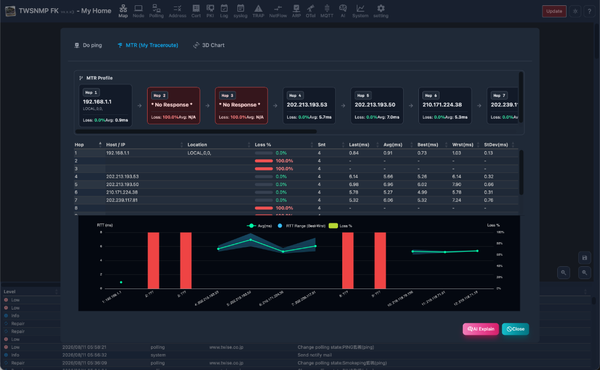
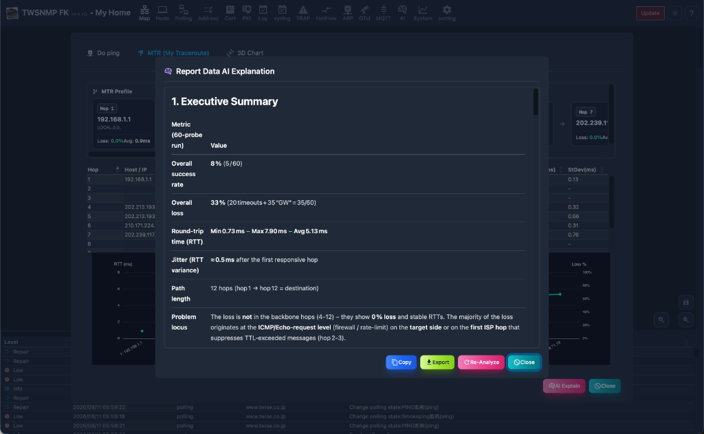
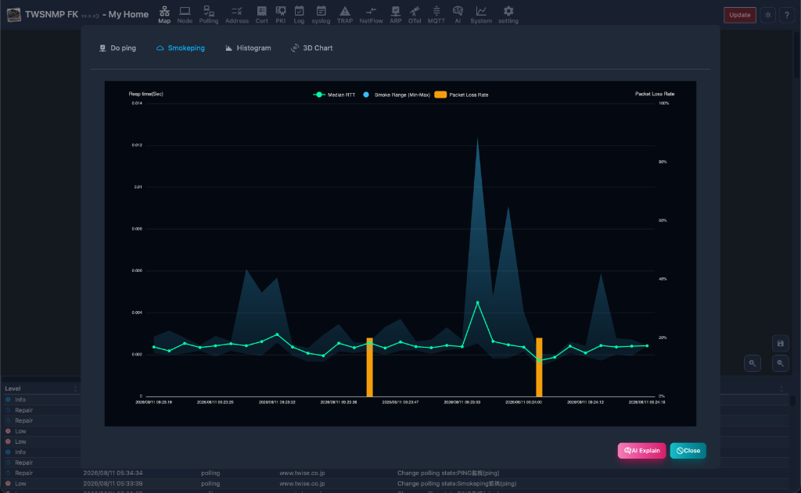
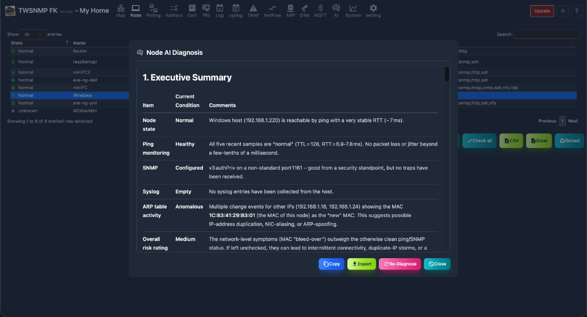
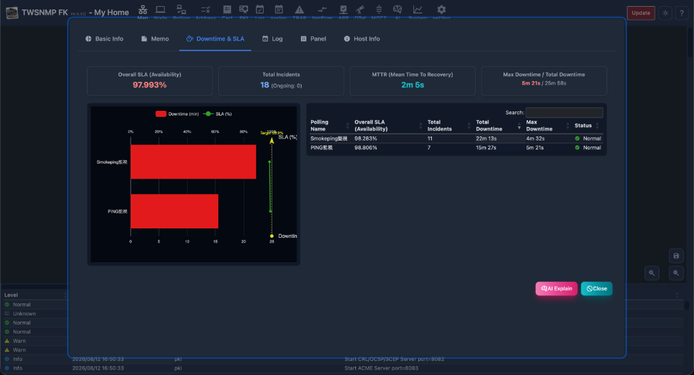
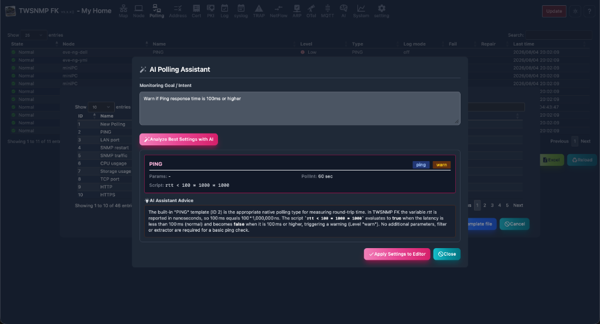
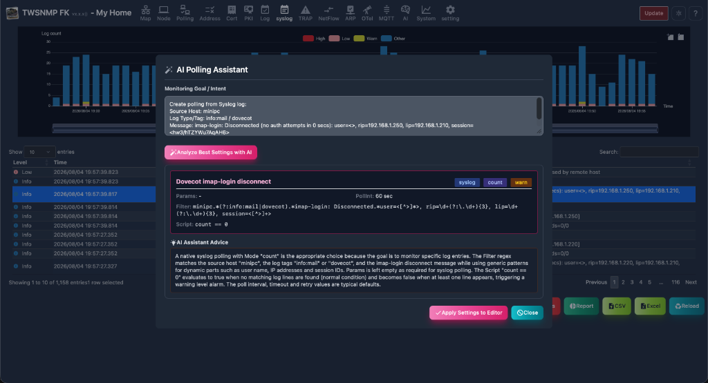
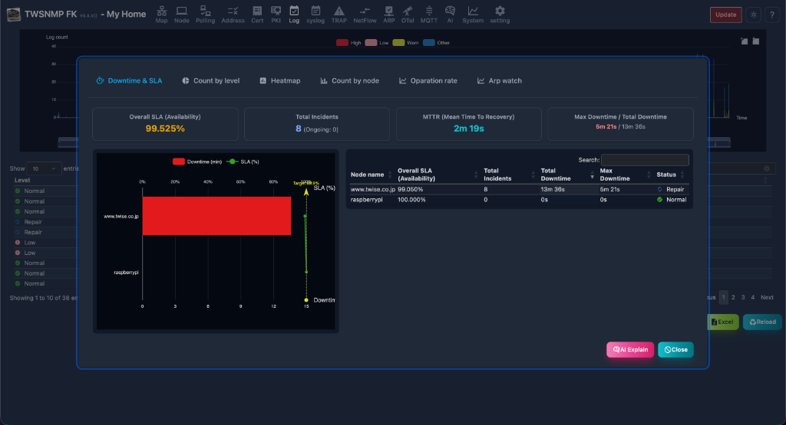
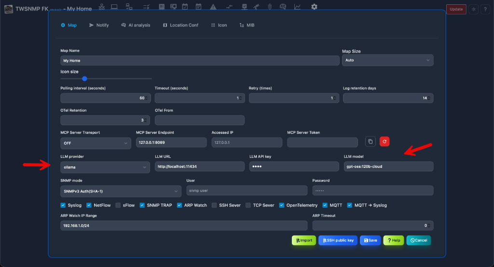

# First TWSNMP FK
Most popular SNMP manager in Japan


---

## At the beginning

TWSNMP is an SNMP manager that supports the most popular SNMPv3 in Japan for over 25 years.
It is TWSNMP FK that has been reprinted with the latest machine technology in 2023.
The TWSNMP FC that runs on the container is accessed from the web browser, but the FK is a desktop app and does not require a browser.

---

## Microsoft Store
Windows version
https://www.microsoft.com/store/apps/9nsqn46p0mVL
You can buy it.
<!-- _class: tinytext -->


---
## App Store
The Mac version is
https://apps.apple.com/jp/app/twsnmpfk/id6468539128
You can buy it.


---

## Linux Version

You can download the package (`.tar.gz` format) from the GitHub Releases.

### Notes for Running on Linux
Running the application as a normal user will result in permission errors (no raw socket permission for ICMP Ping, no privileged port permission for 514/162).
**Do not run the application directly with `sudo`** (connection to the X11/Wayland display server will break).

1. **Grant Capabilities**:
   `sudo setcap 'cap_net_bind_service,cap_net_raw+ep' ./twsnmpfk`
2. **Install ARP Monitoring Tools** (adds `arp` command):
   `sudo apt-get update && sudo apt-get install -y net-tools`
3. **Run as a normal user**:
   `./twsnmpfk`

---

## Starting TWSNMP FK
In the case of Windows, start from the start menu to the Mac OS in your favorite method, such as from the launcher.Welcome to the screen.Start with the <Start> button.Stop the program with the <Stop> button.The explanation screen of how to use it is displayed with the <Help> button.
<!-- _class: tinytext -->


---
## Select a folder to save data
Click the <Start> button on the screen to display a dialog to select a folder to save the data.Please select a folder.You can also create a new one.


---
## First map
Select a new folder and start a map without node.After a while, the log will be displayed.


---
## Flow of the first map creation
The flow of creating a map is

- Click the appropriate position on the map
- Start "Automatic discovery" from the menu
- The IP address range to be searched
- Precrose automatic discovery
- Move node on map
- Line connection

You can now search for PCs, routers, servers, etc. connected to the managed network and register on the map.

---

## New Features

TWSNMP FK is continuously enhanced. v1.30.0+ added several key features and improvements.

### SNMPv3 Security (v1.33.0)

Added support for SHA256/AES128 and SHA512/AES256, providing stronger security for modern network monitoring requirements.

### Map and UI Improvements (v1.33.0)

- **Node IP Display**: Option to show node IP addresses directly on the map.
- **Group Drawing Items**: New group (frame/background) items for better organization.
- **VPanel Enhancements**: Zoom and port wrap controls for the virtual panel.
- **Map Aesthetics**: Removed background rectangles for unselected nodes.

---

### Drawing Item Enhancements (v1.33.0)

Added support for opacity (transparency) and improved UI for background images.

### New Features in v2.2.0

- **AI Explanation for All Reports**: Added an `[AI Explain]` button to the footer (left of Close button) across all 12 report screens (Node, IPAM/Address, ARP, Event Log, Syslog, Trap, NetFlow, sFlow, sFlow Counter, MQTT, Polling, Network). Sends current tab data (system resources, storage, processes, traffic flows, log statistics, etc.) to AI (LLM) for automated health diagnostics, risk evaluation, anomaly detection, and actionable remediation advice (excluding basic info tab).
- **Address Management AI Explanation**: Added an `[AI Explain]` button to the Address Management screen. Summarizes normal address counts and sends detailed entries of abnormal/changed addresses (duplicate/169.254 APIPA, IP changes, MAC changes) to AI (LLM) for detailed per-entry diagnosis, root-cause analysis, security/operational risk evaluation, and recommended action steps.
- **AI-Assisted Polling Creation from Log Views**: Displays an `[AI Assist]` button when selecting entries in Syslog, SNMP Trap, MQTT, NetFlow, or sFlow log views (when AI is enabled) to automatically generate polling configurations (types, parameters, filters, Grok patterns, scripts).
- **Conditional AI Feature Controls**: AI action buttons across all views are dynamically displayed only when AI integration is enabled.
- **Node Selection Enhancements in Polling**: Required target node selection during polling creation, and enabled changing target nodes when editing existing polling entries.

### New Features in v2.1.0

- **Expanded Map Exporting**: Export maps to various formats (PNG, SVG, PDF, Draw.io XML/SVG, JSON, CSV, Excel XLSX).
- **Enhanced AI (LLM) Integration**:
  - **Node AI Diagnosis**: Automatically diagnose node status, related logs, and response behaviors via AI (LLM) from map context menus or node lists.
  - **Event Log AI Investigation**: AI-driven analysis of root causes and suggested actions for selected event logs.
  - **Polling AI Assist**: AI assistant for generating and suggesting monitoring types, parameters, and scripts in the polling editor.
- **Extended AI Polling Algorithms**: Added "Hotelling's T2" and "k-NN" (k-Nearest Neighbors) algorithms alongside Isolation Forest.
- **Enhanced MQTT Features**: Formatted viewer for the latest received payload (JSON/TEXT/HEX) and MQTT topic statistical report charts.
- **Improved Table Navigation**: Multi-select range selection (`multi+shift`) using the Shift key across all data tables.

---

### AI (LLM) Integration (v1.32.0)

- **MIB Browser**: Natural language search and AI-powered MIB object explanations.
- **Log Analysis**: AI explanations for NetFlow, Syslog, and SNMP Trap logs.
- **Report Summarization**: AI-driven summaries for periodic reports.
- **Multi-Provider Support**: Supports Gemini, OpenAI, Claude, and Ollama.

---

TWSNMP FK provides a "Network Report" function that visualizes MAC addresses, IP addresses, hostnames, and other information of devices connected to each port from the FDB (Forwarding Database) table information of network switches, allowing you to grasp the overall connection status of the network.

### Displaying the Report

By clicking on the network icon on the map displayed on the "Network" screen, a detailed report of that network will be displayed. This report includes the FDB table, last change time of each port, and so on.

### FDB Table Visualization

Based on the FDB table information, a list of which MAC addresses are connected to each port, and the corresponding IP addresses and hostnames for those MAC addresses, is displayed. This allows you to see at a glance which device in the network is connected to which port.

### Line Search

By entering a MAC address or IP address, you can quickly search for the switch port to which the target device is connected.

---
## Map

The map screen has three large parts.


---
| Screen | Contents |
| ---- | ---- |
| Toolbar | Switch the screen.|
| Map | This is the part that displays the composition of the network.|
| Event Log | Displays the latest 100 event logs.|


---
###  Light/dark mode switching

Click the 🌙 mark on the upper right to dark mode.I like dark mode.Probably the person who aims for a white hacker likes dark mode.There are only white hackers in the cat world.By Cat of the predecessor assistant.The current assistant cat seems to like both because the pattern is black and white.


---
### Map menu

Right -click the location other than the node and drawing items on the map to display.


---
| Menu | Operation |
| ---- | ---- |
| Add node | Add the node to the map manually.|
| Draw item | Add drawing items to the map.|
| New Network | Add network elements to the map.|
| Check all | Reconfirm the node that has occurred.|
| Discover | Displays the automatic discovery screen.|
| Import | Import map file from TWSNMP v4.x.|
| Export | Export map to Image (PNG, SVG, PDF), Draw.io, or Data (JSON, CSV, Excel) formats.|
| Grid | Align the position of the node at the specified interval.|
| Background image | Set background image for the map.|
| Reload | Update the map to the latest state.|
| Edit mode | All drawing items are displayed regardless of the state of the map.|
| Node Info | Display additional information for nodes on the map.|


---
### Node menu
Right -click the node on the map to display it.


---
| Menu | Operation |
| ---- | ---- |
| Report | Displays the report screen related to the node.|
| AI Diagnosis | Diagnose node status, related logs, and responses using AI (LLM).|
| PING | Displays the ping screen.|
| MIB Browser | Displays MIB browser.|
| gNMI Tool | Displays gNMI Tool.|
| Wake On Lan | Send Wake On Lan packet.|
| Edit | Displays the screen to edit the node settings.|
| Polling | Displays a polling list related to nodes.|
| ReCheck | Reconfirm the condition of the node by executing polling.|
| Copy | Create a node duplication.|
| Delete | Delete node.|


---
### Network node menu

Right-click a network node on the map to display this menu.


---
| Menu | Operation |
| ---- | ---- |
| Report | Displays the network report screen.|
| ReCheck | Reconfirm polling for the network node.|
| PING | Displays the ping screen.|
| MIB Browser | Displays MIB browser.|
| Find neighbor | Search connection targets via switch FDB table.|
| Edit | Edit network node settings.|
| Edit line | Edit connection lines.|
| Delete | Delete network node.|


---
### Draw item menu
Right -click the drawing item on the map to display it.


---
| Menu | Operation |
| ---- | ---- |
| Edit | Displays the screen to edit the drawing item settings.|
| Copy | Create drawing items.|
| Delete| Delete drawing items.|


---
### Discover
Automatic discovery screen.


---

| Items | Contents |
| ---- | ---- |
| Start IP | The first IP address range to search.|
| End IP | The end of the IP address range to search.|
| Timeout | This is the timeout of ping when searching.|
| Retry | This is the number of retrys of ping when searching.|
| Port scan | Perform a port scan on the found node.|
| add polling| Polling is automatically set on the found node.|
| <Start>| Start automatic discovery.|
| <Auto IP range> | Automatically set the search range from the PC IP address.|

---
#### Automatic discovery is being performed
The number of nodes you have executed or discovered is displayed.


---
#### Automatic discovery is being executed (with port scanning)
The number of nodes you have executed or discovered is displayed.When performing a port scan, the discovered server function is also displayed.


---
### Node editing
You can edit the node from the menu or button by selecting a node on the map screen or node list.


---
| Items | Contents |
| ---- | ---- |
| Name | Node name.|
| IP address | Node IP address.|
| Address mode | IP address fixation (default), MAC address fixing, host name fixed.|
| Icon | It is an icon to be displayed.|
| Auto recheck | When it is returned, it will be automatically normal.|
| SNMP mode | SNMP mode.There are SNMPv1, V2C, V3 (authentication and encryption).|

---
| Items | Contents |
| ---- | ---- |
| SNMP Community | Community name for SNMPV1, V2C.|
| User | User ID when accessing with SNMPv3.|
| Password | Password when accessing with SNMPv3.|
| Public key | This is the public key of the node when polling with SSH.<br> In the case of blank, automatically set at the first connection.|
| URL | URL when accessing with browser etc.<br> It will be displayed on the right -click menu.<BR> You can specify multiple by separation of comma.|
| Description | Supplementary information is described.|


---
### Drawing item (rectangle, elliptical)
It is an edit screen of drawing item (rectangle, elliptical).


---

| Items | Contents |
| ---- | ---- |
| Type | It is a type of drawing item.You can only change it when you add it.|
| Width | The width of the drawing item.|
| Height | It is the height of the drawing item.|
| Color | It is the color of the drawing item.|
| Display condition | It is a state of the map that displays drawing items.|
| Magnification | The display rate of drawing items.|


---
### Drawing item (label)
It is the editing screen of the drawing item (label).


---

| Items | Contents |
| ---- | ---- |
| Type | It is a type of drawing item.You can only change it when you add it.|
| Character size | Label character size.|
| Color | It is the color of the drawing item.|
| Display condition | It is a state of the map that displays drawing items.|
| Character string | It is a string to be displayed.|
| Magnification | The display rate of drawing items.|

---
### Drawing item (image)
It is the editing screen of drawing item (image).


---

| Items | Contents |
| ---- | ---- |
| Type | It is a type of drawing item.You can only change it when you add it.|
| Width | It is the width of the image.|
| Height | It is the height of the image.|
| Display condition | It is a state of the map that displays drawing items.|
| Image | It is an image to be displayed.Select an image file with the <Select> button.|
| Magnification | The display rate of drawing items.|


---
### Drawing item (polling result)
It is the editing screen of drawing item (polling result: text).


---

| Items | Contents |
| ---- | ---- |
| Type | It is a type of drawing item.You can only change it when you add it.|
| Size | Character size.|
| Node | This is a node list for selecting polling.|
| Polling | Polling that displays results.|
| Variable name | The name of the variable displayed from the polling results.|
| Display format | Format when displaying.|
| Magnification | The display rate of drawing items.|

---
### Drawing item (polling result: gauge)
It is the editing screen of drawing item (polling result: gauge).It can be used to display % data.


---
| Items | Contents |
| ---- | ---- |
| Type | It is a type of drawing item.You can only change it when you add it.|
| Size | Gauge size.|
| Node | This is a node list for selecting polling.|
| Polling | Polling that displays results.|
| Variable name | The name of the variable displayed from the polling results.|
| Gauge label | This is a character string displayed under the gauge.|
| Magnification | The display rate of drawing items.|


---
### Line editing
To edit the line, press the two nodes while pressing the shift key on the map screen.


---

| Items | Contents |
| ---- | ---- |
| Node1 | This is the first node to connect the line.|
| Polling1 | This is the first node polling that determines the color on one side of the line.|
| Node2 | This is the second node to connect the line.|
| Polling2 | This is the second node polling that determines the color on one side of the line.|
---

| Items | Contents |
| ---- | ---- |
| Polling for information | Polling for information displayed next to the line.<br> Specify the traffic monitor polling.|
| Information | Set the character string to be displayed next to the line.<br> It will be overwritten by setting a polling for information.|
| Thickness of the line | It is the thickness of the line.|
| Port | Specify the port number used when displaying the panel.|

---
### PING
This is the screen to execute ping diagnostics. Four operation modes are available: Normal Ping, Smoke (jitter analysis), Traceroute, and MTR (real-time per-hop metrics).
To get location information, a GeoIP database file is required.


---
| Items | Contents |
| ---- | ---- |
| Operation Mode | Select the execution mode (Normal Ping, Smoke, Traceroute, MTR). |
| IP address | The target IP address or hostname to run ping. |
| Count / Duration | Number of execution times for Normal Ping, or duration (1 min, 3 min, 5 min, 10 min, Continuous) for Smoke and MTR modes. |
| Size | Ping packet payload size.<br> Select "Inc Size" in Normal Ping to run pings with increasing packet size. |
| TTL | TTL value of ping packets (configurable in Normal Ping mode). |
| Result Graph | Time-series graph of ping response time and TTL values. |

---
| Items | Contents |
| ---- | ---- |
| Results | Ping execution log results.<br> Timestamp, response time, size, Tx/Rx TTL, source IP, location. |
| Beep | Notify ping execution results with sound. |
| Start | Start ping in the selected mode. |
| Stop | Stop ping. |
| AI Explain | Send displayed charts and report data to AI (LLM) for automated diagnostic analysis. |
| Close | Close the ping window. |

---
#### MTR (My Traceroute)
Automatically discovers all router hops along the path to the target, and performs continuous ping sampling to each hop. Displays per-hop metrics (Sent, Avg, Best, Worst, StDev, Loss %) and a hop latency profile chart.



##### MTR AI Explanation
Sends the MTR path metrics, hop-by-hop latency, and packet loss statistics to AI (LLM) for automated path diagnostics, problem locus identification, and actionable network troubleshooting advice.



---
#### Smokeping
Measures and visualizes latency variation (jitter), min/max/median response times, and packet loss intensity using high-frequency pings (200ms interval) with color gradient charts.



---
####  PING Histogram
It is a histogram of response time.


---
#### PING 3D analysis
The response time, size, and implementation date and time are displayed in 3D graphs.


---
####  PING Line speed prediction
From the change in response time if the size is changed
This is a report that predicts the line speed.


---
#### PING Route analysis
Display location information. It cannot be displayed without a GEOIP database.


---
### MIB browser
This is a screen to get MIB information of SNMP from the node.
It is necessary to set SNMP access information in the node setting.
If you want to use MIB other than built -in, save the MIB file to the extmibs of the data folder.
<!-- _class: tinytext -->


---
| Items | Contents |
| ---- | ---- |
| Object name | Specify the object name of the MIB you want to get.<br> You can choose from the MIB tree.Example: System |
| <MIB Tree> Button | Display MIB tree.|
| History | It is the history of the object name obtained so far.You can select and get it again.|
| Results | Acquired MIB information.In the case of MIB in a table format, it is automatically displayed in a table format.|
---
| Items | Contents |
| ---- | ---- |
| Raw data | Displays the acquired MIB information without converting it.<BR> In the case of off, convert the time data to an easy -to -understand display.|
| Acquisition | Get MIB information.|
| CSV | Export the obtained MIB information of the CSV file.|
| Excel | Export the acquired MIB information of the Excel file.|

---
#### MIB tree

This is a screen for selecting the obtained MIB object name.
You can narrow down the displayed MIBs by entering keywords in the search box at the top of the MIB tree.
OIDs, MIB names, descriptions, etc., are subject to search.
Open the tree and click the object name to see the explanation.
Double click to select.
Also, AI-powered object explanation is available.


---
#### Set dialog

This is the screen for executing SNMP Set. Specify the object name, type, and value and press the <SET> button to send a Set request.


---
### GNMI tool

<!-_class: TinyText->
This is a screen to acquire management information from Node from GNMI.
You need to set the GNMI in the node settings.

| Items | Contents |
| ---- | ---- |
| Target | Specify the IP: port to access with GNMI.|
| Encoding | Specify GNMI encoding.(JSON | JSON_IETF) |
| PATH | Specify the path to get.|
| History | Path history acquired so far.You can select and get it again.|
| Result | This is the result of acquired.|
| Copy | Copy the acquired results.|
| Polling | Create a polling from the selected result.|
| Capabilities | Get Capabilities.|
| YANG Information | Displays GitHub in the Yang file.|
| Acquisition | Execute GET under the specified conditions.|
| CSV | Save the result with CSV.|
| Excel | Save the result with Excel.|

---
## Location Map screen
This is a screen that displays the node on the map.
Map data can be used in OpenStreetMap, which is used in location information services.
You can select by clicking the node.You can move by dragging.Multiple choices cannot be selected.
<!-- _class: tinytext -->


---
| Items | Contents |
| ---- | ---- |
| Edit | Displays the screen of the selected node.|
| Polling | Displays the selected node polling.|
| Delete| Delete the selected node from the map screen.|
| Report | Displays the selected node report screen.|
| Initial display| Save the center and zoom level of the map.The next time you open the map screen, it will be in the same state.|
| Reload | Update the list of event logs to the latest state.|

---
### Add node to location map

Right -click where you want to place the node on the map and the dialog to add is displayed.You can add it by selecting a node.
<!-- _class: tinytext -->


---
## Node list
A list of nodes to be managed.


---
| Items | Contents |
| ---- | ---- |
| State | Node condition.<br> Severe, mild, precautions, return, normal, unknown.|
| Name | Node name.|
| IP address | Node IP address.|
| MAC address | Node MAC address.|
| Vendor | The name of the vendor corresponding to the MAC address.|
| Description | Supplementary information about nodes.|

---
| Items | Contents |
| ---- | ---- |
| Edit | Edit node settings.|
| Polling | Displays a list of polling related to the selected node.|
| AI Diagnose | Comprehensive AI-powered (LLM) diagnosis of node status, related logs, and responses.|
| Report | Displays the selected node analysis report.|
| Delete| Delete the selected node.|
| Reconfirm | Reconfirm the polling of the selected node.|
| Remost confirmation | Reconfirm all nodes polling.|
| CSV | Export the node list to the CSV file.|
| Excel | Export the node list to the Excel file.|
| Reload | Update the node list to the latest state.|


---
### Node polling list
A list of polling related to nodes.


---
| Items | Contents |
| ---- | ---- |
| State | Polling state.<br> Severe, mild, precautions, return, normal, unknown.|
| Name | Polling name.|
| Level | Pauling level.|
| Type | Polling type.<br> Ping, SNMP, TCP, etc. |
| Log | Log mode.|
| Last time | This is the last date and time when polling was implemented.|

---

| Items | Contents |
| ---- | ---- |
| Add | Add polling to nodes.|
| Edit | Edit the selected polling.|
| Copy | Create a selected polling copy.|
| Report | Displays the selected polling analysis report.|
| Delete | Delete the selected polling.|
| Reload | Update the polling list to the latest state.|
| Close | Close the list of polling.|


---
### AI Diagnosis
Uses AI (LLM) to comprehensively analyze the selected node's current status, polling responses, and related logs.



---
| Items | Contents |
| ---- | ---- |
| Copy | Copy the AI diagnosis report content to the clipboard.|
| Export | Export the AI diagnosis report content to a text file.|
| Re-Diagnose | Re-run the AI diagnosis using the latest node status and log data.|
| Close | Close the AI diagnosis dialog.|


---
### Basic information report
Basic information about nodes.


---
### Memo

Memo about the node.


---
### Downtime & SLA

An aggregate report analyzing overall node SLA (Availability %), total incidents count, MTTR, max/total downtime, and per-polling downtime & SLA ranking chart and detail table based on polling failure and recovery logs. Supports AI explanation via the `[AI Explain]` button.



---
### node event log
This is an event log related to the node.


---
### Panel
Displays the appearance of the node.Displays the port from the acquisition of the interface mib by SNMP or the line connection information.The <physical port> switch can only be displayed on the physical port.Rotate the panel display with the <rotation> switch.
<!-- _class: tinytext -->


---
### Host information
Displays the information of the host resource mib of SNMP.If it is not compatible with the host resource MIB, it cannot be displayed.
<!-- _class: tinytext -->


---
### Storage
Displays the storage information of SNMP host resource mib.When you select, the addition button of the polling will be displayed.If it is not compatible with the host resource MIB, it cannot be displayed.
<!-- _class: tinytext -->


---
### Device
Displays the device information of the SNMP host resource MIB.If it is not compatible with the host resource MIB, it cannot be displayed.
<!-- _class: tinytext -->


---
### File System
Displays File System, information on SNMP host sources MIB.If it is not compatible with the host resource MIB, it cannot be displayed.
<!-- _class: tinytext -->


---
### Process
Displays the process information of SNMP host resource mib.When you select, the addition button of the polling will be displayed.If it is not compatible with the host resource MIB, it cannot be displayed.

<!-- _class: tinytext -->


---
## Polling list
A list of polling to be managed.


---
| Items | Contents |
| ---- | ---- |
| State | Polling state.<br> Severe, mild, precautions, return, normal, unknown.|
| Node name | Node related to polling.|
| Name | Polling name.|
| Level | Pauling disability level.|
| Type | Polling type.(Ping, SNMP, TCP, HTTP, DNS, TWSNMP, Syslog, Mail, etc.)|
| Log | Polling log mode.|
| Final confirmation | Polling final confirmation date and time.|

---

| Items | Contents |
| ---- | ---- |
| Add | Add polling.|
| Edit | Edit the selected polling.|
| Copy | Copy the selected polling.|
| Export | Export the selected polling settings.|
| Report | Displays the selected polling analysis report.|
| Delete log| Delete the selected polling logs.|
| Delete| Delete the selected polling.|
| CSV | Export the polling list to the CSV file.|
| Excel | Export the polling list to the Excel file.|
| Reload | Update the polling list to the latest state.|


---
### Polling template selection

This is the selection screen of the template displayed when adding polling.


---
| Items | Contents |
| ---- | ---- |
| ID | Template number.|
| Name | Polling name.|
| Type | Polling type.<br> Ping, SNMP, TCP, etc. |
| Mode | Polling mode.|
| Description | Polling explanation.|
| Template file | Import polling from template file.|
| Add | Select polling.|
| Cancel | Polling Closes.|


---
### AI Polling Setting Assistant

An assistant feature that leverages AI (LLM) to automatically generate optimal polling types, threshold parameters, evaluation JavaScript scripts, and setup advice from natural language prompts or received log messages.

#### Natural Language Prompting


#### Creating Polling from Received Logs (Syslog/TRAP)


---
| Items | Contents |
| ---- | ---- |
| Monitoring Goal / Intent | Enter desired monitoring details or alert conditions in natural language.|
| Quick Examples | One-tap input for common monitoring scenarios (Ping Latency, HTTP/HTTPS, Syslog Error, etc.).|
| Analyze Best Settings with AI | Send request to AI (LLM) based on the instructions to analyze and generate optimal settings.|
| Setting preview | Preview of the generated polling type, evaluation script, polling interval, and status level.|
| AI Assistant Advice | Detailed explanation and guidance from AI regarding the generated configuration logic.|
| Apply Settings to Editor | Apply the AI-generated settings directly to the polling configuration/edit screen.|
| Close | Close the AI polling setting assistant dialog.|


---
### Basic information
Basic information about polling.


---
### Polling log
This is a log of the polling result.It is displayed only when the log mode is not output.
<!-- _class: tinytext -->


---
### Time chart
In the log of the polling result, the numerical data is displayed in a chronological graph.The displayed items can be selected at the top of the graph.It is displayed only when the log mode is not output.
<!-- _class: tinytext -->


---
### Histogram
The numerical data in the log of the polling result is displayed on the histogram.The displayed items can be selected at the top of the graph.It is displayed only when the log mode is not output.
<!-- _class: tinytext -->


---
### AI analysis
This is the result of AI analysis of numerical data in the log of the polling results.It is displayed only when the log mode is set to AI analysis and sufficient data is obtained.
<!-- _class: tinytext -->


---
### Polling editing
Polling edit can be displayed by clicking the button on the polling list. The AI Assist feature is available when adding or editing a polling monitor.
<!-- _class: tinytext -->


---
| Items | Contents |
| ---- | ---- |
| Name | Polling name.|
| Level | Pauling disability level.|
| Type | Polling type.<br> Ping, SNMP, TCP, etc. |
| Mode | Operation mode depends on the type of polling.|
| Log mode | How to save the polling result log ("None", "Always", "On change", "AI analysis").|
| AI mode | Anomaly detection algorithm used when Log mode is "AI analysis" ("Isolation Forest", "Hotelling's T2", "k-NN").|
---
| Items | Contents |
| ---- | ---- |
| Parameter | Polling type and mode -dependent parameters.<br>For email polling, set the following:<br><ul><li>**Mail Server**: Hostname or IP address of the IMAP/POP3 server</li><li>**Port**: Port number of the IMAP/POP3 server (993 for IMAP, 995 for POP3 are common)</li><li>**User Name**: Username for the mailbox</li><li>**Password**: Password for the mailbox</li><li>**Protocol**: IMAP or POP3</li><li>**Secure Connection**: Whether to use SSL/TLS</li><li>**Keyword**: Check if the mail subject or body contains specific keywords (optional)</li></ul>|
| Filter | Polling type and filter condition that depends on mode.|
| Extract pattern | This is a GROK pattern that depends on the type of polling and the mode.Use when extracting data from logs.|
| Script | Java Script that determines disability and calculates variables.|
| Polling interval | Polling interval.|
| Timeout | Timeout at the time of polling.|
| Retry | This is the number of retry times when polling.|
| AI Assist | Generates and suggests monitoring methods, parameters, and scripts using AI (LLM) based on prompt requests.|

---
## Address list
This is a list of IP address found by TWSNMP.Only the IP address in the same segment found in the ARP watch function is displayed.You can detect duplicate and the change in the address.
<!-- _class: tinytext -->


---

| Items | Contents |
| ---- | ---- |
| State | It is the state of the address.(Normal, duplicate, IP change, Mac change.) |
| Address | IP address.|
| Domain | Domain information obtained from reverse IP lookup, etc.|
| MAC address | MAC address.|
| Node name | The name of the node registered on the map as a management target.|
| Vendor | The name of the vendor corresponding to the MAC address.|
| Risk | Risk level determined from the IP address.|
| Final change | This is the last change date and time.|

---

| Items | Contents |
| ---- | ---- |
| Add node | Add the selected IP address to the map.It is displayed only when it is not registered.|
| Delete| Delete the selected IP address.|
| Report | Display the address list report.|
| AI Explanation | Sends current tab data to AI (LLM) for subnet allocation efficiency, IP conflict risk analysis, and recommendations (only visible when AI integration is enabled).|
| clear| Clear all address lists.|
| CSV | Export the address list to the CSV file.|
| Excel | Export the address list to the Excel file.|
| Reload | Update the address list to the latest state.|

---
### IP address usage status

This is a report on the status of the set IP address.
<!-- _class: tinytext -->


---
### Relationship between IP and MAC address (force model)

This is a report that shows the relationship between IP address and MAC address with an force model.The normal address is one -on -one for the IP address and the MAC address.You can detect MAC addresses using the same IP address on multiple Macs or having multiple IP addresses.
<!-- _class: tinytext -->


---
### Relationship between IP and MAC address (circular model)
This is a report that shows the relationship between IP address and MAC address with a circular model.The normal address is one -on -one for the IP address and the MAC address.You can detect MAC addresses with the same IP address on multiple Macs or have multiple IP addresses.
<!-- _class: tinytext -->


---
### Address Analysis

Displays detailed info on IP addresses, MAC addresses, and domain names.
Available from the address list or log lists (Syslog, NetFlow, etc.).

| Item | Contents |
| ---- | ---- |
| State | Information level (severity). |
| Name | Information item name. |
| Value | Information value. |

---
## Server certificate list

Monitor server certificates from TWSNMP. Add targets via the edit screen.


<!-- _class: tinytext -->

|Item|Content|
|----|---|
|>|Expand the server certificate details.|
|Status|Status certificate state.|
|Target|The IP address or host name of the server.|
|Port number|The port number to monitor.|
|Subject|This is the certificate content of the server certificate. Host name, etc.|
|Issuer|Issuer of the server certificate.|
|Start|The start date and time for the server certificate expiration date.|
|End|The end date and time of the server certificate expiration date.|
|Last Confirmation|The date and time of the last verification.|

|Button|Content|
|----|---|
|Add|Add monitored targets.|
|Edit|Edit the selected monitored object.|
|Delete|Deletes the selected monitored object.|
|AI Explain|Sends all server certificate data (including normal, expiring soon, and error status) to AI (LLM) to analyze operational status, risks, and recommended actions for certificate renewal or configuration fixes (displayed only when AI integration is enabled).|
|Update|Refresh the list to the latest state.|


---
## PKI CA construction
<!-- _class: tinytext -->

This is the screen before building a CA for the PKI function.


---
<!-- _class: tinytext -->

|Item|Content|
|----|---|
|Name|This is the name of the CA.I'll try to use the Subject of the CA certificate.|
|DNS name|Specify the CDP of the certificate to be issued, the OCSP address, the host name and IP address to be used for SANs for the certificate of the ACME server, separated by commas.|
|ACME URL|This is the basic URL for the ACME server.Blanks will be automatically set from the host name.|
|OCSP/SCEP Server URL|This is the basic URL for the CRL/OCSP/SCEP Server.Blanks will be automatically set from the host name.|
|CA key type|Specify the CA key type.|

---
|Item|Content|
|----|---|
|CA certificate duration|Specify the number of years the certificate is valid.|
|CRL Update Interval|Specify the CRL update interval in hours.|
|Certificate Period|Specify the period of the certificate to be issued in hours.|
|CRL/OCSP/SCEP server port number|Specify the HTTP server port number.Cannot be changed later.|
|ACME Server Port Number|Specify the ACME Server Port Number.Cannot be changed later.|

---
### Certificate list
After the CA is built, the certificate list screen will be displayed.You can check the issued certificate.

<!-- _class: tinytext -->


---
<!-- _class: tinytext -->

|Item|Content|
|----|---|
|Status|Certificate status.|
|Type|Certificate type.|
|ID|Certificate serial number.|
|Subject|A Subject for the certificate.|
|Node|The node where the certificate was obtained.|
|Created|The start date and time of the certificate period.|
|Expire|The end date and time of the certificate period.|
|Revoked|The date and time the certificate was revoked.|
---
<!-- _class: tinytext -->

|Item|Content|
|----|---|
|Create CSR|Displays the screen for creating a certificate request (CSR).|
|Certificate creation|Read the CSR and issue the certificate.|
|CA Initialization|Destroy CA.|
|Server Control|Displays the server control screen.|
|Renew|Update the certificate list.|
|Revokes|Revokes the selected certificate.|
|Export|Saves the selected certificate to a file.|
---

#### Create CSR
<!-- _class: tinytext -->
This is the screen for creating a certificate request (CSR).


---

|Item|Content|
|----|---|
|Key type|Specifies the key type for CSR.|
|Name|Specifies the value for CN.|
|SANs|Subject Alt Names are specified, separated by commas.|
|Organization name|Specify the organization name.It's OK to leave blank.|
|Organization Unit|Specify an organizational unit.It's OK to leave blank.|
|Country code|Specify the country code.It's OK to leave blank.|
|State/Province name|Specify the state or prefecture name.It's OK to leave blank.|
|City name|Specify the city name.It's OK to leave blank.|
---

### Server Control
<!-- _class: tinytext -->
This is a screen that controls the operation of the PKI server.


---

|Item|Content|
|----|---|
|ACME Server|Start the ACME server.|
|CRL/OCSP/SCEP Server|Start the CRL/OCSP/SCEP server.|
|ACME Server Basic URL|Specifies the basic URL that the ACME server responds to.|
|CRL Update Interval|Specify the CRL update interval in hours.|
|Certificate Period|Specify the period of the certificate to be issued in hours.|

---
## Event Log
This is the event log screen.At the top, there is a graph showing the number of logs in chronological order.


---
| Items | Contents |
| ---- | ---- |
| Level | Log level.There is severe, mild, attention, return, and information.|
| Date and time | The date and time of the log is recorded.|
| Type | Log type. Polling, System, Oprate, User, ArpWatch, |
| Related node | Name of node related to logs.<br> The blank means that there is no related node.|
| Event | This is an event that occurred.|

---

| Items | Contents |
| ---- | ---- |
| AI Investigation | Automatically analyzes and investigates the root cause and suggested measures for selected event logs using AI (LLM).|
| Filter | Specify the search conditions and display the log.|
| Delete all logs | Delete all event logs.|
| Report | Displays the event log analysis report.|
| CSV | Export the event log to the CSV file.|
| Excel | Export the event log to the Excel file.|
| Reload | Update the list of event logs to the latest state.|

---
### AI Investigation
Uses AI (LLM) to automatically analyze the root cause of recorded system events and warning logs, timeline event transitions, and recommended troubleshooting steps.


---
| Items | Contents |
| ---- | ---- |
| Copy | Copy the investigation report content to the clipboard.|
| Export | Export the investigation report content to a text file.|
| Re-Analyze | Re-run the AI cause investigation using the latest event log data.|
| Close | Close the AI investigation dialog.|


---
### Event log filter
This is a dialog that specifies the search conditions for the event log.


---
| Items | Contents |
| ---- | ---- |
| Level | Log level.All, there are more attention, more than severe, mild.|
| Type | Log type. Polling, System, Oprate, User, ArpWatch, |
| Related node | Search by node name related to the log.|
| Event | Search by the string of the event that occurred.|

<br>
The string can be searched by regular expression.

---
### Event log downtime & SLA
An aggregate report analyzing overall SLA (Availability %), total incidents count, MTTR (Mean Time To Recovery), max/total downtime, and node-by-node SLA/downtime ranking chart and detail table based on polling failure and repair events.



---
### Event log count by state

This is a report of the number of event logs by state (level).


---
### Event log Heatmap
This is a report of the number of cases of each event log on the heat map.


---
### Event log count by node

This is a report of the number of event logs by node.


---
### Operating rate
This is a report that uses a chronological graph of the value of the operating rate (OPRATE) in the event log.


---
### ARP watch

This is a report of the value of the address usage rate (ARPWATCH) in the event log as a chronological graph.


---
## Syslog
Syslog screen.At the top, there is a graph showing the number of logs in chronological order.


---
| Items | Contents |
| ---- | ---- |
| Level | Syslog level.There is severe, High,Low, Warn, and information.|
| Date and time | It is the date and time when I received syslog.|
| Host | SYSLOG source host.|
| Type | Syslog Facility and priority string.|
| Tags | Syslog tag.Process and process ID.|
| Message | Syslog message.|

---

| Items | Contents |
| ---- | ---- |
| Polling | Register the polling from the selected syslog.|
| Filter | Specify the search conditions and display syslog.|
| Delete all logs | Delete all syslogs.|
| Report | Displays Syslog analysis reports.|
| Export CSV | syslog to CSV file.|
| Excel | EXCEL file is exported to syslog.|
| Reload | Update the list of syslog to the latest state.|

---
### Syslog Filter
This is a dialog that specifies the search conditions for syslog.


---
| Items | Contents |
| ---- | ---- |
| Level | Syslog level.<BR> All, more than information, more than caution, mild or higher, more severe.|
| Host | It is the source host.|
| Tags | The value of the syslog tag.|
| Message | Syslog message.|

*Host,Tag,Message can be searched in regular expressions.

---
### Syslog count by state
This is a report of the number of syslogs by state.


---
### Syslog Heatmap
This is a report of the number of cases of syslog on the heat map.


---
### Normalization Analysis

Report that normalizes syslog and aggregates it.
Counts numbers, IP addresses, email addresses, etc. with common characters.


---
### Syslog count by host
This is a report of the number of syslogs by the source host.


---
### Syslog count by host (3D)
This is a report displayed in three -dimensional graphs of Syslog, source host, priority, and time.


---
### Syslog FFT
This is a report that analyzes Syslog for each host and analyzes the number of receiving cases.


---
### AI Explanation
Sends current Syslog reports, severity distributions, and top sender host metrics to AI (LLM) for log spike analysis, anomaly explanation, and actionable remediation steps (only visible when AI integration is enabled).

---
## SNMP TRAP
SNMP Trap log screen.At the top, there is a graph showing the number of logs in chronological order.


---

| Items | Contents |
| ---- | ---- |
| Date and time | This is the date and time of receiving SNMP Trap.|
| Sending source | SNMP Trap's source host.|
| Type | SNMP Trap type.|
| Variables | Variables attached to SNMP Trap.|

---

| Items | Contents |
| ---- | ---- |
| Polling | Register the polling from the selected SNMP Trap.|
| Filter | Specify the search conditions and display SNMP Trap.|
| Delete all logs | Delete all syslogs.|
| Report | Displays the analysis report of SNMP Trap.|
| CSV | Sport the SNMP Trap to the CSV file.|
| Excel | Export SNMP Trap to Excel file.|
| Reload | Update the SNMP Trap list to the latest state.|


---
### SNMP TRAP Filter

This is a dialog that specifies the search conditions for SNMP Trap.


---
| Items | Contents |
| ---- | ---- |
| Sending source | It is the source host.|
| Type | SNMP Trap type.|

<br>
*Character strings can be searched in regular expressions.
<!-- _class: tinytext -->

---
### SNMP TRAP count by TRAP type
This is a report of the number of SNMP traps by type.


---
### SNMP TRAP  Heatmap
This is a report of the number of cases of SNMP TRAP on the heat map.


---
### SNMP TRAP count by host
This is a report of the number of SNMP Trap receiving cases by source host.


---
### SNMP TRAP send source and type (3D)
This is a report displayed in the source host, type, and three -dimensional graph of the SNMP Trap receiving log.
<!-- _class: tinytext -->


---
### AI Explanation
Sends current SNMP Trap report entries to AI (LLM) for trap frequency analysis, affected equipment identification, and remediation guidance (only visible when AI integration is enabled).


---
### NetFlow

This is the analysis screen of Netflow.


---
#### Explanation of table items


| Items | Contents |
| ---- | ---- |
| Date and time | The date and time of receiving Netflow.|
| Sending source | It is the source IP.|
| Port | It is the port number of the source.|
| Location | It is the source of the source.GEOIP DB is required.|
| Address | IP for the destination.|
| Port | The destination port number.|
| Location | It is the destination position.GEOIP DB is required.|
---
| Items | Contents |
| ---- | ---- |
| Protocol | Protocol such as TCP/UDP/ICMP.|
| TCP flag | TCP flag.|
| Packet | The number of sending packets.|
| Byte | The number of sending bytes.|
| Period | Flow communication time.|

---

#### Button

| Items | Contents |
| ---- | ---- |
| Filter | Specify the search conditions and display Netflow.|
| Delete all logs | Delete all Netflow.|
| Copy | Copy the selected log.|
| Report | Displays Netflow analysis reports.|
| CSV | Export Netflow to CSV file.|
| Excel | Export Netflow to Excel file.|
| Update | Update the Netflow list to the latest state.|


---

#### Filter item

It is a filter for netflow search.


---
| Items | Contents |
| ---- | ---- |
| Start date and time | Specify the date and time of the search start.|
| End date and time | Specify the date and time of the search termination.|
| Simple mode | Mode to apply IP, port, and position in both directions.|
| IP | In the case of simple mode, specify the source and destination IP.|
| Port | In the case of simple mode, specify the source and destination port.|
| Location | Specify the source and destination position in the case of simple mode.|
---
| Items | Contents |
| ---- | ---- |
| Sending source IP | Specify the source IP.|
| Port | Specify the source port.|
| Location | Specify the source position.|
| Destination IP | Specify the destination IP.|
| Port | Specify the destination port.|
| Location | Specify the destination position.|
| Protocol | Specify the protocol name.|
| TCP flag | Specify the TCP flag.|

---
#### Netflow report

| Report name | Contents |
| ---- | ---- |
| Heat Map | Heat map by time zone of Netflow's receiving number.|
| Histogram | Histgram of numerical data.|
| Traffic | This is a time -series graph of traffic.|
| TOP List | This is a ranking report for each item.|
| TOP list (3D) | Ranking reports for each item are displayed in 3D graphs.|
| IP Pair Flow | The combination of communication is displayed in a graph.|
---
| Report name | Contents |
| ---- | ---- |
| FFT Analysis | Analyzing the communication cycle with FFT.|
| FFT Analysis (3D) | Analyze the communication cycle with FFT and display it on the 3D graph.|
| Map | Display the position of the IP address on the map.|
| AI Explanation | Sends current NetFlow data to AI (LLM) for traffic volume, top communicating pairs, bandwidth analysis, and traffic anomaly explanations (only visible when AI integration is enabled).|

---
#### sFlow

This is the analysis screen of sFLOW.


##### Flow sample

<!-- _class: tinytext -->

| Items | Contents |
| ---- | ---- |
| Date and time | It is the date and time when the SFLOW sample received.|
| Sending source | It is the source IP.|
| Port | It is the port number of the source.|
| Location | It is the source of the source.GEOIP DB is required.|
| Mac | This is the MAC address of the source.|

---
<!-- _class: tinytext -->

| Items | Contents |
| ---- | ---- |
| Address | IP for the destination.|
| Port | The destination port number.|
| Location | It is the destination position.GEOIP DB is required.|
| Mac | This is the destination MAC address.|
| Protocol | Protocol such as TCP/UDP/ICMP.|
| TCP flag | TCP flag.|
| Byte | The number of sending bytes.|

---
#### Description of button

<!-- _class: tinytext -->

| Items | Contents |
| ---- | ---- |
| Counter | Switch between flow samples and counter samples.|
| Filter | Specify the search conditions and display sFlow.|
| Delete all logs| Delete all sFlow.|
| Copy | Copy the selected log.|
---
| Items | Contents |
| ---- | ---- |
| Report | Displays SFLOW analysis reports.|
| CSV | Export sFlow to CSV file.|
| Excel | Export SFLOW to Excel file.|
| Update | Update the SFLOW log to the latest state.|

---
#### Flow sample filter item
<!-- _class: tinytext -->

| Items | Contents |
| ---- | ---- |
| Start date and time | Specify the date and time of the search start.|
| End date and time | Specify the date and time of the search termination.|
| Simple mode | Mode to apply IP, port, and position in both directions.|
| IP | In the case of simple mode, specify the source and destination IP.|
| Port | In the case of simple mode, specify the source and destination port.|
| Location | Specify the source and destination position in the case of simple mode.|
| Sending source IP | Specify the source IP.|

---
<!-- _class: tinytext -->

| Items | Contents |
| ---- | ---- |
| Port | Specify the source port.|
| Location | Specify the source position.|
| Destination IP | Specify the destination IP.|
| Port | Specify the destination port.|
| Location | Specify the destination position.|
| Protocol | Specify the protocol name.|
| TCP flag | Specify the TCP flag.|

- Strings can be searched using regular expressions.

---
##### Counter sample
<!-- _class: tinytext -->

| Items | Contents |
| ---- | ---- |
| Date and time | It is the date and time when the SFLOW sample received.|
| Sending source | It is the source IP.|
| Type | The type of counter sample.(I/F, CPU, Memory, Disk, Netowk) |
| Data | Data of counter sample.|

---
#### Counter sample filter item
<!-- _class: tinytext -->

| Items | Contents |
| ---- | ---- |
| Start date and time | Specify the date and time of the search start.|
| End date and time | Specify the date and time of the search termination.|
| Submit | Specify the source.|
| Type | Specify the type of counter sample.|

- The character string can be searched by regular expression.

---

#### Flow sample report
<!-- _class: tinytext -->

| Report name | Contents |
| ---- | ---- |
| Heat map | Heat map showing the number of log time.|
| Communications | This is a time -series graph of communication volume.|
| TOP List | This is a ranking report for each item.|
| TOP list (3D) | Ranking reports for each item are displayed in 3D graphs.|
| IP Pair Flow | The combination of communication is displayed in a graph.|
| FFT Analysis | Analyzing the communication cycle with FFT.|
| FFT Analysis (3D) | Analyze the communication cycle with FFT and display it on the 3D graph.|
| Map | Display the position of the IP address on the map.|
| AI Explanation | Sends current sFlow sample data to AI (LLM) for flow traffic analysis, heavy talker identification, and anomaly explanations (only visible when AI integration is enabled).|

---
#### Counter sample report
<!-- _class: tinytext -->

| Report name | Contents |
| ---- | ---- |
| Heat map | Heat map showing the number of log time.|
| I/F BPS | This is a time -series graph of the communication volume (Bytes/Sec) obtained from I/F sample.|
| I/F PPS | This is a time -series graph of the communication volume (Packets/Sec) obtained from I/F sample.|

---
<!-- _class: tinytext -->

| Report name | Contents |
| ---- | ---- |
| CPU | CPU usage rate and load time series graph acquired from CPU sample.|
| Memory | Memory is a graph of memory usage and available capacity obtained from a sample.|
| DISK | This is a graph of disk usage and access amount acquired from Disk sample.|
| Network | Network is a graph of network usage obtained from sample.|
| AI Explanation | Sends current sFlow counter data to AI (LLM) for port traffic load analysis, interface error diagnostics, and bottleneck detection (only visible when AI integration is enabled).|
---
## ARP warch log

ARP watch log screen.
At the top, there is a graph showing the number of logs in chronological order.


---
| Items | Contents |
| ---- | ---- |
| State | Log status.Either new or change.|
| Date and time | The date and time of the log.|
| IP address | IP address to log.|
| Node | The name of the node registered on the map.|
| New MAC | New discovery or MAC address after change.|
| New vendor | The vendor name of the new MAC address.|
| Old MAC | MAC address before change.|
| Old vendor | This vendor name of the old MAC address.|

---
| Items | Contents |
| ---- | ---- |
| Report | Displays the ARP watch log analysis report.|
| CSV | Export the ARP watch log to the CSV file.|
| Excel | Export the ARP watch log to the Excel file.|
| Reload | Update the list of ARP watch logs to the latest state.|


---
### ARP watch log count by IP address
This is a report of the number of logs by IP address.The IP address with many changes is obvious at a glance.
<!-- _class: tinytext -->


---
### ARP watch log count by IP address (3D)
This is a report of ARP watch logs from both IP addresses and time series.The time of new discoveries and changes is obvious at a glance.
<!-- _class: tinytext -->


---
## OpenTelemetry

OpenTelemetry Collector screen. Toggle between Metrics, Traces, and Logs.


---
### Metrics
Time charts and histograms are available for visualization.


---
### Traces
Displays DAG (relationships between services) and timeline graphs.


---
### Settings
Retention Time, Source IP limits, and reception ON/OFF.


---
## MQTT
Displays received MQTT topics, status, client ID, and counts. You can expand any topic row to view and inspect the latest received payload data (formatted as JSON, TEXT, or HEX) directly on the screen. Also supports viewing statistical report charts, copying topic names, and creating polling tasks.


---
### MQTT Report

A report screen that provides multi-faceted analysis of received MQTT messages, including statistical charts, topic hierarchy treemaps, and 3D correlation graphs.


---
| Tab | Contents |
| ---- | ---- |
| By Client ID | Aggregates and displays message counts and data volume per Client ID.|
| By Source IP | Aggregates message counts and data volume per sender IP address.|
| By Topic | Aggregates message counts and data volume ratios per topic.|
| Heatmap | Visualizes message reception frequency over time using a heatmap.|
| By Status | Displays the distribution and ratio of topics by status level.|
| Topic Hierarchy Treemap | Visualizes the hierarchical structure of MQTT topics using a Treemap.|
| 3D Chart | Plots correlations between topics, senders, and data volume in 3D space.|


---
### MQTT settings
Toggle enable/disable and record MQTT data to syslog.


---
## MCP Server

MCP server function for AI to use TWSNMP FK.


---
### MCP Server Features

Provides tools for network monitoring and management.
- [MCP server specifications](./mcp.html)
- [MCP server prompt specifications](./mcp_prompt.html)

---
## AI analysis
The screen of the AI analysis list.Only the list is displayed in the polling log settings and the analysis is performed.
<!-- _class: tinytext -->


---
| Items | Contents |
| ---- | ---- |
| anomaly score | A deviation value that indicates the degree of anomaly of AI analysis results.<br> 50 is average.Large values are highly anomaly.|
| Node name | The name of the node to be analyzed.|
| Polling | Polling for AI analysis.|
| Data count | The number of data to be analyzed AI.If you are small, the accuracy will be low.|
| Last time | The last date and time of AI analysis.|

---
| Items | Contents |
| ---- | ---- |
| Report | Displays reports on the selected AI analysis results.|
| clear| Clear the selected AI analysis results.|
| Reload | Update the AI analysis list to the latest state.|

---
### AI anomaly score heatmap
This is a report showing an anomaly score on a daily heat map.It indicates that the red color is the time when the anomaly has occurred.
<!-- _class: tinytext -->


---
### AI anomaly score percentage
The percentage of the anomaly score in the entire period is shown in a circular graph.


---
### AI anomaly score time chart
This is a report that displays an anomaly score in chronological order.


---
## System
System information screen.At the top, there is a graph showing log resources and communication information in a chronological order.
<!-- _class: tinytext -->


---
| Items | Contents |
| ---- | ---- |
| Date and time | It is the date and time when System information is recorded.|
| CPU | CPU usage rate.|
| Memory | Memory usage rate.|
| Disk | Data folder is the usage rate of disks.|
| Load | load.|
| Communication amount | LAN port communication amount.|
| Connection number | TCP connection number.|
| Process | Total number of processes.|
| DB size | Database size.|

---
| Items | Contents |
| ---- | ---- |
| Size prediction | Database size and disk usage rate are forecast for one year.|
| Backup | Get backup.|
| Reload | Update System information to the latest state.|

---
### Size prediction
This is a year forecast for the database size and disk usage rate.


---
## Map settings
This is the screen to set the management map.


---
| Items | Contents |
| ---- | ---- |
| Map name | Map name.It will be displayed in the upper left of the screen.<br> Please give your favorite name.|
| Icon size | It is the size of the icon to be displayed on the map.|
| Polling interval | Default polling interval.|
| Timeout | Default timeout.|
| Retry | Default number of retry times.|
| Log saving days | It is the number of days to save the log.The log will be deleted automatically after passing.|
---
| Items | Contents |
| ---- | ---- |
| SNMP mode | SNMP version and type of encryption.(SNMPV1, SNMPv2C, SNMPv3) |
| SNMP Community | Community name for SNMPV1, V2C.|
| SNMP user | User name at SNMPv3.|
| SNMP password | Password name for SNMPv3.|
| Syslog | Receive syslog.|
| SNMP Trap | Receive SNMP Trap.|
| SSH Seerver | SSH Server|
| ARP Watch | Enable ARP monitoring function.|


---
### LLM Settings (AI Provider Configuration)

Configuration for setting up the LLM provider used by TWSNMP FK's AI integration features (Node AI Diagnosis, Log Explanation, AI Polling Assistant, and Report AI Summaries).



---
| Items | Contents |
| ---- | ---- |
| LLM provider | Select the AI provider to use (Ollama, OpenAI, Gemini, Claude, DeepSeek, etc.).|
| LLM URL | Specify the provider API endpoint URL (Default for Ollama: `http://localhost:11434`).|
| LLM API key | Enter the authentication API key for cloud providers (leave blank for local LLM).|
| LLM model | Enter the model name to use (e.g., `gpt-oss`, `llama3`, `gpt-4o`, etc.).|

> [!TIP]
> **Recommended: Local LLM (Ollama)**
> When using cloud LLMs (such as OpenAI or Gemini), network topology, hostnames, IP addresses, and Syslog log contents may be sent to external cloud servers.
> Using a **Local LLM like Ollama (`ollama run gpt-oss`)** allows you to process all AI analysis completely on-premises with **zero external data transmission, full privacy compliance, and zero API usage cost**. Local LLM deployment is strongly recommended for secure network monitoring environments.

---
### When you want to change the receiving port of syslog, SNMP Trap
The port number is specified by the startup parameter of the program.


```
  -syslogPort int
    	Syslog port (default 514)
  -trapPort int
      SNMP TRAP port (default 162)
  -sshdPort int
      SSH Server port (default 2022)
```

*If SYSLOG or SNMP Trap cannot be received, check the OS and security software firewall settings.

---
## Notification settings
This is the screen to set the notification.


---
| Items | Contents |
| ---- | ---- |
|Provider|Select from smtp/Google/Microsoft.|
|OAuth2|Client ID, Secret, Tenant Name (Microsoft).|
| Mail server | Host name or IP address: port number |
| Certificate | Check when the mail server is self-signed.|
| Auth | User ID and Password.|
| From/To | Sending source and destination emails.|
|Subject | Notification email subject.|

---
| Items | Contents |
| ---- | ---- |
| Notification level | Monitoring level to send notifications.|
| Notification interval | Interval to check notifications.|
| Regular report | Send a daily report.|
| Repair notification | Send an email when repaired.|
| Webhook | Webhook URL for failures and reports.|
| Command | Run command when state changes.|
| Audio | Audio file to play for severe/mild status.|

---
### Email send test

Click the <Test> button to send the test email with the configured content.

---
## AI analysis setting
This is the screen to set AI analysis.


---
| Items | Contents |
| ---- | ---- |
| Level to be high | Specify the deviation level of AI analysis determined as severe disorder.|
| Level to be low | Specify the deviation level of AI analysis determined as mild disorder.|
| Level to be warn | Specify the deviation level of AI analysis determined as a disorder.|

---
### About AI analysis

- The AI analysis is implemented by setting the log mode to "AI analysis" in the polling settings.
- An anomaly detection of the numerical data of the polling result in isolation forest.
- The results are set to deviation values.
- The deviation value is familiar to school results.It shows how rare it is.
- So, the disability level setting is an expression of once every 10,000 times.

---
## Location map settings
This is the screen to set the map.


---
| Items | Contents |
| ---- | ---- |
| Style | Specify the map style.Specify in URL or JSON.|
| Central coordinates | The central coordinates on the map are in the order of longitude and latitude.<br>Example: 135.3338576281734, 39.614306840830096 |
| Zoom | Specify the enlargement level of the map.|
| Icon size | Specify the size of the icon to be displayed.|

---
### About map style

The map is displayed using Maplibre GL JS.The map to be displayed is specified in the style.
You can specify it with URL or JSON.Search for MAPLIBRE GL JS and find something suitable.


##### URL example

```
https://tile.openstreetmap.jp/styles/osm-bright-ja/style.json
```
---
##### JSON example

```json
{
			 	"version": 8,
			 	"sources": {
			 		"MIERUNEMAP": {
						"type": "raster",
			 			"tiles": ["https://tile.mierune.co.jp/mierune_mono/{z}/{x}/{y}.png"],
						"tileSize": 256,
			 			"attribution":
			 				"Maptiles by <a href='https://mierune.co.jp/' target='_blank'>MIERUNE</a>, under CC BY. Data by <a href='https://osm.org/copyright' target='_blank'>OpenStreetMap</a> contributors, under ODbL."
			 		}
			 	},
			 	"layers": [
					{
						"id": "MIERUNEMAP",
		 				"type": "raster",
			 			"source": "MIERUNEMAP",
			 			"minzoom": 0,
			 			"maxzoom": 18
			 		}
			 	]
}
```
---
## Icon management
This is a screen that manages the icon.


---
| Items | Contents |
| ---- | ---- |
| Icon | It is an image of an icon.|
| Name | Name when choosing.You can attach it freely.|
| Code | icon code.|

---
| Button | Contents |
| ---- | ---- |
| Added | Add a new icon.|
| Edit | Edit the name of the selected icon.|
| Delete| Delete the selected icon.|
| Help | Display this help.|
| Close | Close the setting screen.|

---
### Icon editing screen


---
| Items | Contents |
| ---- | ---- |
| Icon | Select an icon.The name of the web font of the MDI icon.|
| Name | Give the icon your favorite name.|

---
## MIB management
This is a screen that manages SNMP MIB.


---
| Items | Contents |
| ---- | ---- |
| Type | It is a type of built -in or reading.|
| Name | MIB module name.|
| File | It is a read file name.|
| Error | An error when you read it.|

---
| Button | Contents |
| ---- | ---- |
| MIB Tree | Displays MIB tree.|
| Help | Display this help.|
| Close | Close the setting screen.|


---
### MIB tree screen


---

## File in the datastore
You can customize it by saving the following files in the data folder.

| File | Contents |
| --- | --- |
| TWSNMPFK.db | Database file.If it does not exist, it will be created automatically.|
| Services.txt | This is a file to use the service name conversion.(Optional) |
| Mac-vendors-export.csv | Mac A database that indicates the relationship between the MAC address and the vendor name.(Optional) |
| Polling.json | Polling settings (optional) |

---
| File | Contents |
| --- | --- |
| mail_test.html | Notification test mail template (optional) |
| mail_notify.html | Notification mail template (optional) |
| Mail_repot.html | Template of report mail (optional) |
| EXTMIBS/*| Additional reading extended MIB (optional) |

---
## Usage

```
Usage of twsnmpfk:
  -datastore string  Path to data store directory
  -kiosk             Kisok mode(frameless and full screen)
  -lang string       Language(en|jp)
  -lock string       Disable edit map and lock page(map or loc)
  -maxDispLog int    Max log size to diplay (default 10000)
  -ping string       ping mode icmp or udp
  -syslogPort int    Syslog port (default 514)
  -trapPort int      SNMP TRAP port (default 162)
  -sshdPort int      SSH server port (default 2022)
  -netflowPort int   Netflow port (default 2055)
  -sFlowPort int     sFlow port (default 6343)
  -tcpdPort int      tcp server port (default 8086)
```
---
```
  -caCert, -clientCert, -clientKey   TLS/mTLS for TWLogEye
  -otelGRPCPort, -otelHTTPPort       OTel receiver ports
  -otelCert, -otelKey, -otelCA       OTel TLS/mTLS settings
  -mqttTCPPort, -mqttWSPort          MQTT server ports
  -mqttCert, -mqttKey, -mqttFrom     MQTT TLS and client limits
  -mqttUsers                         MQTT user/password list
  -mcpCert, -mcpKey                  MCP server TLS settings
  -notifyOAuth2Port                  OAuth2 redirect port
```

---
| Parameters | Description |
| --- | --- |
| dataStore | Datastore Path |
| kiosk | Kiosk mode (frameless, full screen) |
| lock <page> | disable edit map and show fixed page |
| Maxdisplog <number> | Maximum number of logs (default 10000) |
| ping <Mode> | Ping operation mode (ICMP or UDP) |
| syslogPort <PORT> | Syslog receiving port (default 514) |
| trapPort <Port> | SNMP TRAP Reception port (Default 162) |
---
| Parameters | Description |
| --- | --- |
|sshdPort <port>| SSH Server Receive Port (Default 2022)|
|netflowPort <port>| NetFlow/IPFIX receive port (default 2055)|
|sFlowPort <port>| sFlow receiving port (default 6343)|
|tcpdPort <port>| TCP log receiving port (default 8086)|
|otelCert <file>|OpenTelemetry server certificate|
|otelKey <file>|OpenTelemetry server private key|
|otelGRPCPPort <number>|GRPC port number for OpenTelemetry |
|otelHTTPPort <file>|OpenTelemetry HTTP port number|
---
| Parameters | Description |
| --- | --- |
| mqttTCPPort |MQTT server TCP port (default 1883)|
| mqttWSPort |MQTT server Websock port (default 1884)|
| mqttCert |MQTT server cert path|
| mqttKey |MQTT server key path|
| mqttFrom |MQTT server Client IP limit|
| mqttUsers |MQTT server User ID and password list|
| mcpCert |MCP server cert path|
| mcpKey |MCP server key path|
| notifyOAuth2Port |OAuth2 redirect port (default 8180)|

---
## Configuration File

Place `.twsnmpfk.ini` in the datastore folder to load boot parameters.

<!-- _class: tinytext -->

```ini:.twsnmpfk.ini
#lang=ja
#maxDispLog=10000
#lock=map

[logger]
syslogPort=8514
trapPort=8162
netflowPort=2056
sshdPort=2023

[OTel]
#otelGRPCPort=4317
#otelHTTPPort=4318

[MCP]
#mcpCert=
#mcpKey=

[MQTT]
#mqttTCPPort=1883
#mqttWSPort=1884
```

