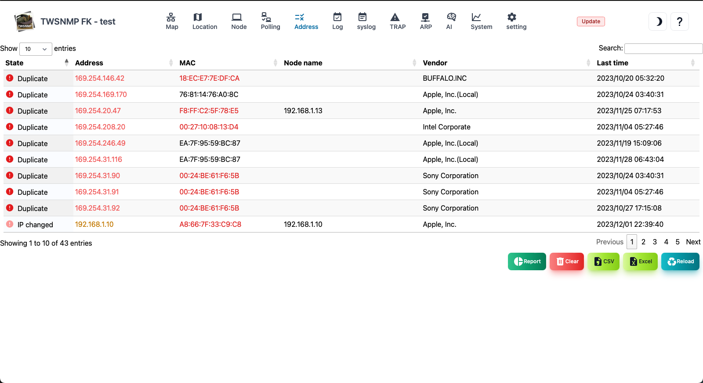
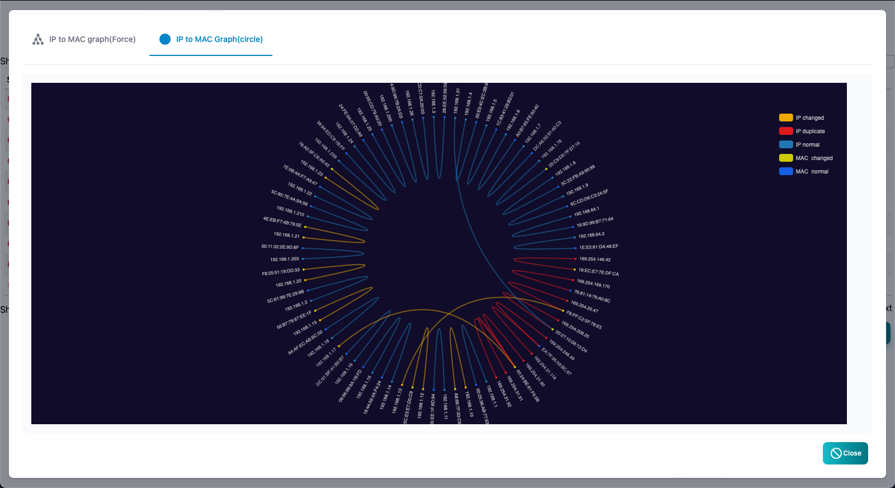

#### Address list

This is a list of IP address found by TWSNMP. 
Only the IP address in the same segment found in the ARP monitoring function is displayed. 
You can detect duplicate and the change in the address.

>>>
#### Address list item

| Items | Contents |
| ---- | ---- |
| State | It is the state of the address.(Normal, duplicate, IP change, Mac change.) |
| Address | IP address.|
| MAC address | MAC address.|
| Node name | The name of the node registered on the map as a management target.|
| Vendor | The name of the vendor corresponding to the MAC address.|
| Final change | This is the last change date and time.|

>>>
#### Description of button

| Items | Contents |
| ---- | ---- |
| Add node | Add the selected IP address to the map.  It is displayed only when it is not registered.|
|  Delete  | Delete the selected IP address.|
| Report | Display the address list report.|
|  clear  | Clear all address lists.|
| CSV | Export the address list to the CSV file.|
| Excel | Export the address list to the Excel file.|
| Update | Update the address list to the latest state.|

---
#### Relationship between IP and MAC address (force model)

This is a report that shows the relationship between IP address and MAC address with an force model. 
The normal address is one -on -one for the IP address and the MAC address. 
You can detect MAC addresses using the same IP address on multiple Macs or having multiple IP addresses.

---
#### Relationship between IP and MAC address (circular model)

This is a report that shows the relationship between IP address and MAC address with a circular model. 
The normal address is one -on -one for the IP address and the MAC address. 
You can detect MAC addresses with the same IP address on multiple Macs or have multiple IP addresses.

