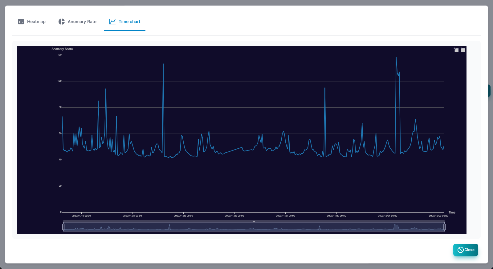

#### AI analysis list

The screen of the AI analysis list. 
Only the list is displayed in the polling log settings and the analysis is performed.

>>>
#### AI analysis list item

| Items | Contents |
| ---- | ---- |
| Anomary score | A deviation value that indicates the degree of abnormality of AI analysis results.  50 is average.Large values are highly anomary.|
| Node name | The name of the node to be analyzed.|
| Polling | Polling for AI analysis.|
| Data amount | The number of data to be analyzed AI.If you are small, the accuracy will be low.|
| Final confirmation | The last date and time of AI analysis.|

>>>
#### Description of button

| Items | Contents |
| ---- | ---- |
| Report | Displays reports on the selected AI analysis results.|
|  clear  | Clear the selected AI analysis results.|
| Update | Update the AI analysis list to the latest state.|

---
#### AI anomary score heat map

This is a report showing an anomary score on a daily heat map. 
It indicates that the red color is the time when the anomary has occurred.

---
#### AI anomary score percentage

The percentage of the anomary score in the entire period is shown in a circular graph.

---
#### AI anomary score time chart

This is a report that displays an anomary score in chronological order.

