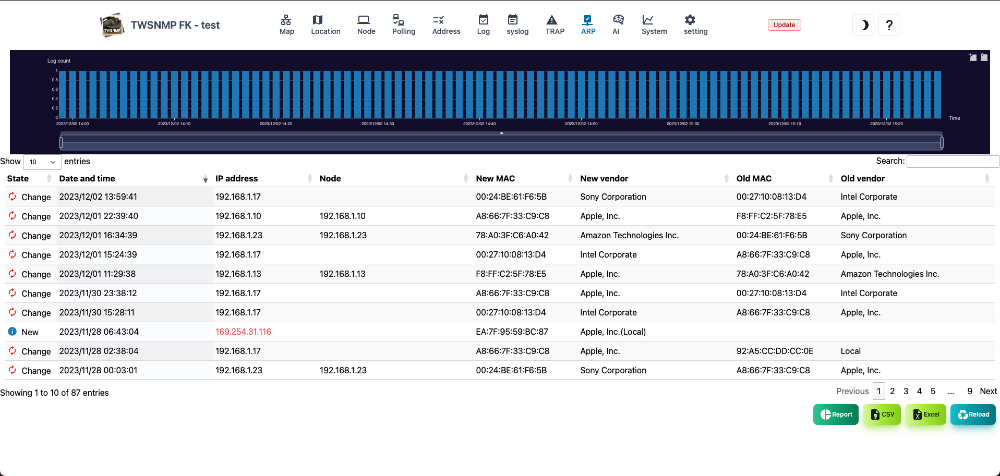

#### ARP monitoring log

ARP monitoring log screen. 
At the top, there is a graph showing the number of logs in chronological order.

>>>
#### ARP monitoring log item

| Items | Contents |
| ---- | ---- |
| State | Log status.Either new or change.|
| Date and time | The date and time of the log.|
| IP address | IP address to log.|
| Node | The name of the node registered on the map.The blanks are not registered on the map.|
| New MAC address | New discovery or MAC address after change.|
| New vendor | The name of the vendor corresponding to the new MAC address.|
| Old MAC address | MAC address before change.|
| Old vendor | This is the name of the vendor corresponding to the old MAC address.|

>>>
#### Description of button

| Items | Contents |
| ---- | ---- |
| Report | Displays the ARP monitoring log analysis report.|
| CSV | Export the ARP monitoring log to the CSV file.|
| Excel | Export the ARP monitoring log to the Excel file.|
| Update | Update the list of ARP monitoring logs to the latest state.|

---
#### By IP address

This is a report of the number of logs by IP address. 
The IP address with many changes is obvious at a glance.

---
#### By IP address (3D)

This is a report of ARP monitoring logs from both IP addresses and time series. 
The time of new discoveries and changes is obvious at a glance.

