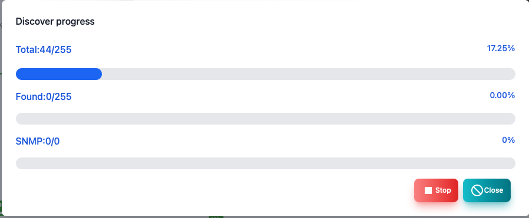
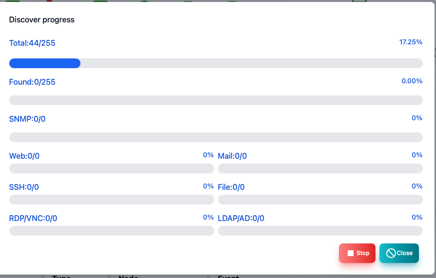

#### Discover

Automatic discovery screen.

>>>

| Items | Contents |
| ---- | ---- |
| Start IP | The first IP address range to search.|
| End IP | The end of the IP address range to search.|
| Timeout | This is the timeout of ping when searching.|
| Retry | This is the number of retrys of ping when searching.|
| Port scan | Perform a port scan on the found node.  Please note that security software may warn you. |
| Polling automatic setting | Polling is automatically set on the found node.|
| <Start> button | Start automatic discovery.|
| <Auto IP range> button | Automatically set the search range from the PC IP address.|

---
#### Automatic discovery is being performed

The number of nodes you have executed or discovered is displayed.

---
#### Automatic discovery is being executed (with port scanning)

The number of nodes you have executed or discovered is displayed.When performing a port scan, the discovered server function is also displayed.

