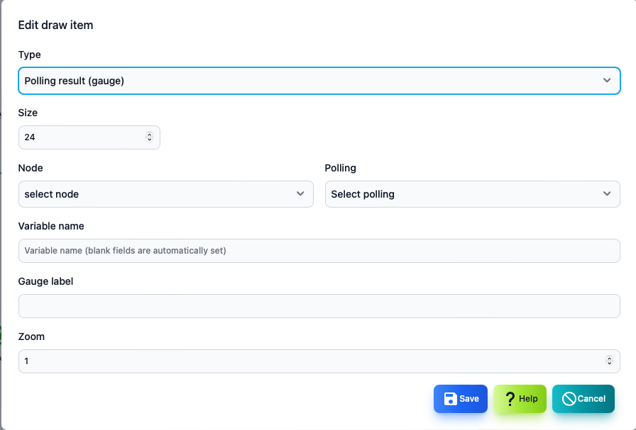

#### Drawing item (rectangle, elliptical)

It is an edit screen of drawing item (rectangle, elliptical).

>>>

#### Item of drawing items (rectangles, ellipse)

| Items | Contents |
| ---- | ---- |
| Type | It is a type of drawing item.You can only change it when you add it.|
| Width | The width of the drawing item.|
| Height | It is the height of the drawing item.|
| Color | It is the color of the drawing item.|
| Display condition | It is a state of the map that displays drawing items.|
| Magnification | The display rate of drawing items.|

---
#### Drawing item (label)

It is the editing screen of the drawing item (label).

>>>

#### Item of drawing items (label)

| Items | Contents |
| ---- | ---- |
| Type | It is a type of drawing item.You can only change it when you add it.|
| Character size | Label character size.|
| Color | It is the color of the drawing item.|
| Display condition | It is a state of the map that displays drawing items.|
| Character string | It is a string to be displayed.|
| Magnification | The display rate of drawing items.|

---
#### Drawing item (image)

It is the editing screen of drawing item (image).

>>>

#### Item of drawing items (images)

| Items | Contents |
| ---- | ---- |
| Type | It is a type of drawing item.You can only change it when you add it.|
| Width | It is the width of the image.|
| Height | It is the height of the image.|
| Display condition | It is a state of the map that displays drawing items.|
| Image | It is an image to be displayed.Select an image file with the <Select> button.|
| Magnification | The display rate of drawing items.|

---
#### Drawing item (polling result)

It is the editing screen of drawing item (polling result: text).

>>>

#### Item of drawing items (polling results)

| Items | Contents |
| ---- | ---- |
| Type | It is a type of drawing item.You can only change it when you add it.|
| Size | Character size.|
| Node | This is a node list for selecting polling.|
| Polling | Polling that displays results.|
| Variable name | The name of the variable displayed from the polling results.|
| Display format | Format when displaying.|
| Magnification | The display rate of drawing items.|

---
#### Drawing item (polling result: gauge)

It is the editing screen of drawing item (polling result: gauge).It can be used to display % data.

>>>

#### Item of drawing items (polling results: gauge)

| Items | Contents |
| ---- | ---- |
| Type | It is a type of drawing item.You can only change it when you add it.|
| Size | Gauge size.|
| Node | This is a node list for selecting polling.|
| Polling | Polling that displays results.|
| Variable name | The name of the variable displayed from the polling results.|
| Gauge label | This is a character string displayed under the gauge.  In the example below, BPS.|
| Magnification | The display rate of drawing items.|

