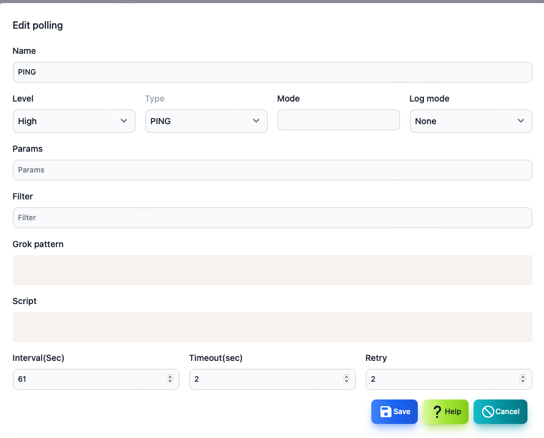

#### Polling editing

Polling edit can be displayed from the button by selecting a polling list on the polling list.

>>>

| Items | Contents |
| ---- | ---- |
| Name | Polling name.|
| Level | Pauling disability level.|
| Type | Polling type.  Ping, SNMP, TCP, etc. |
| Mode | Operation mode depends on the type of polling.|
| Log mode | How to save the polling result log.|
| Parameter | Polling type and mode -dependent parameters.|
| Filter | Polling type and filter condition that depends on mode.  Used for log search.|
| Extract pattern | This is a GROK pattern that depends on the type of polling and the mode.  Use when extracting data from logs.|
| Script | Java Script that determines disability and calculates variables.|
| Polling interval | Polling interval.|
| Timeout | Timeout at the time of polling.|
| Retry | This is the number of retry times when polling.|

