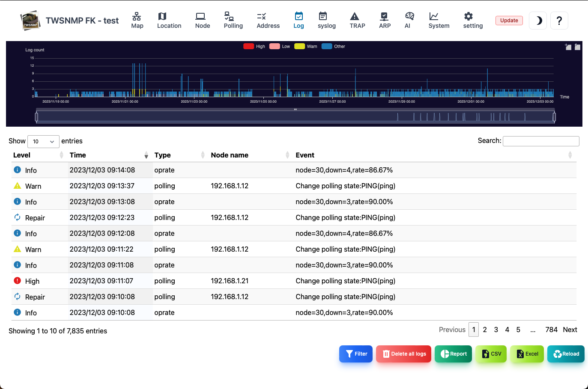

#### Event Log

This is the event log screen. 
At the top, there is a graph showing the number of logs in chronological order.

>>>
#### Event log item

| Items | Contents |
| ---- | ---- |
| Level | Log level.  There is severe, mild, attention, return, and information.|
| Date and time | The date and time of the log is recorded.|
| Type | Log type.  Polling, System, Oprate, User, ArpWatch, |
| Related node | Name of node related to logs.  The blank means that there is no related node.|
| Event | This is an event that occurred.|

>>>
#### Description of button

| Items | Contents |
| ---- | ---- |
| Filter | Specify the search conditions and display the log.|
|  Delete all logs  | Delete all event logs.|
| Report | Displays the event log analysis report.|
| CSV | Export the event log to the CSV file.|
| Excel | Export the event log to the Excel file.|
| Update | Update the list of event logs to the latest state.|

---
#### Filter

This is a dialog that specifies the search conditions for the event log.

>>>
#### Filter item

| Items | Contents |
| ---- | ---- |
| Level | Log level.  All, there are more attention, more than severe, mild.|
| Type | Log type.  Polling, System, Oprate, User, ArpWatch, |
| Related node | Search by node name related to the log.|
| Event | Search by the string of the event that occurred.|

The string can be searched by regular expression.

---
#### By state

This is a report of the number of event logs by state (level).

---
#### Heat map

This is a report of the number of cases of each event log on the heat map.

---
#### By node

This is a report of the number of event logs by node.

---
#### Operating rate

This is a report that uses a chronological graph of the value of the operating rate (OPRATE) in the event log.

---
#### ARP watch

This is a report of the value of the address usage rate (ARPWATCH) in the event log as a chronological graph.

