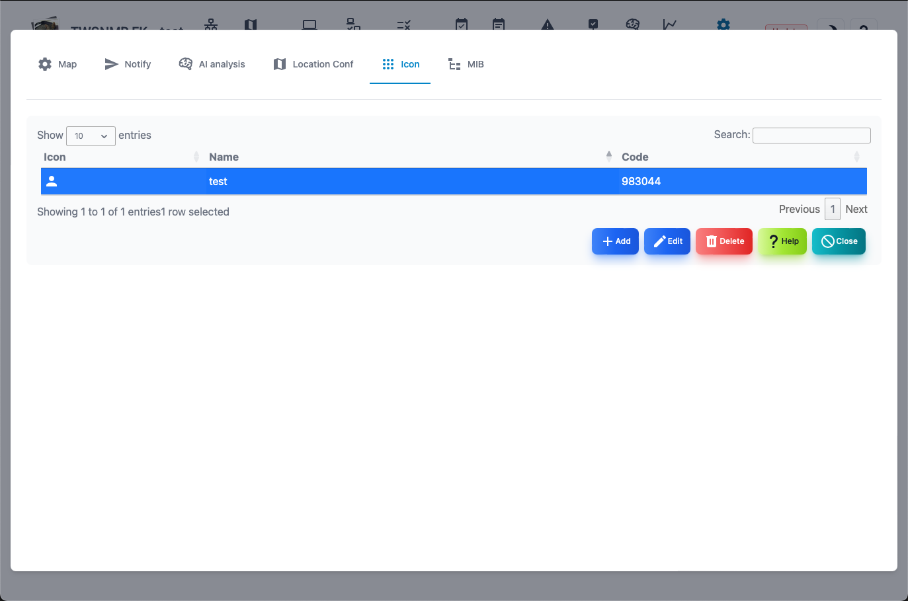
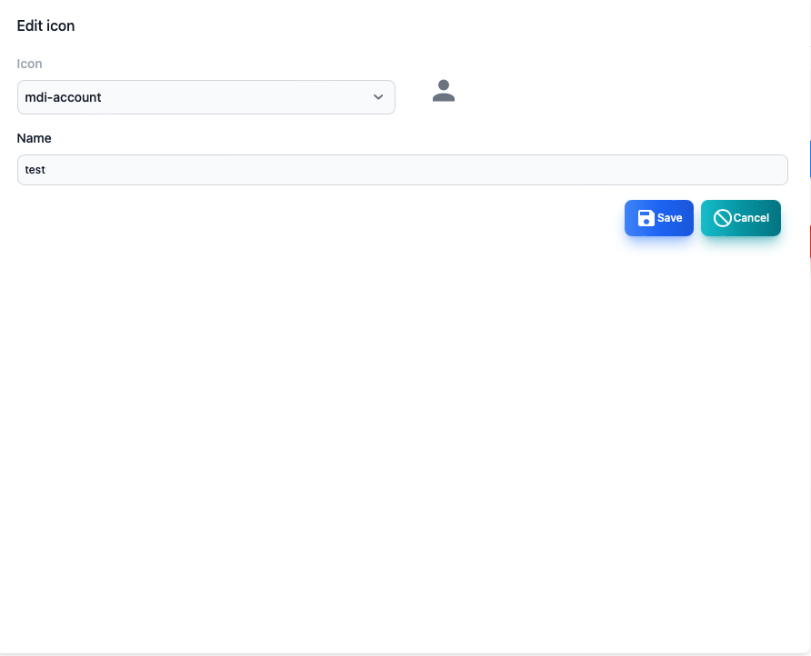

#### Icon management

This is a screen that manages the icon.

>>>
#### Icon management items

| Items | Contents |
| ---- | ---- |
| Icon | It is an image of an icon.|
| Name | Name when choosing.You can attach it freely.|
| Code | icon code.|

>>>
#### Description of button

| Button | Contents |
| ---- | ---- |
| Added | Add a new icon.|
| Edit | Edit the name of the selected icon.|
|  Delete  | Delete the selected icon.|
| Help | Display this help.|
| Close | Close the setting screen.|

---
#### Icon editing screen

>>>

| Items | Contents |
| ---- | ---- |
| Icon | Select an icon.The name of the web font of the MDI icon.|
| Name | Give the icon your favorite name.|

