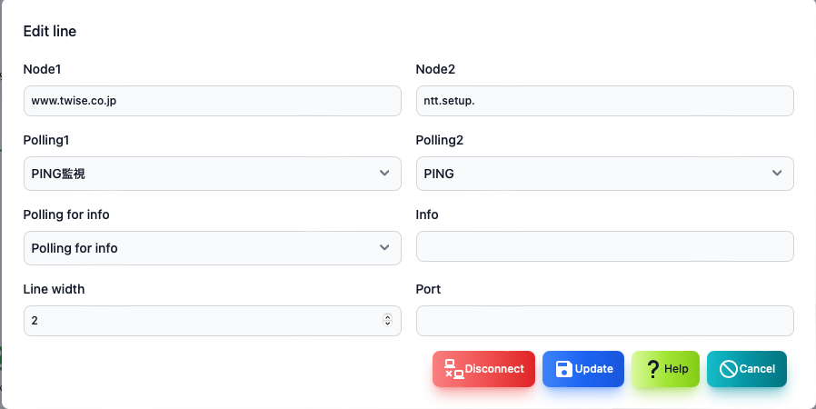

#### Line editing

To edit the line, press the two nodes while pressing the shift key on the map screen.

>>>

| Items | Contents |
| ---- | ---- |
| Node 1 | This is the first node to connect the line.|
| Polling 1 | This is the first node polling that determines the color on one side of the line.|
| Node 2 | This is the second node to connect the line.|
| Polling 2 | This is the second node polling that determines the color on one side of the line.|
| Polling for information | Polling for information displayed next to the line.  Specify the traffic amount.|
| Information | Set the character string to be displayed next to the line.  It will be overwritten by setting a polling for information.|
| Thickness of the line | It is the thickness of the line.|
| Port | Specify the port number used when displaying the panel.|

