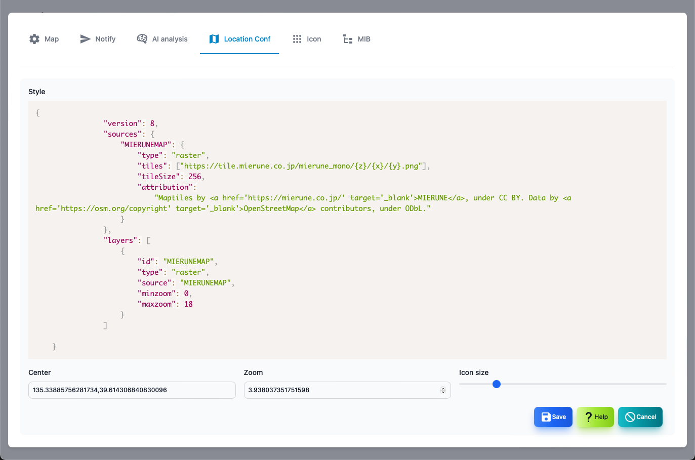

#### Location map settings
<div class="text-xl">
This is the screen to set the map.
</div>



>>>

<div class="text-lg">

| Items | Contents |
| ---- | ---- |
| Style | Specify the map style.Specify in URL or JSON.|
| Central coordinates | The central coordinates on the map are in the order of longitude and latitude.<br>Example: 135.3338576281734, 39.614306840830096 |
| Zoom | Specify the enlargement level of the map.|
| Icon size | Specify the size of the icon to be displayed.|
</div>

---
#### About map style

<div class="text-xl">
The map is displayed using Maplibre GL JS.The map to be displayed is specified in the style.
  You can specify it with URL or JSON.Search for MAPLIBRE GL JS and find something suitable.
</div>

>>>

#### URL example

```
https://tile.openstreetmap.jp/styles/osm-bright-ja/style.json
```


>>>

#### JSON example

```json
{
			 	"version": 8,
			 	"sources": {
			 		"MIERUNEMAP": {
						"type": "raster",
			 			"tiles": ["https://tile.mierune.co.jp/mierune_mono/{z}/{x}/{y}.png"],
						"tileSize": 256,
			 			"attribution":
			 				"Maptiles by <a href='https://mierune.co.jp/' target='_blank'>MIERUNE</a>, under CC BY. Data by <a href='https://osm.org/copyright' target='_blank'>OpenStreetMap</a> contributors, under ODbL."
			 		}
			 	},
			 	"layers": [
					{
						"id": "MIERUNEMAP",
		 				"type": "raster",
			 			"source": "MIERUNEMAP",
			 			"minzoom": 0,
			 			"maxzoom": 18
			 		}
			 	]
}
```
