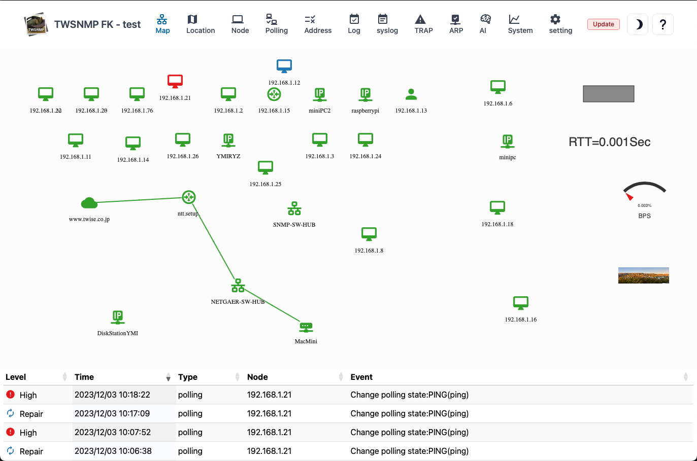

#### Map

The map screen has three large parts.

>>>
#### Explanation of the map

| Screen | Contents |
| ---- | ---- |
| Toolbar | Switch the screen.|
| Map | This is the part that displays the composition of the network.|
| Event Log | Displays the latest 100 event logs.|

---
####  Light/dark mode switching

Upper rightSwitch to dark mode with an icon 
Switch light mode with icon

>>>
#### Image of switching

---
#### Map menu

Right -click the location other than the node and drawing items on the map to display.

>>>
#### Map menu

| Menu | Operation |
| ---- | ---- |
| Add node | Add the node to the map manually.|
| Draw item | Add drawing items to the map.|
| Check all | Reconfirm the node that has occurred.|
| discover | Displays the automatic discovery screen.|
| Grid | Align the position of the node at the specified interval.|
| Relaod | Update the map to the latest state.|
| edit mode | All drawing items are displayed regardless of the state of the map.|

---
#### Node menu

Right -click the node on the map to display it.

>>>
#### Node menu

| Menu | Operation |
| ---- | ---- |
| Report | Displays the report screen related to the node.|
| Ping | Displays the ping screen.|
| MIB browser | Displays MIB browser.|
| Wake on LAN | Wake on LAN packet.|
| Edit | Displays the screen to edit the node settings.|
| Polling | Displays a polling list related to nodes.|
| Reconfirm | Relieve the condition of the node by executing the polling.|
| Copy | Create a node duplication.|
|  Delete  | Delete node.|

---
#### Drawing item menu

Right -click the drawing item on the map to display it.

>>>
#### Drawing item menu

| Menu | Operation |
| ---- | ---- |
| Edit | Displays the screen to edit the drawing item settings.|
| Copy | Create drawing items.|
|  Delete  | Delete drawing items.|

