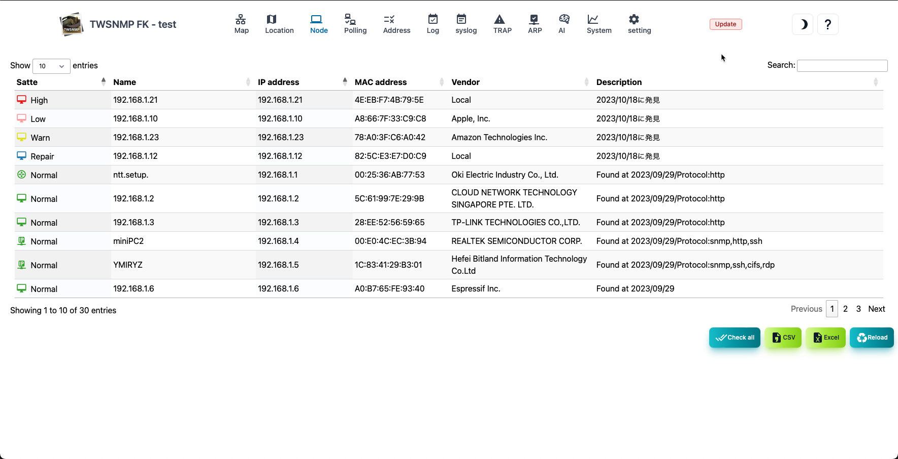
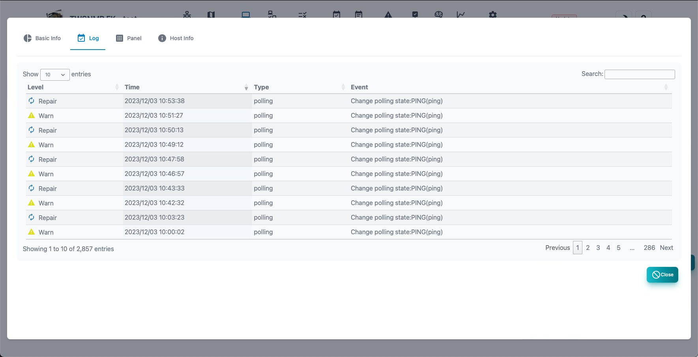
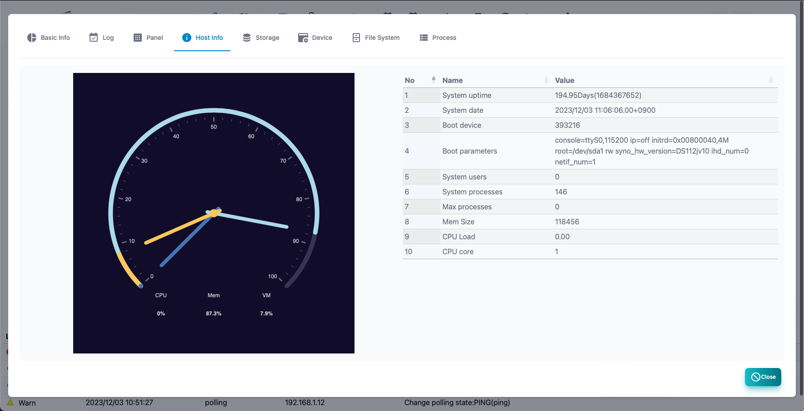
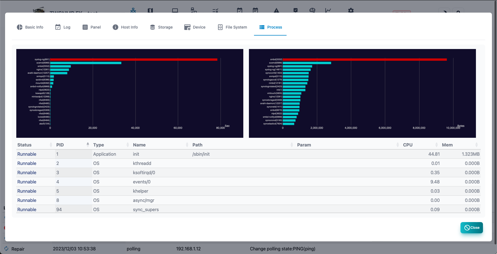

#### Node list

A list of nodes to be managed.

>>>
#### Node list item

| Items | Contents |
| ---- | ---- |
| State | Node condition.  Severe, mild, precautions, return, normal, unknown.|
| Name | Node name.|
| IP address | Node IP address.|
| MAC address | Node MAC address.|
| Vendor | The name of the vendor corresponding to the MAC address.|
| Description | Supplementary information about nodes.|

>>>
#### Description of button

| Items | Contents |
| ---- | ---- |
| Edit | Edit node settings.|
| Polling | Displays a list of polling related to the selected node.|
| Report | Displays the selected node analysis report.|
|  Delete  | Delete the selected node.|
| Reconfirm | Reconfirm the polling of the selected node.|
| Remost confirmation | Reconfirm all nodes polling.|
| CSV | Export the node list to the CSV file.|
| Excel | Export the node list to the Excel file.|
| Update | Update the node list to the latest state.|

---
#### Node polling list

A list of polling related to nodes.

>>>

| Items | Contents |
| ---- | ---- |
| State | Polling state.  Severe, mild, precautions, return, normal, unknown.|
| Name | Polling name.|
| Level | Pauling level.|
| Type | Polling type.  Ping, SNMP, TCP, etc. |
| Log | Log mode.|
| Last confirmation | This is the last date and time when polling was implemented.|

>>>
#### Description of button

| Items | Contents |
| ---- | ---- |
| Add | Add polling to nodes.|
| Edit | Edit the selected polling.|
| Copy | Create a selected polling copy.|
| Report | Displays the selected polling analysis report.|
|  Delete  | Delete the selected polling.|
| Update | Update the polling list to the latest state.|
| Close | Close the list of polling.|

---
#### Basic information report

Basic information about nodes.

---
#### log

This is an event log related to the node.

---
#### Panel

Displays the appearance of the node. 
Displays the port from the acquisition of the interface mib by SNMP or the line connection information. 
The <physical port> switch can only be displayed on the physical port. 
Rotate the panel display with the <rotation> switch.

---
#### Host information

Displays the information of the host resource mib of SNMP. 
 If it is not compatible with the host resource MIB, it cannot be displayed.

---
#### Storage

Displays the storage information of SNMP host resource mib. 
When you select, the addition button of the polling will be displayed. 
 If it is not compatible with the host resource MIB, it cannot be displayed.

---
#### Device

Displays the device information of the SNMP host resource MIB. 
 If it is not compatible with the host resource MIB, it cannot be displayed.

---
#### File System

Displays File System, information on SNMP host sources MIB. 
 If it is not compatible with the host resource MIB, it cannot be displayed.

---
#### Process

Displays the process information of SNMP host resource mib. 
When you select, the addition button of the polling will be displayed. 
 If it is not compatible with the host resource MIB, it cannot be displayed.

