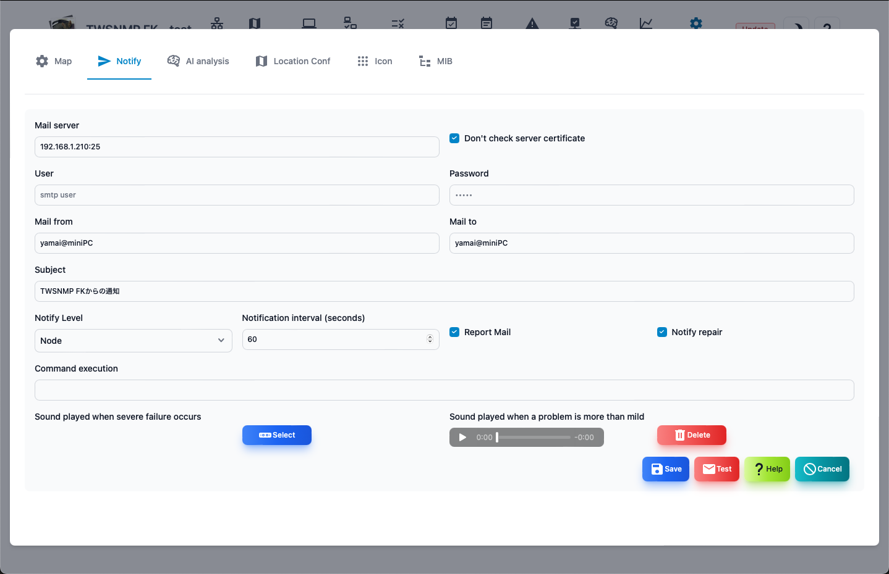

#### Notification settings

This is the screen to set the notification.

>>>

| Items | Contents |
| ---- | ---- |
| Mail server | Specify a mail server to send notification emails.  Host name or IP address: port number |
| Do not check the server certificate | Check when the specified mail server is Oleore certificate.|
| User | Set a user ID when authentication is required when sending an email.|
| Password | Set the password when authentication is required when sending email.|
| Sending source | Sending source email address.|
| Address | Notification email destination email address.  You can specify multiple by separation of comma.|
Subject | Notification email subject.|
| Notification level | Specify the monitoring level to send disability notifications.|
| Notification interval | Specify the interval to check the notification.|
| Regular report | Send a daily report.|
| Return notification | We will also send an email when you return.|
| Comment execution | Run the command specified in the state parameter when the map changes.  $ Level is in the map.0: Severe, 1: Mild, 2: Note, 3: Normal, -1: Unknown |
| Sounds played during severe disorders | Specify the audio file to play when the state of the map is severe.|
| Sounds played during mild disability | Specify the audio file to be played when the state of the map is mild.|

---
#### Email transmission test

Click the <Test> button to send the test email with the configured content.

