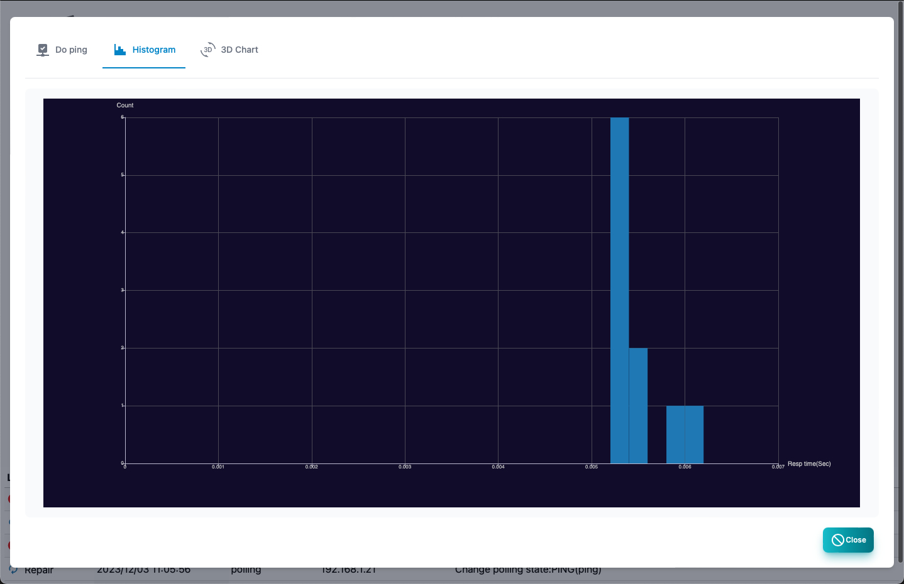
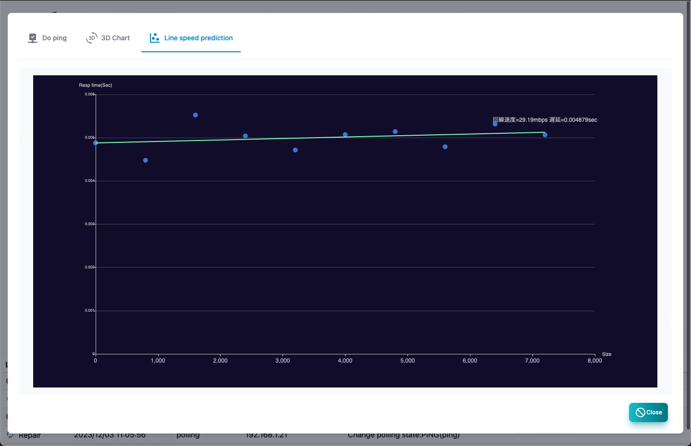

#### PING

This is the screen to execute ping. 
 To get a location information, you need a Geoip database file.

>>>
#### Explanation

| Items | Contents |
| ---- | ---- |
| IP address | This is the IP address to run ping.|
| Number of times | Ping is the number of execution times.|
| Size | Ping packet size.  The change mode is executed while increasing the size.|
| TTL | TTL value of ping packet.  The trace route runs while increasing the TTL value.|
Result Graph | Ping's execution result is a graph of the response time, TTL value.|
| Results | Ping execution results.  As a result, the date and time of implementation, the response time, the size, the transmission reception TTL, the source IP, the location |
| Beep | Ping will be informed by sound.|
| Start | Start ping.|
| Stop | Ping stops.|
| Close | Ends ping.|

---
#### histogram

It is a histogram of response time.

---
#### 3D analysis

The response time, size, and implementation date and time are displayed in 3D graphs.

---
#### Line prediction

From the change in response time if the size is changed
This is a report that predicts the line speed.

---
#### Route analysis

Display location information.It cannot be displayed without a GEOIP database.

