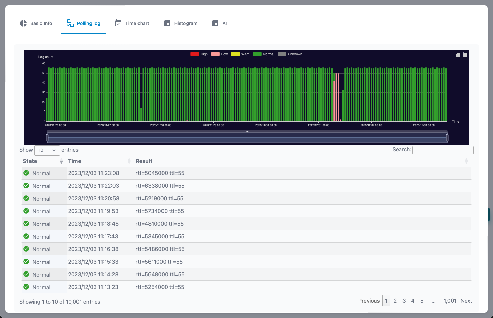
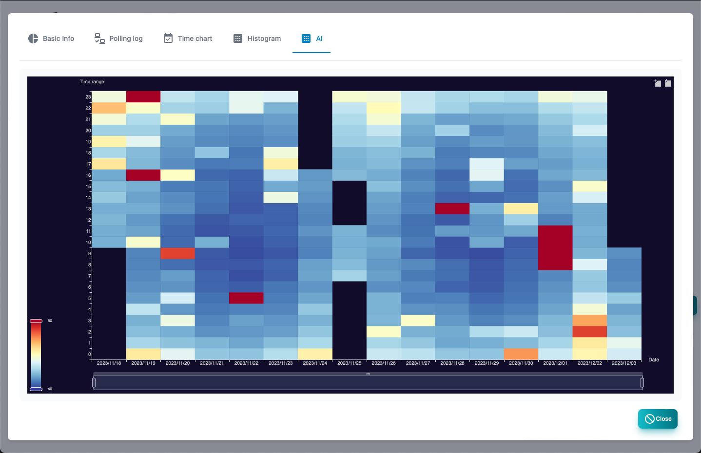

#### Polling list

A list of polling to be managed.

>>>
#### Polling list item

| Items | Contents |
| ---- | ---- |
| State | Polling state.  Severe, mild, precautions, return, normal, unknown.|
| Node name | Node related to polling.|
| Name | Polling name.|
| Level | Pauling disability level.|
| Type | Polling type.|
| Log | Polling log mode.|
| Final confirmation | Polling final confirmation date and time.|

>>>
#### Description of button

| Items | Contents |
| ---- | ---- |
| Added | Add polling.|
| Edit | Edit the selected polling.|
| Copy | Copy the selected polling.|
| Report | Displays the selected polling analysis report.|
|  Delete  | Delete the selected polling.|
| CSV | Export the polling list to the CSV file.|
| Excel | Export the polling list to the Excel file.|
| Update | Update the polling list to the latest state.|

---
#### Polling template selection

This is the selection screen of the template displayed when adding polling.

>>>

| Items | Contents |
| ---- | ---- |
| ID | Template number.|
| Name | Polling name.|
| Type | Polling type.  Ping, SNMP, TCP, etc. |
| Mode | Polling mode.|
| Description | Polling explanation.|

>>>
#### Description of button

| Items | Contents |
| ---- | ---- |
| Add | Select polling.|
| Cancellation | Polling Closes.|

---
#### Basic information

Basic information about polling.

---
#### Polling log

This is a log of the polling result. 
 It is displayed only when the log mode is not output.

---
#### Time chart

In the log of the polling result, the numerical data is displayed in a chronological graph. 
The displayed items can be selected at the top of the graph. 
 It is displayed only when the log mode is not output.

---
#### Histogram

The numerical data in the log of the polling result is displayed on the histogram. 
The displayed items can be selected at the top of the graph. 
 It is displayed only when the log mode is not output.

---
#### AI analysis

This is the result of AI analysis of numerical data in the log of the polling results. 
 It is displayed only when the log mode is set to AI analysis and sufficient data is obtained.

