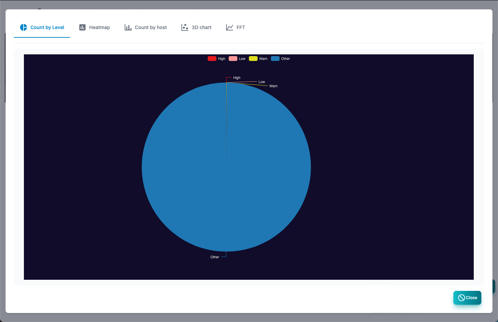
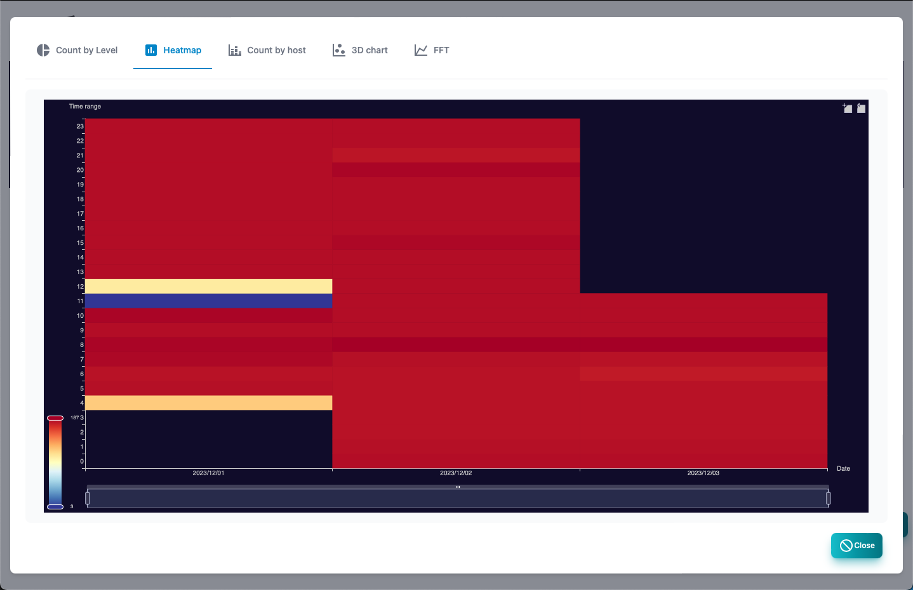

#### Syslog

Syslog screen. 
At the top, there is a graph showing the number of logs in chronological order.

>>>
#### Syslog item

| Items | Contents |
| ---- | ---- |
| Level | Syslog level.  There is severe, mild, precautions, and information.|
| Date and time | It is the date and time when I received syslog.|
| Host | SYSLOG source host.|
| Type | Syslog Facility and priority string.|
| Tags | Syslog tag.Process and process ID.|
| Message | Syslog message.|

>>>
#### Description of button

| Items | Contents |
| ---- | ---- |
| Polling | Register the polling from the selected syslog.|
| Filter | Specify the search conditions and display syslog.|
|  Delete all logs  | Delete all syslogs.|
| Report | Displays Syslog analysis reports.|
| Export CSV | syslog to CSV file.|
| Excel | EXCEL file is exported to syslog.|
| Reload | Update the list of syslog to the latest state.|

---
#### Filter

This is a dialog that specifies the search conditions for syslog.

>>>
#### Filter item

| Items | Contents |
| ---- | ---- |
| Level | Syslog level.  All, more than information, more than caution, mild or higher, more severe.|
| Host | It is the source host.|
| Tags | The value of the syslog tag.|
| Message | Syslog message.|

 Character strings can be searched in regular expressions.

---
#### By state

This is a report of the number of syslogs by state.

---
#### Heat map

This is a report of the number of cases of syslog on the heat map.

---
#### By host

This is a report of the number of syslogs by the source host.

---
#### By host (3D)

This is a report displayed in three -dimensional graphs of Syslog, source host, priority, and time.

---
#### Catalysis by FFT

This is a report that analyzes Syslog for each host and analyzes the number of receiving cases.

