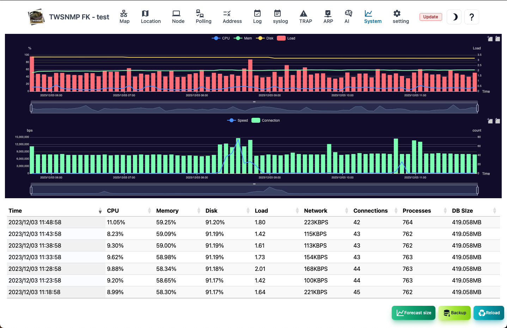
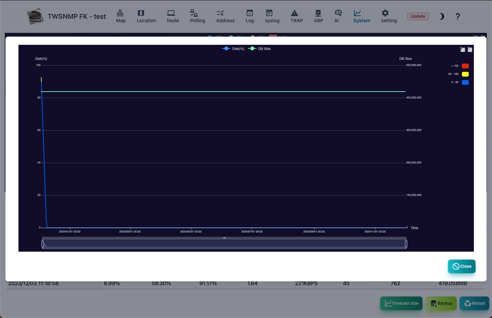

#### System

System information screen. 
At the top, there is a graph showing log resources and communication information in a chronological order.

>>>
#### System information item

| Items | Contents |
| ---- | ---- |
| Date and time | It is the date and time when System information is recorded.|
| CPU | CPU usage rate.|
| Memory | Memory usage rate.|
| Disk | Data folder is the usage rate of disks.|
| Load | load.|
| Communication amount | LAN port communication amount.|
| Connection number | TCP connection number.|
| Process | Total number of processes.|
| DB size | Database size.|

>>>
#### Description of button

| Items | Contents |
| ---- | ---- |
| Size prediction | Database size and disk usage rate are forecast for one year.|
| Backup | Get backup.|
| Update | Update System information to the latest state.|

---
#### Size prediction

This is a year forecast for the database size and disk usage rate.

