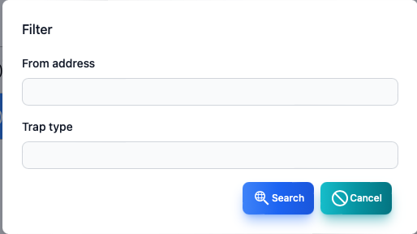
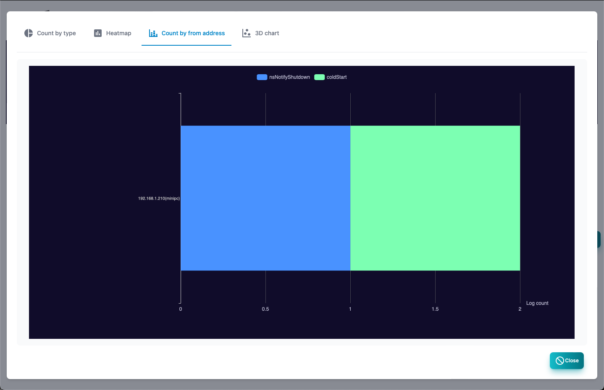
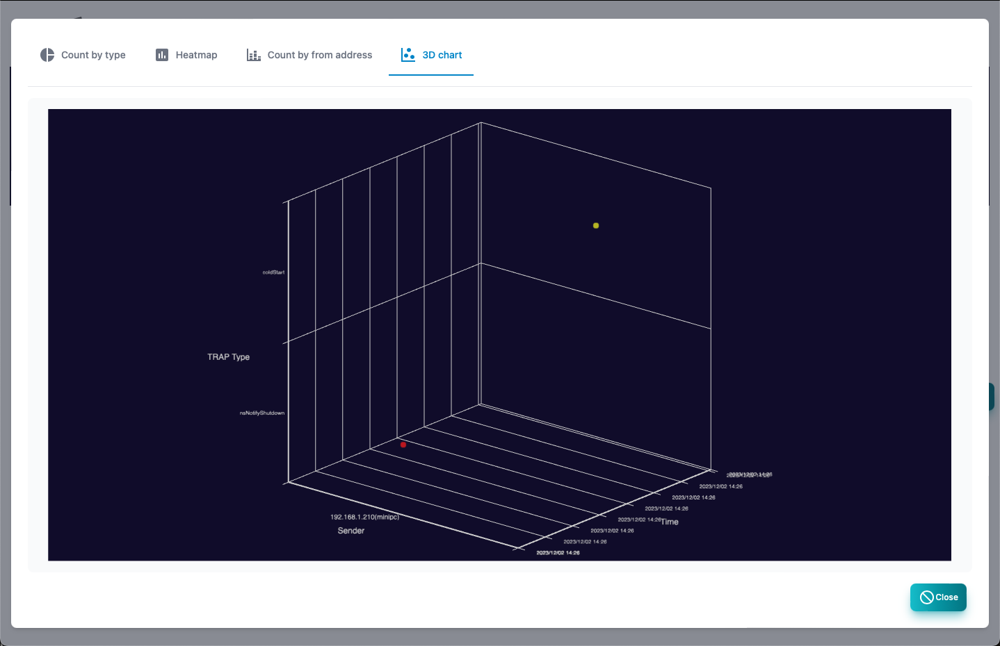

#### SNMP TRAP

SNMP Trap log screen. 
At the top, there is a graph showing the number of logs in chronological order.

>>>
#### SNMP Trap log item

| Items | Contents |
| ---- | ---- |
| Date and time | This is the date and time of receiving SNMP Trap.|
| Sending source | SNMP Trap's source host.|
| Type | SNMP Trap type.|
| Variables | Variables attached to SNMP Trap.|

>>>
#### Description of button

| Items | Contents |
| ---- | ---- |
| Polling | Register the polling from the selected SNMP Trap.|
| Filter | Specify the search conditions and display SNMP Trap.|
|  Delete all logs  | Delete all syslogs.|
| Report | Displays the analysis report of SNMP Trap.|
| CSV | Sport the SNMP Trap to the CSV file.|
| Excel | Export SNMP Trap to Excel file.|
| Reload | Update the SNMP Trap list to the latest state.|

---
#### Filter

This is a dialog that specifies the search conditions for SNMP Trap.

>>>
#### Filter item

| Items | Contents |
| ---- | ---- |
| Sending source | It is the source host.|
| Type | SNMP Trap type.|

 Character strings can be searched in regular expressions.

---
#### TRAP type

This is a report of the number of SNMP traps by type.

---
#### Heat map

This is a report of the number of cases of SNMP TRAP on the heat map.

---
#### By host

This is a report of the number of SNMP Trap receiving cases by source host.

---
#### Send source and type (3D)

This is a report displayed in the source host, type, and three -dimensional graph of the SNMP Trap receiving log.

