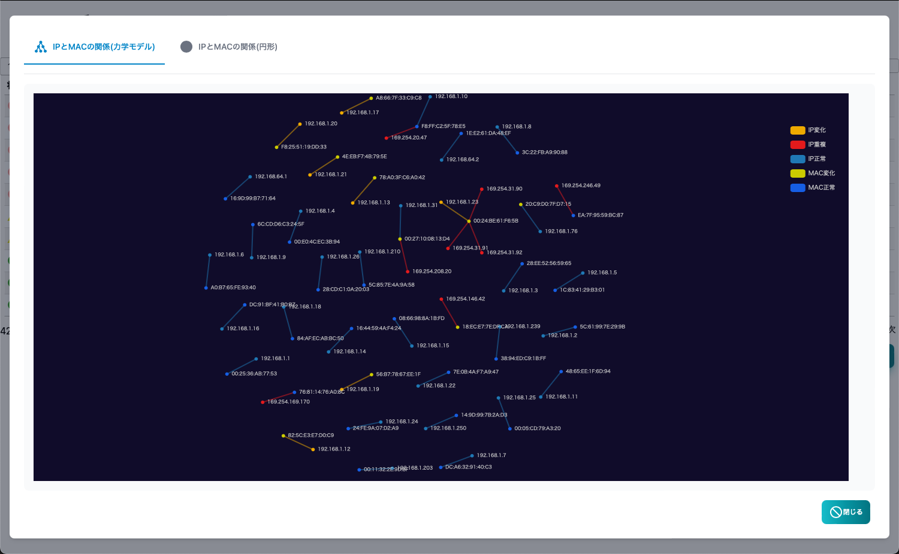

#### アドレスリスト

TWSNMPが見つけたIPアドレスのリストです。 
ARP監視機能で見つけた同じセグメントにあるIPアドレスだけ表示されます。 
重複やアドレスが変化したことを検知できます。

>>>
#### アドレスリストの項目

|項目|内容|
|----|----|
|状態|アドレスの状態です。(正常,重複、IP変化、MAC変化があります。)|
|アドレス|IPアドレスです。|
|MACアドレス|MACアドレスです。|
|ノード名|管理対象としてマップに登録されたノードの名前です。|
|ベンダー|MACアドレスに対応したベンダーの名前です。|
|最終変化|最後に変化した日時です。|

>>>
#### ボタンの説明

|項目|内容|
|----|----|
|ノード追加|選択したIPアドレスをマップに追加します。 未登録の場合だけ表示されます。|
|削除|選択したIPアドレスを削除します。|
|コピー|選択したログをコピーします。|
|レポート|アドレスリストのレポートを表示します。|
|クリア|アドレスリストを全てクリアします。|
|CSV|アドレスリストをCSVファイルにエクスポートします。|
|Excel|アドレスリストをExcelファイルにエクスポートします。|
|更新|アドレスリストを最新の状態に更新します。|

---
#### IPとMACアドレスの関係（力学モデル）

IPアドレスとMACアドレスの関係を力学モデルで図示したレポートです。 
正常なアドレスはIPアドレスとMACアドレスが１対１になります。 
同じIPアドレスを複数のMACで使っていたり、複数のIPアドレスをもつ、MACアドレスを検知できます。

---
#### IPとMACアドレスの関係（円形モデル）

IPアドレスとMACアドレスの関係を円形モデルで図示したレポートです。 
正常なアドレスはIPアドレスとMACアドレスが１対１になります。 
同じIPアドレスを複数のMACで使っていたり、複数のIPアドレスをもつMACアドレスを検知できます。

