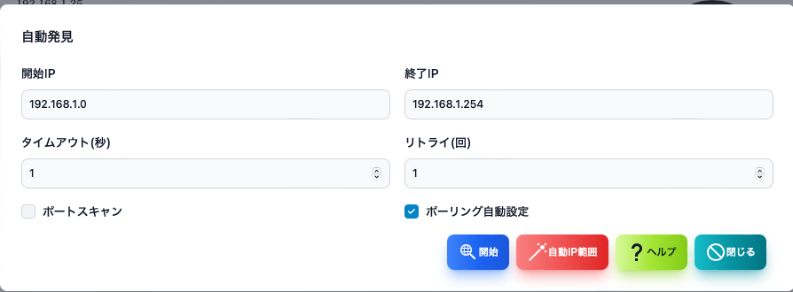
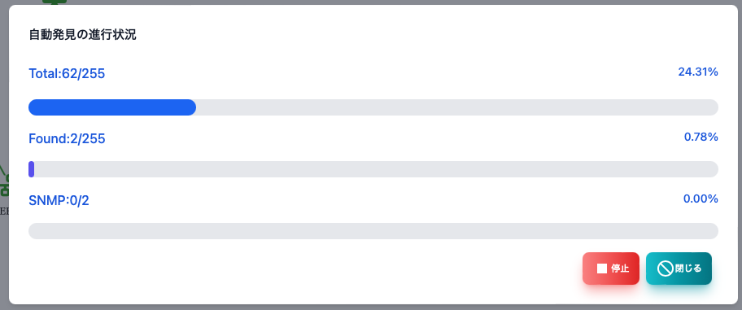

#### 自動発見

自動発見の画面です。

>>>

|項目|内容|
|----|----|
|開始IP|検索するIPアドレス範囲の最初です。|
|終了IP|検索するIPアドレス範囲の最後です。|
|タイムアウト|検索時のPINGのタイムアウトです。|
|リトライ|検索時のPINGのリトライ回数です。|
|ポートスキャン|発見したノードにポートスキャンを実施します。 セキュリティーソフトが警告するかもしれないので注意してください。 |
|ポーリング自動設定|発見したノードにポーリングを自動で設定します。|
|＜開始＞ボタン|自動発見を開始します。|
|＜自動IP範囲＞ボタン|PCのIPアドレスから検索範囲を自動で設定します。|

---
#### 自動発見実行中

実行や発見したノードの数が表示されます。

---
#### 自動発見実行中（ポートスキャンあり）

実行や発見したノードの数が表示されます。ポートスキャンを実施する場合は、発見したサーバー機能も表示されます。

