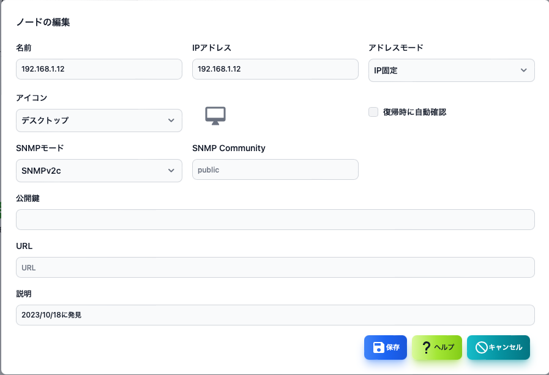

#### ノード編集

ノードの編集はマップ画面やノードリストでノードを選択してメニューかボタンから表示できます。

>>>

|項目|内容|
|----|----|
|名前|ノードの名前です。|
|IPアドレス|ノードのIPアドレスです。|
|アドレスモード|IPアドレス固定（デフォルト）、MACアドレス固定、ホスト名固定のいずれかです。|
|アイコン|表示するアイコンです。|
|復帰時に自動確認|復帰状態になった時には、自動で正常状態にします。|
|SNMPモード|SNMPのモードです。SNMPv1,v2c,v3（認証と暗号化別）があります。|
|SNMP Community|SNMPv1,v2cの時のCommunity名です。|
|ユーザー|SNMPv3でアクセスする時のユーザーIDです。|
|パスワード|SNMPv3でアクセスする時のパスワードです。|
|公開鍵|SSHでポーリングする場合のノードの公開鍵です。 空欄の場合は初回接続時に自動設定します。|
|URL|ブラウザーなどでアクセスする時のURLです。 右クリックメニューに表示されます。 カンマ区切りで複数指定できます。 TWSNMP連携の場合のアクセス先にも使用します。|
|説明|補足情報を記載します。|

