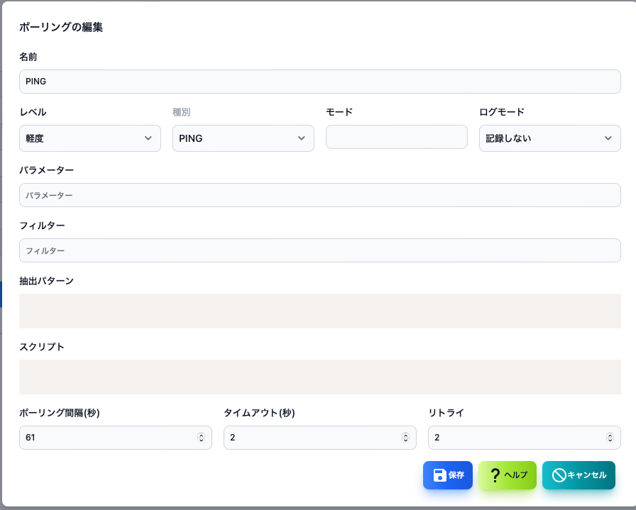

#### ポーリング編集

ポーリング編集はポーリングリストでポーリングを選択してボタンから表示できます。

>>>

|項目|内容|
|----|----|
|名前|ポーリングの名前です。|
|レベル|ポーリングの障害レベルです。|
|種別|ポーリングの種類です。 PING,SNMP,TCPなど|
|モード|ポーリングの種類に依存した動作モードです。|
|ログモード|ポーリング結果ログの保存方法です。|
|パラメータ|ポーリングの種類とモードに依存したパラメータです。|
|フィルター|ポーリングの種類とモードに依存したフィルター条件です。 ログの検索などで使用します。|
|抽出パターン|ポーリングの種類とモードに依存したGrokのパターンです。 ログからデータを抽出する時などに使用します。|
|スクリプト|障害の判定や変数の計算を行うJava Scriptです。|
|ポーリング間隔|ポーリングの実施間隔です。|
|タイムアウト|ポーリング実施時のタイムアウトです。|
|リトライ|ポーリング実施時のリトライ回数です。|

