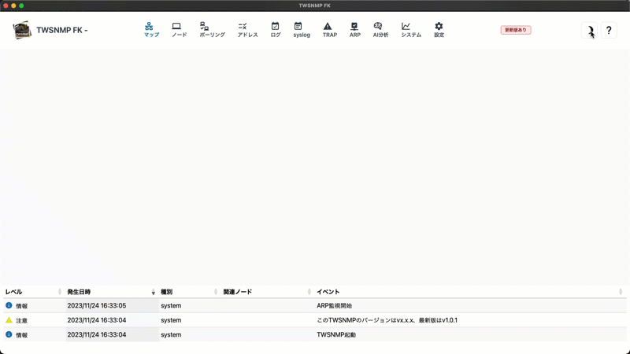

## マップ画面

- 上部のアイコンで画面切り替え
- 右上の🌒か🌞アイコンでダークモード切り替え
- マップ上の空白を右クリックでマップメニュー表示
- ノードと描画アイテムの右クリックでメニュー表示
- シフトキーを押しながらノードを２つ選択してライン編集

---
##  ダークモード切り替え

右上の🌒か🌞アイコンでダークモード切り替え

---
## マップメニュー

- 新規ノード:ノードを手動で追加
- 描画アイテム:描画アイテムを追加
- 全て再確認:障害が発生しているノードを再確認
- グリッド整列:ノードの位置を指定の間隔に整列
- 更新:マップの表示を最新の状態に更新
- アイテム編集表示:全ての描画アイテムをマップの状態に関わらず全て表示

---
