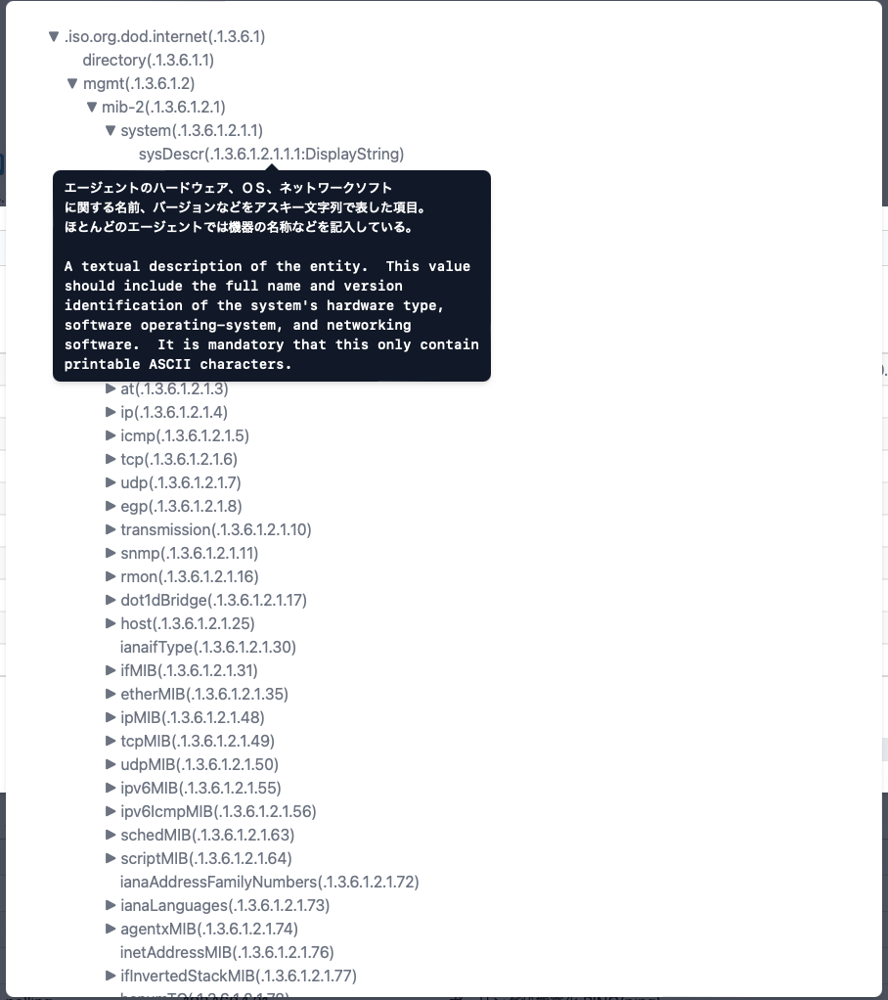

#### MIBブラウザー

ノードからSNMPのMIB情報を取得する画面です。 
ノードの設定でSNMPのアクセス情報を設定しておく必要があります。 
組み込み以外のMIBを利用したい場合は、データフォルダのextmibsにMIBファイルを保存してください。

>>>
#### 説明

|項目|内容|
|----|----|
|オブジェクト名|取得したいMIBのオブジェクト名を指定します。 MIBツリーから選択できます。 例:system|
|<MIBツリー＞ボタン|MIBツリーを表示します。|
|履歴|これまで取得したオブジェクト名の履歴です。選択して再取得できます。|
|結果|取得したMIB情報です。テーブル形式のMIBの場合は自動的に表形式で表示します。|
|生データ|取得したMIB情報を変換しないで表示します。 オフの場合は、時刻データを人間がわかりやすい表示に変換します。|
|取得|MIB情報を取得します。|
|CSV|取得したMIB情報をCSVファイルのエクスポートします。|
|Excel|取得したMIB情報をExcelファイルのエクスポートします。|

---
#### MIBツリー

取得するMIBのオブジェクト名を選択するための画面です。 
ツリーを開いてオブジェクト名をクリックすれば説明が表示されます。 
ダブルクリックして選択します。

