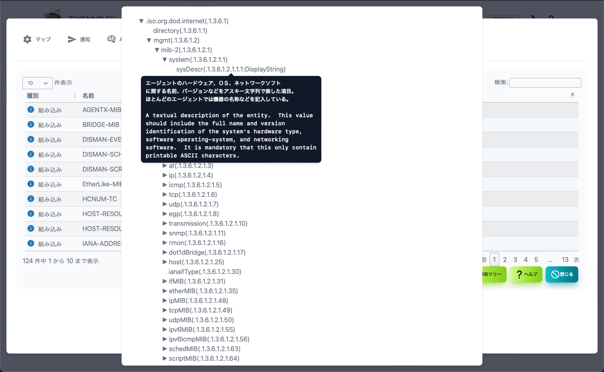

#### MIB管理

SNMPのMIBを管理する画面です。

>>>
#### MIB管理の項目

|項目|内容|
|----|----|
|種別|組み込みか読み込みの種類です。|
|名前|MIBモジュールの名前です。|
|ファイル|読み込んだファイル名です。|
|エラー|読み込んだ時のエラーです。|

>>>
#### ボタンの説明

|ボタン|内容|
|----|----|
|MIBツリー|MIBツリーを表示します。|
|ヘルプ|このヘルプを表示します。|
|閉じる|設定画面を閉じます。|

---
#### MIBツリー画面

