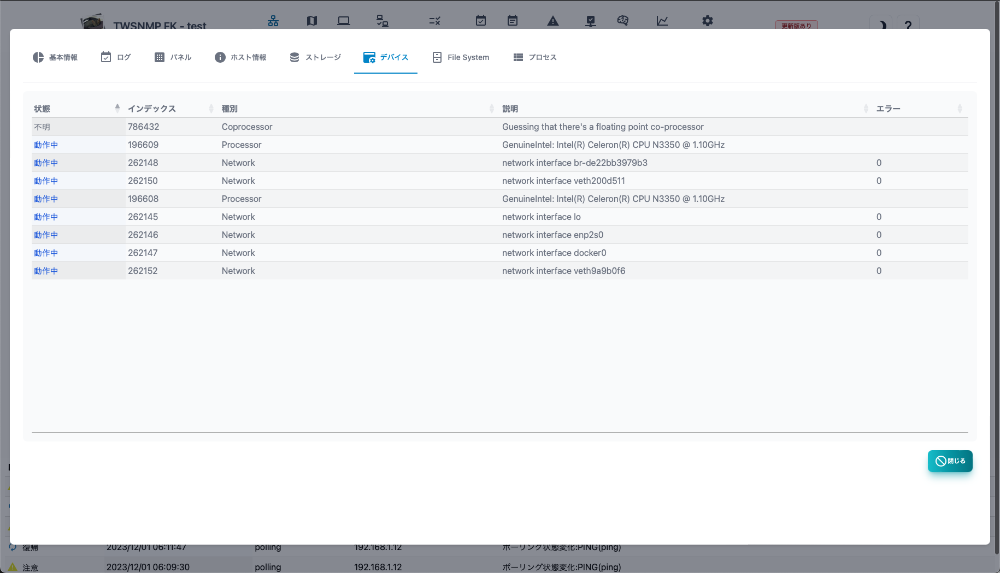
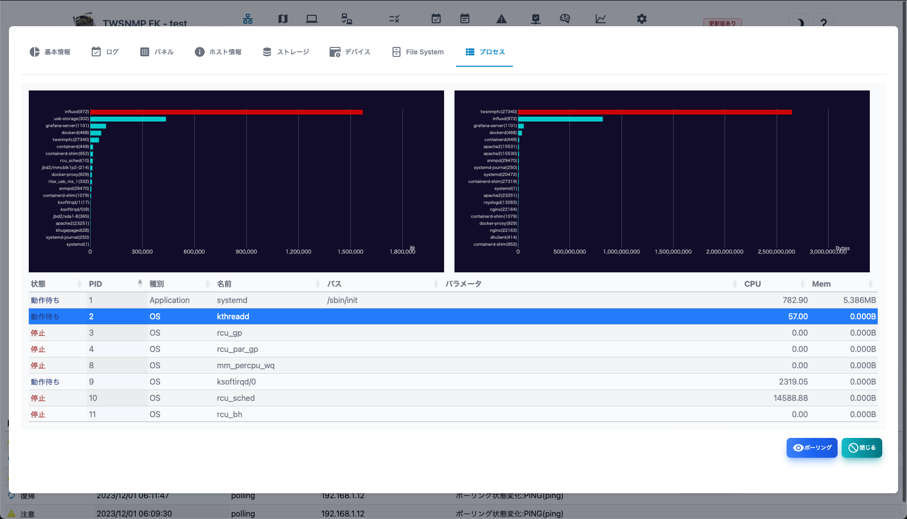

#### ノードリスト

管理対象のノードの一覧です。

>>>
#### ノードリストの項目

|項目|内容|
|----|----|
|状態|ノードの状態をです。 重度、軽度、注意、復帰、正常、不明があります。|
|名前|ノードの名前です。|
|IPアドレス|ノードのIPアドレスです。|
|MACアドレス|ノードのMACアドレスです。|
|ベンダー|MACアドレスに対応したベンダーの名前です。|
|説明|ノードに関する補足情報です。|

>>>
#### ボタンの説明

|項目|内容|
|----|----|
|編集|ノードの設定の編集をします。|
|ポーリング|選択したノードに関連したポーリングのリストを表示します。|
|レポート|選択したノードの分析レポートを表示します。|
|削除|選択したノードを削除します。|
|再確認|選択したノードのポーリングを再確認します。|
|全て再確認|全てのノードのポーリングを再確認します。|
|CSV|ノードリストをCSVファイルにエクスポートします。|
|Excel|ノードリストをExcelファイルにエクスポートします。|
|更新|ノードリストを最新の状態に更新します。|

---
#### ノードのポーリングリスト

ノードに関連したポーリングのリストです。

>>>

|項目|内容|
|----|----|
|状態|ポーリングの状態をです。 重度、軽度、注意、復帰、正常、不明があります。|
|名前|ポーリングの名前です。|
|レベル|ポーリングのレベルです。|
|種別|ポーリングの種類です。 ping,snmp,tcpなど|
|ログ|ログモードです。|
|最終確認|ポーリングを実施した最後の日時です。|

>>>
#### ボタンの説明

|項目|内容|
|----|----|
|追加|ノードにポーリングを追加します。|
|編集|選択したポーリングを編集します。|
|コピー|選択したポーリングのコピーを作成します。|
|レポート|選択したポーリングの分析レポートを表示します。|
|削除|選択したポーリングを削除します。|
|更新|ポーリングのリストを最新の状態に更新します。|
|閉じる|ポーリングのリストを閉じます。|

---
#### 基本情報レポート

ノードに関する基本的な情報です。

---
#### ログ

ノードに関連するイベントログです。

---
#### パネル

ノードの外観を表示します。 
SNMPによるinterface MIBの取得か、ライン接続の情報からポートを表示します。 
＜物理ポート＞スイッチで、物理ポートだけ表示できます。 
＜回転＞スイッチでパネルの表示を回転します。

---
#### ホスト情報

SNMPのホストリソースMIBの情報を表示します。 
ホストリソースMIBに対応していない場合は表示できません。

---
#### ストレージ

SNMPのホストリソースMIBのストレージ情報を表示します。 
選択するとポーリングの追加ボタンが表示されます。 
ホストリソースMIBに対応していない場合は表示できません。

---
#### デバイス

SNMPのホストリソースMIBのデバイス情報を表示します。 
ホストリソースMIBに対応していない場合は表示できません。

---
#### File System

SNMPのホストリソースMIBのFile Syste,情報を表示します。 
ホストリソースMIBに対応していない場合は表示できません。

---
#### プロセス

SNMPのホストリソースMIBのプロセス情報を表示します。 
選択するとポーリングの追加ボタンが表示されます。 
ホストリソースMIBに対応していない場合は表示できません。

