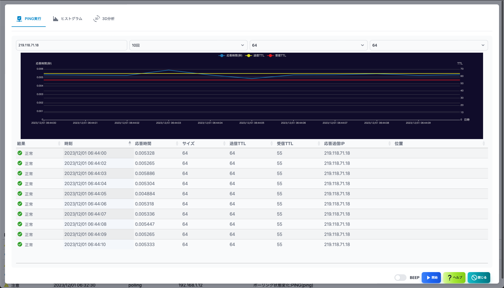
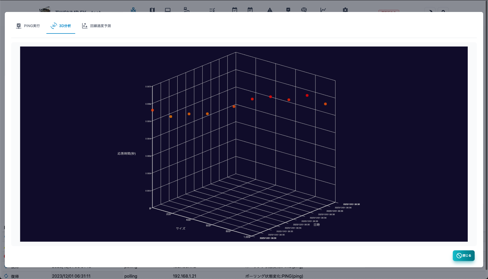

#### PING

PINGを実行する画面です。 
位置情報を取得するには、GeoIPのデータベースファイルが必要です。

>>>
#### 説明

|項目|内容|
|----|----|
|IPアドレス|PINGを実行する対象のIPアドレスです。|
|回数|PINGの実行回数です。|
|サイズ|PINGパケットのサイズです。 変化モードは、サイズを増やしながら実行します。|
|TTL|PINGパケットのTTL値です。 トレースルートは、TTL値を増やしながら実行します。|
|結果グラフ|PINGの実行結果の応答時間、TTL値のグラフです。|
|結果|PINGの実行結果です。 結果、実施日時、応答時間、サイズ、送信受信のTTL、応答元IP、位置|
|BEEP|PINGの実行結果を音で知らせます。|
|開始|PINGを開始します。|
|停止|PINGを停止します。|
|閉じる|PINGを終了します。|

---
#### ヒストグラム

応答時間のヒストグラムです。

---
#### ３D分析

応答時間、サイズ、実施日時を３Dのグラフで表示したものです。

---
#### 回線予測

サイズを変化させならが実施した場合に応答時間の変化から
回線速度を予測するレポートです。

---
#### 経路分析

位置情報を表示します。GeoIPのデータベースがないと表示できません。

