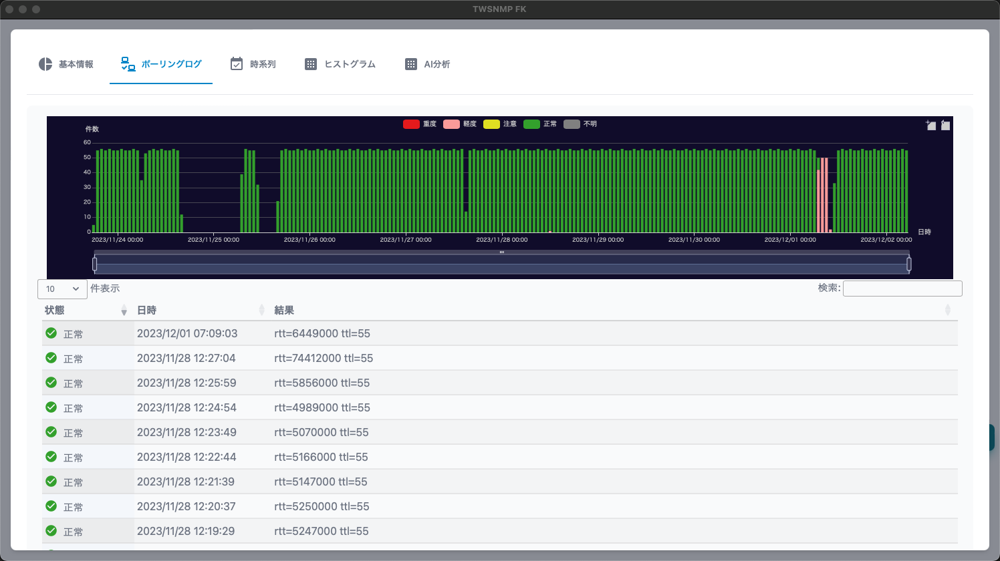

#### ポーリングリスト

管理対象のポーリングの一覧です。

>>>
#### ノードリストの項目

|項目|内容|
|----|----|
|状態|ポーリングの状態です。 重度、軽度、注意、復帰、正常、不明があります。|
|ノード名|ポーリングに関連するノードの名前です。|
|名前|ポーリングの名前です。|
|レベル|ポーリングの障害レベルです。|
|種別|ポーリングの種類です。|
|ログ|ポーリングのログモードです。|
|最終確認|ポーリングの最終確認日時です。|

>>>
#### ボタンの説明

|項目|内容|
|----|----|
|追加|ポーリングを追加します。|
|編集|選択したポーリングを編集します。|
|コピー|選択したポーリングをコピーします。|
|レポート|選択したポーリングの分析レポートを表示します。|
|削除|選択したポーリングを削除します。|
|CSV|ポーリングリストをCSVファイルにエクスポートします。|
|Excel|ポーリングリストをExcelファイルにエクスポートします。|
|更新|ポーリングリストを最新の状態に更新します。|

---
#### ポーリングのテンプレート選択

ポーリングを追加する時に表示されるテンプレートの選択画面です。

>>>

|項目|内容|
|----|----|
|ID|テンプレートの番号です。|
|名前|ポーリングの名前です。|
|種別|ポーリングの種類です。 ping,snmp,tcpなど|
|モード|ポーリングのモードです。|
|説明|ポーリングの説明です。|

>>>
#### ボタンの説明

|項目|内容|
|----|----|
|追加|ポーリングを選択します。|
|キャンセル|ポーリングの選択閉じます。|

---
#### 基本情報

ポーリングに関する基本的な情報です。

---
#### ポーリングログ

ポーリング結果のログです。 
ログモードを出力しない以外に設定した場合のみ表示されます。

---
#### 時系列

ポーリング結果のログの中で数値データを時系列のグラフで表示します。 
表示する項目は、グラフの上部で選択できます。 
ログモードを出力しない以外に設定した場合のみ表示されます。

---
#### ヒストグラム

ポーリング結果のログの中の数値データをヒストグラムで表示します。 
表示する項目は、グラフの上部で選択できます。 
ログモードを出力しない以外に設定した場合のみ表示されます。

---
#### AI分析

ポーリング結果のログの中で数値データをAI分析した結果です。 
ログモードをAI分析に設定して十分なデータを取得した場合のみ表示されます。

