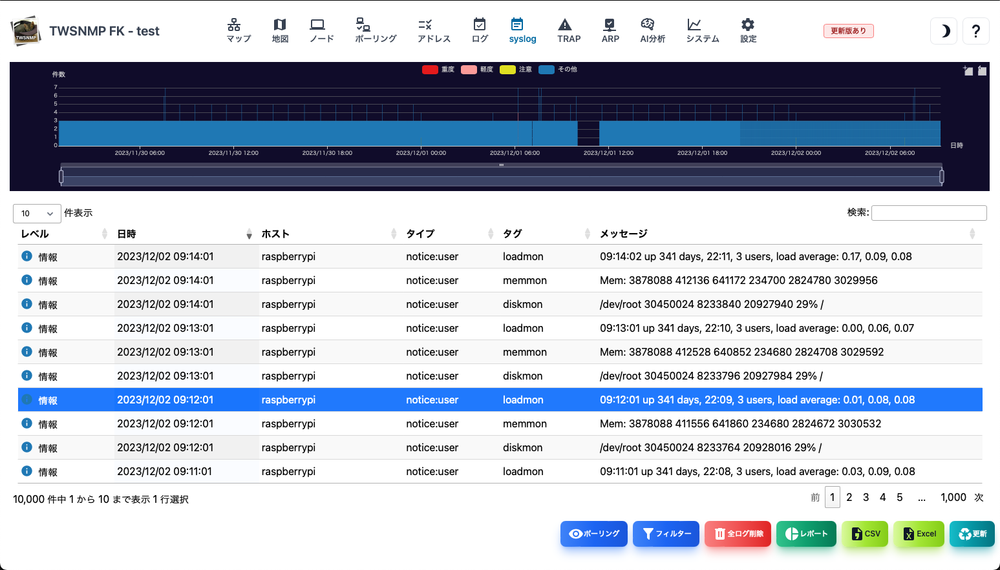
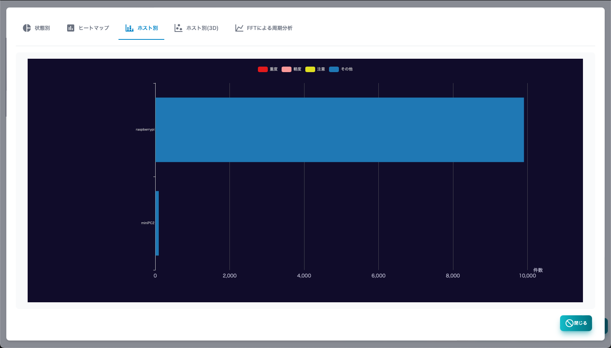
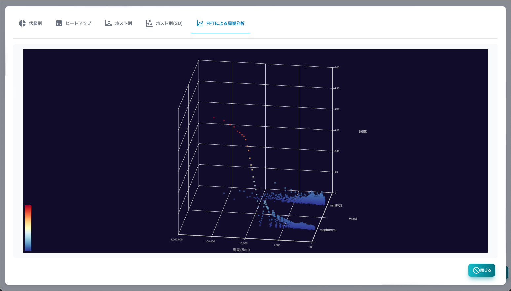

#### Syslog

Syslogの画面です。 
上部にログの発生件数を時系列で示したグラフがあります。

>>>
#### Syslogの項目

|項目|内容|
|----|----|
|レベル|Syslogのレベルです。 重度、軽度、注意、情報があります。|
|日時|Syslogを受信した日時です。|
|ホスト|Syslogの送信元ホストです。|
|タイプ|syslogのファシリティーと優先度の文字列です。|
|タグ|Syslogのタグです。プロセスとプロセスIDなどです。|
|メッセージ|Syslogのメッセージです。|

>>>
#### ボタンの説明

|項目|内容|
|----|----|
|ポーリング|選択したSyslogからポーリングを登録します。|
|フィルター|検索条件を指定してSyslogを表示します。|
|コピー|選択したログをコピーします。|
|全ログ削除|全てのSyslogを削除します。|
|レポート|Syslogの分析レポートを表示します。|
|マジック分析|syslogから情報を自動抽出して分析できます。|
|CSV|SyslogをCSVファイルにエクスポートします。|
|Excel|SyslogをExcelファイルにエクスポートします。|
|更新|Syslogのリストを最新の状態に更新します。|

---
#### フィルター

Syslogの検索条件を指定するダイアログです。

>>>
#### フィルターの項目

|項目|内容|
|----|----|
|レベル|Syslogのレベルです。 全て、情報以上、注意以上、軽度以上、重度があります。|
|ホスト|送信元のホストです。|
|タグ|Syslogのタグの値です。|
|メッセージ|Syslogのメッセージです。|

文字列は、正規表現で検索できます。

---
#### 状態別

 Syslogの件数を状態別に集計したレポートです。

---
#### ヒートマップ

Syslogの時間毎の件数をヒートマップで集計したレポートです。

---
#### ホスト別

Syslogの件数を送信元ホスト別に集計したレポートです。

---
#### ホスト別(3D)

Syslogを送信元ホスト、プライオリティー、時刻の３次元グラフで表示したレポートです。

---
#### FFTによる周期分析

Syslogをホスト毎にFFT分析して受信件数の周期を分析したレポートです。

