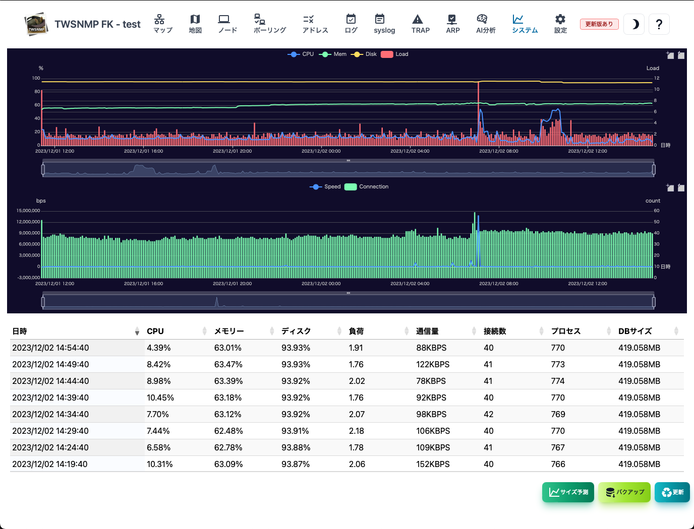
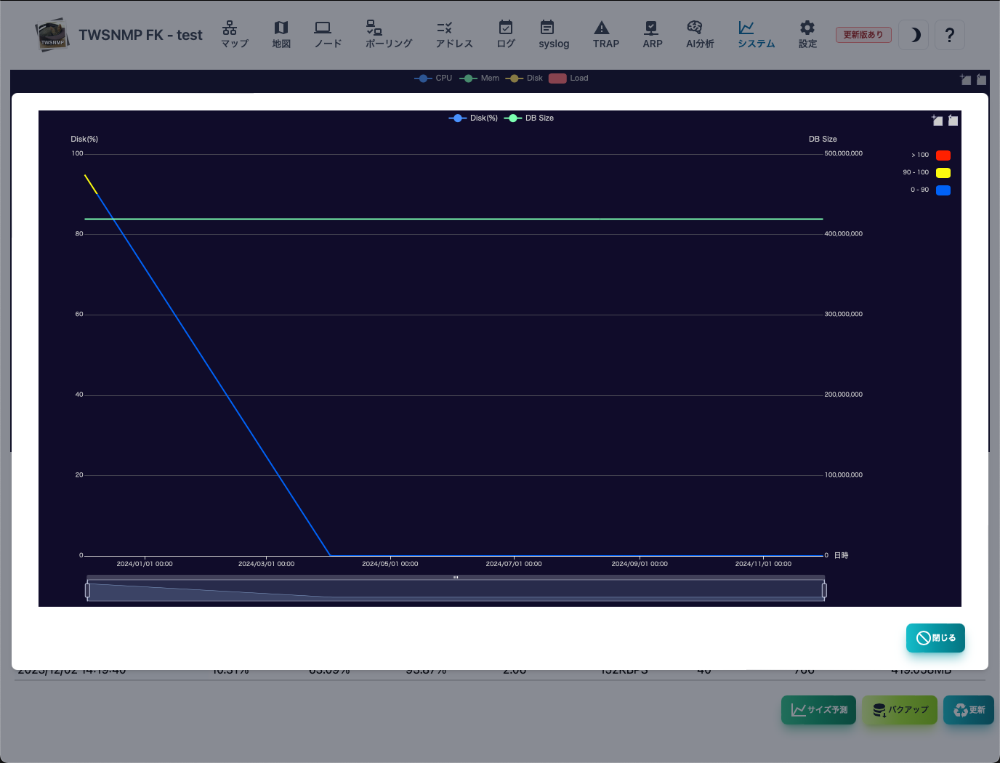

#### System

System情報の画面です。 
上部にログのリソースと通信の情報を時系列で示したグラフがあります。

>>>
#### System情報の項目

|項目|内容|
|----|----|
|日時|System情報を記録した日時です。|
|CPU|CPU使用率です。|
|メモリー|メモリー使用率です。|
|ディスク|データフォルダのあるディスクの使用率です。|
|負荷|負荷です。|
|通信量|LANポートの通信量です。|
|接続数|TCPのコネクション数です。|
|プロセス|プロセスの総数です。|
|DBサイズ|データベースのサイズです。|

>>>
#### ボタンの説明

|項目|内容|
|----|----|
|サイズ予測|データベースサイズとディスク使用率の１年間の予測です。|
|バックアップ|バックアップを取得します。|
|更新|System情報を最新の状態に更新します。|

---
#### サイズ予測

データベースサイズとディスク使用率の１年間の予測です。

