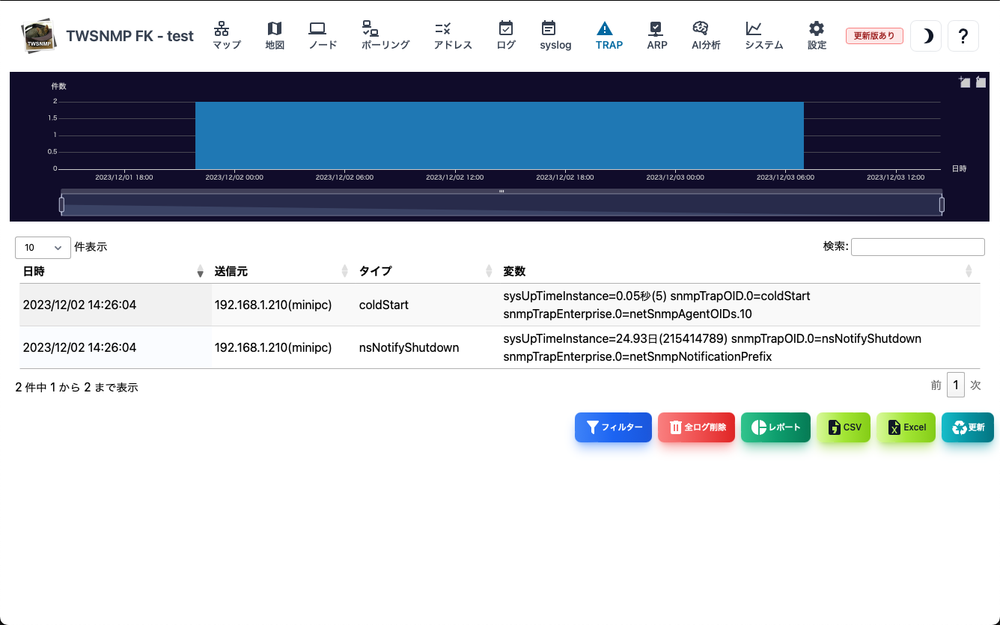
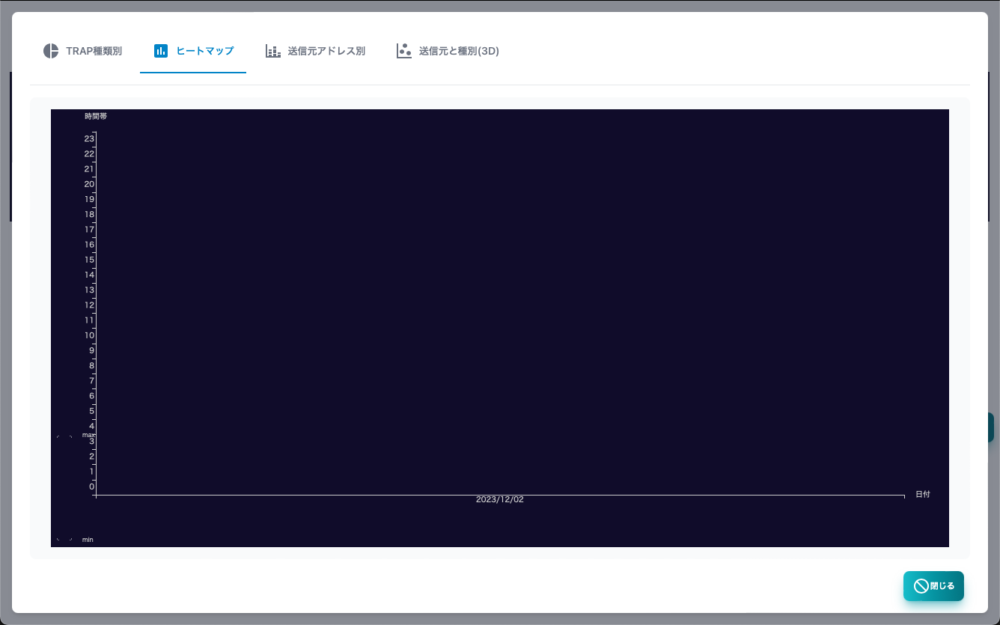

#### SNMP TRAP

SNMP TRAPログの画面です。 
上部にログの発生件数を時系列で示したグラフがあります。

>>>
#### SNMP TRAPログの項目

|項目|内容|
|----|----|
|日時|SNMP TRAPを受信した日時です。|
|送信元|SNMP TRAPの送信元ホストです。|
|タイプ|SNMP TRAPのタイプです。|
|変数|SNMP TRAPに付帯した変数です。|

>>>
#### ボタンの説明

|項目|内容|
|----|----|
|ポーリング|選択したSNMP TRAPからポーリングを登録します。|
|フィルター|検索条件を指定してSNMP TRAPを表示します。|
|全ログ削除|全てのSyslogを削除します。|
|レポート|SNMP TRAPの分析レポートを表示します。|
|CSV|SNMP TRAPをCSVファイルにエクスポートします。|
|Excel|SNMP TRAPをExcelファイルにエクスポートします。|
|更新|SNMP TRAPのリストを最新の状態に更新します。|

---
#### フィルター

SNMP TRAPの検索条件を指定するダイアログです。

>>>
#### フィルターの項目

|項目|内容|
|----|----|
|送信元|送信元のホストです。|
|タイプ|SNMP TRAPのタイプです。|

文字列は、正規表現で検索できます。

---
#### TRAP種類別

 SNMP TRAPの件数を種類別に集計したレポートです。

---
#### ヒートマップ

SNMP TRAPの時間毎の件数をヒートマップで集計したレポートです。

---
#### ホスト別

SNMP TRAPの受信件数を送信元ホスト別に集計したレポートです。

---
#### 送信元と種別(3D)

SNMP TRAPの受信ログを送信元ホスト、種別、時刻の３次元グラフで表示したレポートです。

