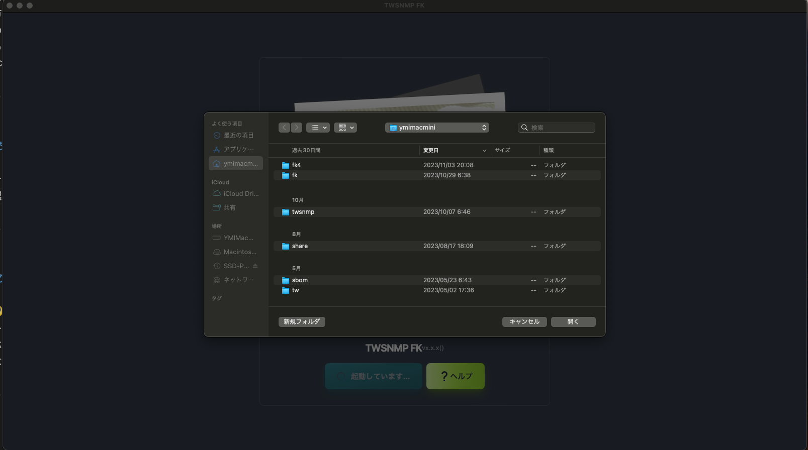
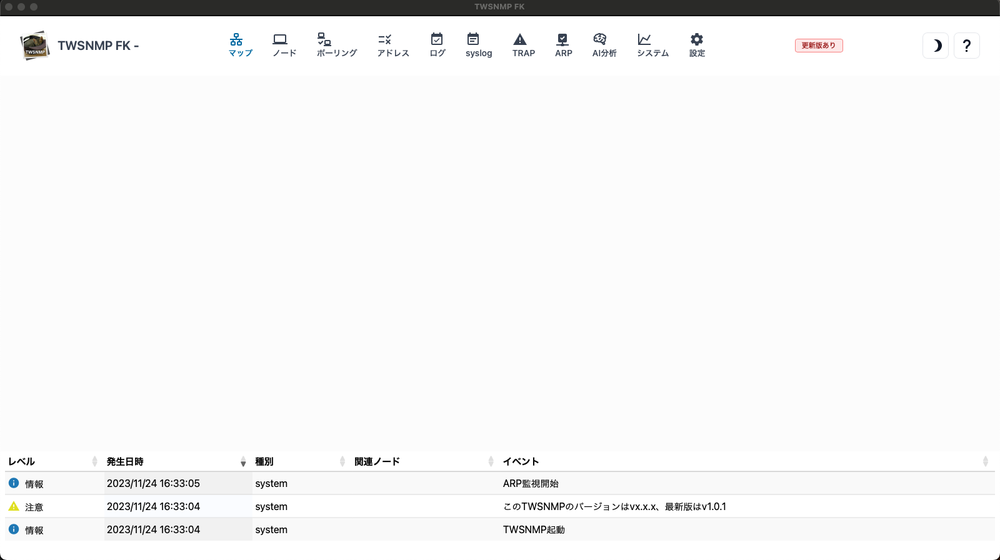

## TWSNMP FKへようこそ

ネットワーク管理マップを作成してみましょう。

まず、<button class="bg-green-600">＜はじめる＞</button>ボタンをクリックします。

---
#### データフォルダを選択

マップの設定やログを記録するデータベースファイルや拡張MIBなどを保存するためのフォルダです。

>>>
#### データストア内のファイル

データフォルダ内に以下ファイルを保存すればカスタマイズできます。

|ファイル|内容|
|---|---|
|twsnmpfk.db|データベースファイルです。存在しない場合は自動作成されます。|
|services.txt|サービス名の変換の使用するファイルです。(オプション)|
|mac-vendors-export.csv|MACアドレスとベンダー名の関係を示すデータベースです。(オプション)|
|polling.json|ポーリング設定(オプション)|
|mail_test.html|通知テストメールのテンプレート(オプション)|
|mail_notify.html|通知メールのテンプレート(オプション)|
|mail_repot.html|レポートメールのテンプレート(オプション)|
|extmibs/*|追加読み込みの拡張MIB(オプション)|

---
#### マップを表示

フォルダーを選択すると空白のマップが表示されます。

---
#### 起動パラメータ

起動時に以下のパラメータを指定できます。

<pre class="text-sm font-mono">
Usage of twsnmpfk:
  -datastore string
    	Path to data dtore directory
  -kiosk
    	Kisok mode(frameless and full screen)
  -lang string
    	Language(en|jp)
  -lock string
    	Disable edit map and lock page(map or loc)
  -maxDispLog int
    	Max log size to diplay (default 10000)
  -ping string
    	ping mode icmp or udp
  -syslogPort int
    	Syslog port (default 514)
  -trapPort int
      SNMP TRAP port (default 162)
</pre>

>>>
#### 起動パラメータの説明

|パラメータ|説明|
|---|---|
|datastore|データストアのパス|
|kiosk|キオスクモード（フレームレス、フルスクリーン）|
|lock <page>| マップの編集を禁止して表示するページを固定 (pageにはmap又はlocを指定)|
|maxDispLog <number>|ログの最大表示数(デフォルト 10000)| 
|ping <mode>|pingの動作モード(icmp又はudp)|
|syslogPort <port>|syslogの受信ポート(デフォルト514)|
|trapPort <port>| SNMP TRAP受信ポート(デフォルト162)|

